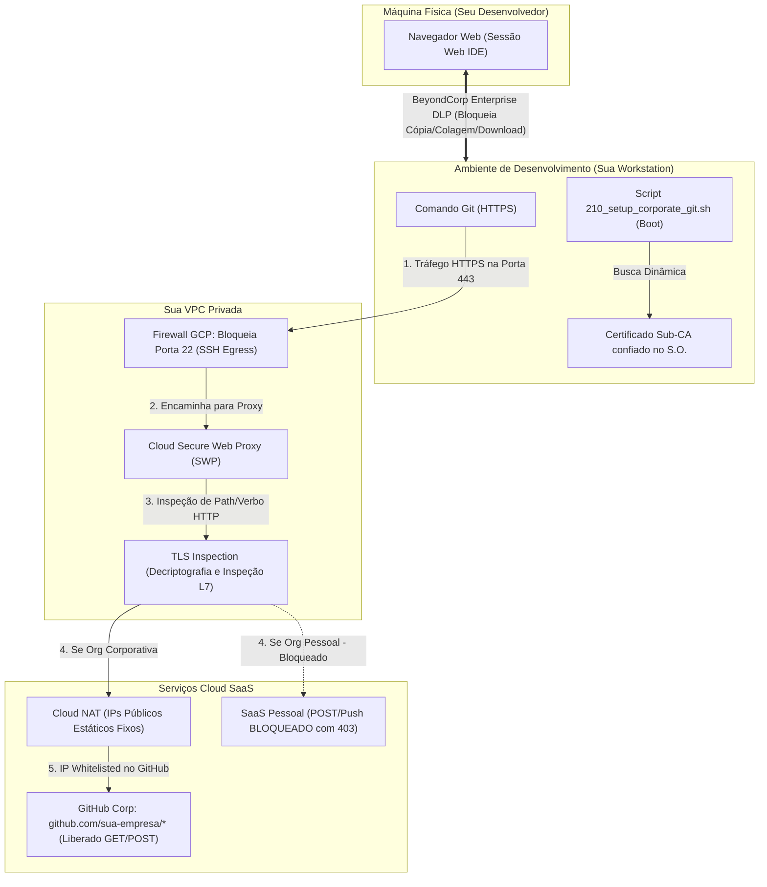

# Manual de Implementação: Seu Ambiente Seguro de Desenvolvimento com Cloud Workstations

Este manual foi desenhado para guiar a sua equipe de engenharia e plataforma, passo a passo, no provisionamento do **seu ambiente de desenvolvimento seguro baseado em Cloud Workstations no Google Cloud Platform (GCP)**.

---

## 🚀 Como usar este manual sem edição manual de comandos
Para tornar a instalação rápida e livre de erros de digitação, **a sua equipe não precisa editar comandos individualmente**. 

Basta preencher as variáveis no bloco único abaixo, copiá-lo e colá-lo no seu **Google Cloud Shell** (ou terminal com gcloud autenticado). A partir desse momento, todas as fases do manual usarão as variáveis de ambiente ativas no terminal (`$GCP_PROJECT_ID`, `$VPC_NAME`, etc.) de forma automática!

### 📌 Copie e cole este bloco de variáveis no seu terminal antes de começar:

```bash
# ==============================================================================
# BLOCO DE CONFIGURAÇÃO DE VARIÁVEIS (PREENCHA COM OS SEUS VALORES)
# ==============================================================================
export GCP_PROJECT_ID="sua-empresa-workstations-prod"     # ID do seu projeto no GCP
export GCP_PROJECT_NUMBER="123456789012"                 # Número do seu projeto no GCP
export GCP_REGION="us-central1"                          # Região para os recursos
export GCP_ZONE="us-central1-a"                          # Zona para a workstation
export VPC_NAME="sua-empresa-vpc"                        # Nome da rede VPC principal
export SUBNET_NAME="sua-empresa-workstations-subnet"     # Nome da sub-rede das workstations
export CORP_ORG_NAME="sua-empresa-github"                # Nome da sua Org corporativa no GitHub
export REGISTRY_NAME="sua-empresa-repo"                  # Nome do seu Artifact Registry
```

---

## 🗺️ Visão Geral Visual da Sua Infraestrutura

O fluxo de comunicação e as barreiras de segurança operam conforme o modelo abaixo:



---

## 🛠️ FASE 1: Infraestrutura de Rede e Perímetro Seguro

O objetivo desta fase é criar para a sua empresa uma rede privada isolada, sem pontos de saída de internet descontrolados, bloqueando canais de tráfego que contornem o proxy (como conexões SSH diretas).

### Passo 1.1: Criar a VPC Privada e a Sub-rede das Workstations
> [!NOTE]
> Criamos a sua rede VPC e uma sub-rede com o recurso **Private Google Access** ativado. Esse recurso é indispensável para que as suas máquinas sem IPs públicos externos se comuniquem de forma segura com as APIs do Google Cloud.

```bash
# 1. Criar a rede VPC em modo personalizado
gcloud compute networks create $VPC_NAME \
    --subnet-mode=custom \
    --project=$GCP_PROJECT_ID

# 2. Criar a sub-rede das Workstations com Private Google Access ativado
gcloud compute networks subnets create $SUBNET_NAME \
    --network=$VPC_NAME \
    --range=10.10.0.0/24 \
    --region=$GCP_REGION \
    --enable-private-ip-google-access \
    --project=$GCP_PROJECT_ID
```

---

### Passo 1.2: Criar a Sub-rede Exclusiva para o Proxy (Proxy-Only Subnet)
> [!IMPORTANT]
> O Secure Web Proxy (SWP) do Google Cloud baseia-se em instâncias Envoy gerenciadas internas. Ele exige que você crie uma sub-rede do tipo `PROXY_ONLY` na mesma região para alocar seus IPs internos de proxy.

```bash
gcloud compute networks subnets create secure-proxy-subnet \
    --network=$VPC_NAME \
    --range=10.129.0.0/23 \
    --region=$GCP_REGION \
    --purpose=REGIONAL_MANAGED_PROXY \
    --role=ACTIVE \
    --project=$GCP_PROJECT_ID
```

---

### Passo 1.3: Bloquear Conexões de Saída via SSH (Porta 22)
> [!CAUTION]
> O protocolo Git por SSH (`git@github.com:...`) é criptografado de ponta a ponta e impede a inspeção L7 do seu proxy. O bloqueio da porta 22 de saída força todo o tráfego Git a usar obrigatoriamente HTTPS (porta 443), permitindo a auditoria profunda de URLs.

```bash
gcloud compute firewall-rules create deny-ssh-egress \
    --network=$VPC_NAME \
    --direction=EGRESS \
    --priority=1000 \
    --action=DENY \
    --rules=tcp:22 \
    --destination-ranges=0.0.0.0/0 \
    --description="Bloquear qualquer conexao SSH de saida para a internet para forcar uso de HTTPS" \
    --project=$GCP_PROJECT_ID
```

---

### Passo 1.4: Configurar o Cloud NAT com IPs Estáticos
> [!TIP]
> Em vez de expor as conexões a IPs dinâmicos e rotativos, criamos IPs públicos fixos. Vocês devem cadastrar esses IPs fixos na política de segurança de acesso (Allowlist de IP) das suas contas corporativas do GitHub/Bitbucket Enterprise.

```bash
# 1. Reservar o IP publico estatico para a sua organizacao
gcloud compute addresses create workstations-nat-ip \
    --region=$GCP_REGION \
    --project=$GCP_PROJECT_ID

# 2. Criar o Cloud Router
gcloud compute routers create workstations-router \
    --network=$VPC_NAME \
    --region=$GCP_REGION \
    --project=$GCP_PROJECT_ID

# 3. Criar o Cloud NAT associado ao IP estatico reservado
gcloud compute routers nats create workstations-nat \
    --router=workstations-router \
    --region=$GCP_REGION \
    --nat-custom-ips=workstations-nat-ip \
    --nat-gateway-cos-all-subnet-ip-ranges \
    --project=$GCP_PROJECT_ID
```

---

## 🔑 FASE 2: Autoridade Certificadora e TLS Inspection

Para que o Secure Web Proxy consiga inspecionar o conteúdo das URLs HTTPS criptografadas, ele precisa decodificar o tráfego de saída. Para fazer isso de forma segura, criamos uma Autoridade Certificadora regional no seu **Private CA Service**.

### Passo 2.1: Criar o CA Pool Regional
```bash
gcloud privateca pools create secure-workstations-ca-pool \
    --location=$GCP_REGION \
    --tier=dev \
    --project=$GCP_PROJECT_ID
```

---

### Passo 2.2: Criar a Subordinate CA no seu Pool
```bash
gcloud privateca subordinates create secure-workstations-sub-ca \
    --pool=secure-workstations-ca-pool \
    --location=$GCP_REGION \
    --create-ca \
    --common-name="Secure Workstations Subordinate CA" \
    --organization="$CORP_ORG_NAME" \
    --project=$GCP_PROJECT_ID
```

---

### Passo 2.3: Configurar o Certificado do Proxy no Certificate Manager
> [!NOTE]
> Criamos uma referência no seu GCP Certificate Manager apontando para a sua CA subordinada regional. O proxy usará essa estrutura para assinar de forma dinâmica os certificados de interceptação de tráfego.

```bash
gcloud certificate-manager certificates create secure-workstations-proxy-cert \
    --location=$GCP_REGION \
    --ca-pool=projects/$GCP_PROJECT_ID/locations/$GCP_REGION/caPools/secure-workstations-ca-pool \
    --project=$GCP_PROJECT_ID
```

---

### Passo 2.4: Conceder Permissões para a Service Account do Proxy (SWP)
> [!IMPORTANT]
> A Service Account interna do seu proxy precisa de autorização explícita no IAM do GCP para assinar os certificados dinâmicos no CA Pool. Sem isso, o proxy falhará nas conexões com erro `552 (handshake_failure)`.

```bash
gcloud privateca pools add-iam-policy-binding secure-workstations-ca-pool \
    --location=$GCP_REGION \
    --role=roles/privateca.certificateManager \
    --member="serviceAccount:service-$GCP_PROJECT_NUMBER@gcp-sa-networksecurity.iam.gserviceaccount.com" \
    --project=$GCP_PROJECT_ID
```

---

## 🛡️ FASE 3: Provisionamento do Secure Web Proxy (SWP)

Esta fase configura as regras inteligentes do seu proxy para validar URLs e impedir vazamentos de dados de forma automática na camada de rede.

### Passo 3.1: Criar a Gateway Security Policy
```bash
gcloud network-security gateway-security-policies create secure-workstations-policy \
    --location=$GCP_REGION \
    --tls-inspection-policy=projects/$GCP_PROJECT_ID/locations/$GCP_REGION/caPools/secure-workstations-ca-pool \
    --project=$GCP_PROJECT_ID
```

---

### Passo 3.2: Criar as Regras de L7 no seu Secure Web Proxy
> [!NOTE]
> Criamos regras que separam o acesso corporativo completo da leitura de bibliotecas públicas externas. Note o uso dos matchers e das prioridades.

#### Regra A: Permitir Leitura e Escrita apenas na sua Org Corporativa (Prioridade 100)
Garante que comandos completos do Git (incluindo o `git push`) sejam liberados exclusivamente se o caminho da URL de destino pertencer à sua organização:

```bash
gcloud network-security gateway-security-policies rules create allow-corp-github \
    --gateway-security-policy=secure-workstations-policy \
    --location=$GCP_REGION \
    --priority=100 \
    --session-matcher="host() == 'github.com' || host() == 'api.github.com'" \
    --application-matcher="request.path.startsWith('/${CORP_ORG_NAME}/')" \
    --basic-profile=ALLOW \
    --tls-inspection-enabled \
    --project=$GCP_PROJECT_ID
```

#### Regra B: Permitir Apenas Clone/Leitura (GET) de Repositórios Públicos (Prioridade 200)
Garante a produtividade do seu time permitindo o download (GET/HEAD) e POST de negociação de clone de repositórios externos, mas bloqueia qualquer escrita:

```bash
gcloud network-security gateway-security-policies rules create allow-github-read \
    --gateway-security-policy=secure-workstations-policy \
    --location=$GCP_REGION \
    --priority=200 \
    --session-matcher="host() == 'github.com' || host() == 'api.github.com'" \
    --application-matcher="request.method == 'GET' || request.method == 'HEAD' || (request.method == 'POST' && request.path.endsWith('/git-upload-pack'))" \
    --basic-profile=ALLOW \
    --tls-inspection-enabled \
    --project=$GCP_PROJECT_ID
```

---

### Passo 3.3: Criar e Lançar o seu Gateway do SWP
O Gateway do proxy será provisionado e associado à sua sub-rede regional ativa:

```bash
gcloud network-security gateways create secure-workstations-proxy \
    --location=$GCP_REGION \
    --addresses=10.10.0.100 \
    --ports=443 \
    --type=SECURE_WEB_PROXY \
    --gateway-security-policy=secure-workstations-policy \
    --network=$VPC_NAME \
    --subnetwork=$SUBNET_NAME \
    --project=$GCP_PROJECT_ID
```

---

## 🐳 FASE 4: Construção da Imagem Docker Customizada Hardened

Criamos uma imagem de container Docker personalizada para o seu time de desenvolvimento. Ela aplica controles locais imutáveis e garante que os containers confiem automaticamente no certificado CA do seu Proxy no boot.

### Passo 4.1: Criar a Estrutura de Arquivos no Repositório

Organize a sua pasta de desenvolvimento local com a seguinte estrutura de diretórios:

```text
cloud-workstations-custom/
├── Dockerfile
├── config/
│   └── AGENTS.md (Diretrizes internas exibidas ao desenvolvedor no boot)
├── scripts/
│   └── 210_setup_corporate_git.sh (Script de inicializacao executado no boot)
└── docs/
    ├── 0_installation_guide/        # O Passo a Passo Prático
    ├── 1_networking/                # Guia de Redes e SWP
    └── 2_access_control/            # Guia de Acesso e Manutenção
```

#### 📄 Dockerfile de Hardening e Configuração de Proxy
Crie o arquivo `Dockerfile` com as seguintes instruções enxutas de segurança:

```dockerfile
FROM us-central1-docker.pkg.dev/cloud-workstations-images/predefined/code-oss:latest
USER root

RUN apt-get update && apt-get install -y --no-install-recommends \
    wget gnupg ca-certificates \
    && wget -q -O - https://dl.google.com/linux/linux_signing_key.pub | gpg --dearmor -o /usr/share/keyrings/google-chrome-keyring.gpg \
    && echo "deb [arch=amd64 signed-by=/usr/share/keyrings/google-chrome-keyring.gpg] http://dl.google.com/linux/chrome/deb/ stable main" | tee /etc/apt/sources.list.d/google-chrome.list > /dev/null \
    && apt-get update && apt-get install -y --no-install-recommends google-chrome-stable \
    && apt-get clean && rm -rf /var/lib/apt/lists/*

RUN mkdir -p /etc/security
COPY config/AGENTS.md /etc/security/AGENTS.md
RUN chmod 644 /etc/security/AGENTS.md

RUN printf '[url "https://github.com/"]\n\tinsteadOf = git@github.com:\n[url "https://bitbucket.org/"]\n\tinsteadOf = git@bitbucket.org:\n[core]\n\thooksPath = /etc/git/hooks\n' > /etc/gitconfig \
    && chmod 644 /etc/gitconfig

RUN mkdir -p /etc/git/hooks
RUN printf '#!/bin/bash\n# Hook global de pre-push contra exfiltracao de dados\nORG_PERMITIDA="${ALLOWED_ORG:-sua-empresa}"\nwhile read local_ref local_sha remote_ref remote_sha; do\n\tREMOTE_URL=$(git remote get-url origin 2>/dev/null)\n\tif [[ ! "$REMOTE_URL" =~ (github\\.com|bitbucket\\.org)/$ORG_PERMITIDA/ ]]; then\n\t\techo "=========================================================="\n\t\techo "🚨 ERRO: TENTATIVA DE EXFILTRAÇÃO DETECTADA 🚨"\n\t\techo "Pushes sao permitidos apenas para a organizacao: $ORG_PERMITIDA"\n\t\techo "=========================================================="\n\t\texit 1\n\tfi\ndone\nexit 0\n' > /etc/git/hooks/pre-push \
    && chmod 755 /etc/git/hooks/pre-push

RUN mkdir -p /usr/local/share/ca-certificates/corp-proxy

COPY scripts/210_setup_corporate_git.sh /etc/workstation-startup.d/210_setup_corporate_git.sh
RUN chmod +x /etc/workstation-startup.d/210_setup_corporate_git.sh
```

#### 📄 Script de Inicialização (`scripts/210_setup_corporate_git.sh`)
Crie o arquivo do script que instala de forma dinâmica o certificado de rede de saída no boot da máquina:

```bash
#!/bin/bash
echo "=== [START] Inicializando Configuracoes Corporativas de Seguranca ==="

TARGET_LINK="/home/user/AGENTS.md"
SOURCE_FILE="/etc/security/AGENTS.md"

if [ -f "$SOURCE_FILE" ]; then
    rm -f "$TARGET_LINK"
    ln -sf "$SOURCE_FILE" "$TARGET_LINK"
    chown -h user:user "$TARGET_LINK"
fi

CA_CERT_PATH="/usr/local/share/ca-certificates/corp-proxy/secure-workstations-sub-ca.crt"
if [ -d "/usr/local/share/ca-certificates/corp-proxy" ] && [ ! -f "$CA_CERT_PATH" ]; then
    GCP_PROJECT=$(curl -s -H "Metadata-Flavor: Google" http://metadata.google.com/computeMetadata/v1/project/project-id 2>/dev/null)
    if [ -n "$GCP_PROJECT" ]; then
        if gcloud privateca subordinates describe secure-workstations-sub-ca \
            --pool=secure-workstations-ca-pool \
            --location=us-central1 \
            --project="$GCP_PROJECT" \
            --format="value(pemCaCertificates)" > "$CA_CERT_PATH" 2>/dev/null; then
            echo "Certificado da CA privada obtido com sucesso em $CA_CERT_PATH!"
        fi
    fi
fi

if [ -d "/usr/local/share/ca-certificates/corp-proxy" ]; then
    if ls /usr/local/share/ca-certificates/corp-proxy/*.crt >/dev/null 2>&1; then
        echo "Atualizando o trust store de certificados CA do sistema..."
        update-ca-certificates --fresh
    fi
fi

echo "=== [END] Configuracoes Corporativas Concluidas ==="
```

---

### Passo 4.2: Compilar e Enviar a Imagem para o seu Artifact Registry
Execute a compilação segura na infraestrutura de nuvem utilizando o **Google Cloud Build**:

```bash
# 1. Criar o repositorio no Artifact Registry (se nao existir)
gcloud artifacts repositories create $REGISTRY_NAME \
    --repository-format=docker \
    --location=$GCP_REGION \
    --description="Repositorio de Imagens de Workstations Seguras" \
    --project=$GCP_PROJECT_ID

# 2. Submeter a compilação do Dockerfile para o Cloud Build
gcloud builds submit --tag ${GCP_REGION}-docker.pkg.dev/${GCP_PROJECT_ID}/${REGISTRY_NAME}/secure-code-oss:latest . \
    --project=$GCP_PROJECT_ID
```

---

### Passo 4.3: Liberar Permissão de Leitura da CA para a sua Workstation
> [!IMPORTANT]
> Para que o script de boot (`210_setup_corporate_git.sh`) consiga ler o certificado público da Subordinate CA no boot, a Service Account associada à workstation (por padrão, a Compute Engine Default Service Account) precisa receber o papel de **Auditor da CA** no projeto.

```bash
gcloud privateca pools add-iam-policy-binding secure-workstations-ca-pool \
    --location=$GCP_REGION \
    --role=roles/privateca.auditor \
    --member="serviceAccount:${GCP_PROJECT_NUMBER}-compute@developer.gserviceaccount.com" \
    --project=$GCP_PROJECT_ID
```

---

## 🚀 FASE 5: Provisionamento das Cloud Workstations no GCP

Nesta fase, criamos as especificações das estações de trabalho do seu time, blindando privilégios locais e aplicando as travas de prevenção de perda de dados (DLP) do BeyondCorp Enterprise.

### Passo 5.1: Criar a sua Workstation Configuration
> [!NOTE]
> Note os parâmetros essenciais de segurança:
> * Desativação nativa absoluta de privilégios sudo.
> * Encaminhamento forçado de tráfego HTTP e HTTPS para o IP do seu proxy regional.
> * Travamento de área de transferência (clipboard), download de arquivos e impressão.

```bash
# Criar a configuracao inicial das Workstations
gcloud workstations configs create secure-workstations-config \
    --cluster=secure-workstations-cluster \
    --location=$GCP_REGION \
    --container-custom-image=${GCP_REGION}-docker.pkg.dev/${GCP_PROJECT_ID}/${REGISTRY_NAME}/secure-code-oss:latest \
    --container-predefined-use-shared-home \
    --disable-public-ip-addresses \
    --subnet=projects/${GCP_PROJECT_ID}/regions/${GCP_REGION}/subnetworks/${SUBNET_NAME} \
    --shielded-secure-boot \
    --shielded-vtpm \
    --shielded-integrity-monitoring \
    --max-idle-duration=1800s \
    --project=$GCP_PROJECT_ID
```

#### 🔒 Configurações Adicionais Recomendadas via Console do GCP
Para aplicar os controles finos de segurança, acesse a configuração criada no Console do GCP e realize os ajustes abaixo:

1. **Variáveis de Ambiente do Container (Container Options)**:
   * `CLOUD_WORKSTATIONS_CONFIG_DISABLE_SUDO`: `true` *(Desativa as capacidades de root na sua máquina)*
   * `ALLOWED_ORG`: `[CORP_ORG_NAME]` *(Substitua pelo valor de $CORP_ORG_NAME para definir a sua org corporativa permitida para push)*
   * `http_proxy`: `http://10.10.0.100:443` *(Direciona todo tráfego de rede para o SWP)*
   * `https_proxy`: `http://10.10.0.100:443` *(Direciona todo tráfego criptografado para o SWP)*
   * `no_proxy`: `metadata.google.internal,169.254.169.254,10.0.0.0/8` *(Bypass interno)*

2. **Políticas de Prevenção de Perda de Dados (BeyondCorp Enterprise DLP)**:
   Na aba **Security Settings** da sua workstation configuration, mude os seletores para `DISABLED` para bloquear os seguintes vetores:
   * **Enable clipboard** ➡️ `DISABLED` (Impede copiar/colar dados com o seu computador físico)
   * **Enable file download** ➡️ `DISABLED` (Impede o download de arquivos de código para a sua máquina física)
   * **Enable printing** ➡️ `DISABLED` (Impede a impressão física ou salvar PDFs locais da tela)

---

### Passo 5.2: Criar e Iniciar a Instância de Workstation do seu Desenvolvedor
```bash
# 1. Criar a workstation dedicada para o seu desenvolvedor
gcloud workstations create secure-dev-station \
    --cluster=secure-workstations-cluster \
    --config=secure-workstations-config \
    --location=$GCP_REGION \
    --project=$GCP_PROJECT_ID

# 2. Iniciar a workstation para iniciar o desenvolvimento
gcloud workstations start secure-dev-station \
    --cluster=secure-workstations-cluster \
    --config=secure-workstations-config \
    --location=$GCP_REGION \
    --project=$GCP_PROJECT_ID
```

---

## 🧪 FASE 6: Roteiro de Homologação (Testes de Validação Prática)

Para que a sua equipe comprove o funcionamento regular e a eficácia de todas as travas implementadas neste manual, realize os seguintes 5 testes práticos abrindo o terminal interno do Code OSS:

### 🚫 Teste 1: Tentativa de Elevação de Privilégios (Sudo)
* **Ação no terminal**:
  ```bash
  sudo -i
  ```
* **Comportamento Esperado**: O sistema operacional rejeitará o comando de imediato, alertando que o usuário `user` não pertence ao arquivo sudoers.
* **O que isso comprova?** Nenhum desenvolvedor terá permissões administrativas para burlar ou alterar controles locais, desinstalar os hooks globais do Git ou desativar os certificados confiados da rede.

---

### 🚫 Teste 2: Bloqueio do Protocolo SSH (Porta 22)
* **Ação no terminal**:
  ```bash
  ssh -T git@github.com
  ```
* **Comportamento Esperado**: A conexão ficará suspensa por alguns segundos e sofrerá um timeout sem estabelecer contato.
* **O que isso comprova?** O tráfego direto de rede fora do HTTPS está devidamente bloqueado pelo firewall VPC, impedindo desvios criptografados que contornem a auditoria de L7.

---

### 🟢 Teste 3: Download e Clone de Dependências Públicas (Leitura)
* **Ação no terminal**:
  ```bash
  git clone https://github.com/twbs/bootstrap.git
  ```
* **Comportamento Esperado**: O clone ocorre com velocidade e sucesso, baixando os arquivos normalmente.
* **O que isso comprova?** O desenvolvedor mantém o acesso de leitura para baixar dependências open-source públicas que auxiliem no seu desenvolvimento, preservando a produtividade do seu time.

---

### 🟢 Teste 4: Trabalho Regular e Pushes para a sua Organização Corporativa
* **Ação no terminal**:
  ```bash
  # 1. Clonar o repositorio corporativo homologado (utiliza a variavel de sua Org)
  git clone https://github.com/${CORP_ORG_NAME}/projeto-modelo.git
  cd projeto-modelo

  # 2. Realizar alterações de teste e commitar localmente
  echo "/* Alteração de segurança corporativa */" >> README.md
  git commit -am "Commit corporativo autorizado"

  # 3. Enviar as alterações
  git push origin main
  ```
* **Comportamento Esperado**: Todas as interações (leitura e escrita) ocorrem com rapidez e sucesso. O tráfego de saída do Git é decodificado, analisado pelo Secure Web Proxy e autorizado de forma transparente.
* **O que isso comprova?** A regra de segurança de rede `allow-corp-github` (prioridade 100) está liberando perfeitamente o acesso completo para o domínio corporativo da sua empresa.

---

### 🚫 Teste 5: Tentativa de Push para Repositórios Pessoais (Vazamento de Código)
* **Ação no terminal**:
  ```bash
  # 1. Adicionar um remote pessoal externo do desenvolvedor
  git remote add leak https://github.com/perfil-pessoal/repositorio-vazado.git

  # 2. Tentar enviar o código corporativo para o destino não corporativo
  git push leak main
  ```
* **Comportamento Esperado**: A operação é abortada localmente e exibe o seguinte aviso em destaque no terminal do desenvolvedor:
  ```text
  ==========================================================
  🚨 ERRO: TENTATIVA DE EXFILTRAÇÃO DETECTADA 🚨
  Pushes sao permitidos apenas para a organizacao: $CORP_ORG_NAME
  ==========================================================
  ```
* **O que isso comprova?** Vocês possuem agora duas barreiras invioláveis contra o vazamento de código:
  1. **A barreira local**: O gancho imutável `pre-push` do Git, gerenciado pelo `root` do container, aborta o comando antes de colocar qualquer pacote na rede.
  2. **A barreira de rede**: Caso o desenvolvedor tente contornar o hook Git local de alguma forma, o Secure Web Proxy (SWP) detectará a chamada `POST` HTTPS para um caminho externo e bloqueará o tráfego de rede retornando o status de erro `HTTP 403 Forbidden`.
