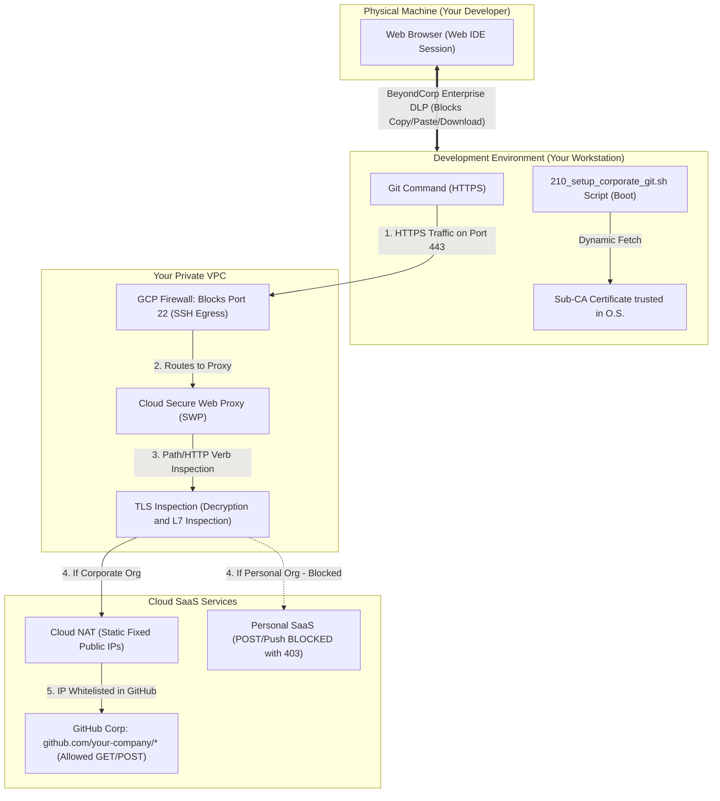

# Implementation Manual: Your Secure Development Environment with Cloud Workstations

This manual has been designed to guide your engineering and platform team step-by-step through provisioning **your secure development environment based on Cloud Workstations on Google Cloud Platform (GCP)**.

---

## 🚀 How to use this manual without manual command editing
To make installation fast and free of typing errors, **your team does not need to edit commands individually**.

Simply fill in the variables in the single block below, copy it, and paste it into your **Google Cloud Shell** (or terminal with authenticated gcloud). From that moment on, all phases of the manual will use the active environment variables in the terminal (`$GCP_PROJECT_ID`, `$VPC_NAME`, etc.) automatically!

### 📌 Copy and paste this variables block into your terminal before starting:

```bash
# ==============================================================================
# VARIABLES CONFIGURATION BLOCK (FILL WITH YOUR VALUES)
# ==============================================================================
export GCP_PROJECT_ID="your-company-workstations-prod"     # Your GCP Project ID
export GCP_PROJECT_NUMBER="123456789012"                 # Your GCP Project Number
export GCP_REGION="us-central1"                          # Region for resources
export GCP_ZONE="us-central1-a"                          # Zone for the workstation
export VPC_NAME="your-company-vpc"                        # Main VPC network name
export SUBNET_NAME="your-company-workstations-subnet"     # Workstations subnet name
export CORP_ORG_NAME="your-company-github"                # Your corporate GitHub Org name
export REGISTRY_NAME="your-company-repo"                  # Your Artifact Registry name
```

---

## 🗺️ Visual Overview of Your Infrastructure

The communication flow and security barriers operate according to the model below:



---

## 🛠️ PHASE 1: Network Infrastructure and Secure Perimeter

The goal of this phase is to create an isolated private network for your company with no uncontrolled internet egress points, blocking traffic channels that bypass the proxy (such as direct SSH connections).

### Step 1.1: Create the Private VPC and Workstations Subnet
> [!NOTE]
> We create your VPC network and a subnet with the **Private Google Access** feature enabled. This feature is essential for your machines without external public IPs to communicate securely with Google Cloud APIs.

```bash
# 1. Create the VPC network in custom mode
gcloud compute networks create $VPC_NAME \
    --subnet-mode=custom \
    --project=$GCP_PROJECT_ID

# 2. Create the Workstations subnet with Private Google Access enabled
gcloud compute networks subnets create $SUBNET_NAME \
    --network=$VPC_NAME \
    --range=10.10.0.0/24 \
    --region=$GCP_REGION \
    --enable-private-ip-google-access \
    --project=$GCP_PROJECT_ID
```

---

### Step 1.2: Create the Proxy-Only Subnet
> [!IMPORTANT]
> Google Cloud's Secure Web Proxy (SWP) is based on internal managed Envoy instances. It requires you to create a `PROXY_ONLY` subnet in the same region to allocate its internal proxy IPs.

```bash
gcloud compute networks subnets create secure-proxy-subnet \
    --network=$VPC_NAME \
    --range=10.129.0.0/23 \
    --region=$GCP_REGION \
    --purpose=REGIONAL_MANAGED_PROXY \
    --role=ACTIVE \
    --project=$GCP_PROJECT_ID
```

---

### Step 1.3: Block Outbound SSH Connections (Port 22)
> [!CAUTION]
> The Git protocol via SSH (`git@github.com:...`) is encrypted end-to-end and prevents your proxy's L7 inspection. Blocking outbound port 22 forces all Git traffic to use HTTPS (port 443), allowing deep URL auditing.

```bash
gcloud compute firewall-rules create deny-ssh-egress \
    --network=$VPC_NAME \
    --direction=EGRESS \
    --priority=1000 \
    --action=DENY \
    --rules=tcp:22 \
    --destination-ranges=0.0.0.0/0 \
    --description="Block any outbound SSH connection to the internet to force HTTPS usage" \
    --project=$GCP_PROJECT_ID
```

---

### Step 1.4: Configure Cloud NAT with Static IPs
> [!TIP]
> Instead of exposing connections to dynamic and rotating IPs, we create fixed public IPs. You must register these fixed IPs in the access security policy (IP Allowlist) of your corporate GitHub/Bitbucket Enterprise accounts.

```bash
# 1. Reserve the static public IP for your organization
gcloud compute addresses create workstations-nat-ip \
    --region=$GCP_REGION \
    --project=$GCP_PROJECT_ID

# 2. Create the Cloud Router
gcloud compute routers create workstations-router \
    --network=$VPC_NAME \
    --region=$GCP_REGION \
    --project=$GCP_PROJECT_ID

# 3. Create the Cloud NAT associated with the reserved static public IP
gcloud compute routers nats create workstations-nat \
    --router=workstations-router \
    --region=$GCP_REGION \
    --nat-custom-ips=workstations-nat-ip \
    --nat-gateway-cos-all-subnet-ip-ranges \
    --project=$GCP_PROJECT_ID
```

---

## 🔑 PHASE 2: Certificate Authority and TLS Inspection

For the Secure Web Proxy to inspect the content of encrypted HTTPS URLs, it needs to decode the outbound traffic. To do this securely, we create a regional Certificate Authority in your **Private CA Service**.

### Step 2.1: Create the Regional CA Pool
```bash
gcloud privateca pools create secure-workstations-ca-pool \
    --location=$GCP_REGION \
    --tier=dev \
    --project=$GCP_PROJECT_ID
```

---

### Step 2.2: Create the Subordinate CA in your Pool
```bash
gcloud privateca subordinates create secure-workstations-sub-ca \
    --pool=secure-workstations-ca-pool \
    --location=$GCP_REGION \
    --create-ca \
    --common-name="Secure Workstations Subordinate CA" \
    --organization="$CORP_ORG_NAME" \
    --project=$GCP_PROJECT_ID
```

---

### Step 2.3: Configure the Proxy Certificate in Certificate Manager
> [!NOTE]
> We create a reference in your GCP Certificate Manager pointing to your regional subordinate CA. The proxy will use this structure to dynamically sign traffic interception certificates.

```bash
gcloud certificate-manager certificates create secure-workstations-proxy-cert \
    --location=$GCP_REGION \
    --ca-pool=projects/$GCP_PROJECT_ID/locations/$GCP_REGION/caPools/secure-workstations-ca-pool \
    --project=$GCP_PROJECT_ID
```

---

### Step 2.4: Grant Permissions to the Proxy Service Account (SWP)
> [!IMPORTANT]
> Your proxy's internal Service Account needs explicit authorization in GCP IAM to sign dynamic certificates in the CA Pool. Without this, the proxy will fail connections with a `552 (handshake_failure)` error.

```bash
gcloud privateca pools add-iam-policy-binding secure-workstations-ca-pool \
    --location=$GCP_REGION \
    --role=roles/privateca.certificateManager \
    --member="serviceAccount:service-$GCP_PROJECT_NUMBER@gcp-sa-networksecurity.iam.gserviceaccount.com" \
    --project=$GCP_PROJECT_ID
```

---

## 🛡️ PHASE 3: Provisioning the Secure Web Proxy (SWP)

This phase configures the intelligent rules of your proxy to validate URLs and prevent data leaks automatically at the network layer.

### Step 3.1: Create the Gateway Security Policy
```bash
gcloud network-security gateway-security-policies create secure-workstations-policy \
    --location=$GCP_REGION \
    --tls-inspection-policy=projects/$GCP_PROJECT_ID/locations/$GCP_REGION/caPools/secure-workstations-ca-pool \
    --project=$GCP_PROJECT_ID
```

---

### Step 3.2: Create L7 Rules in your Secure Web Proxy
> [!NOTE]
> We create rules that separate full corporate access from reading public external libraries. Note the use of matchers and priorities.

#### Rule A: Allow Read and Write only on your Corporate Org (Priority 100)
Ensures that complete Git commands (including `git push`) are allowed exclusively if the destination URL path belongs to your organization:

```bash
gcloud network-security gateway-security-policies rules create allow-corp-github \
    --gateway-security-policy=secure-workstations-policy \
    --location=$GCP_REGION \
    --priority=100 \
    --session-matcher="host() == 'github.com' || host() == 'api.github.com'" \
    --application-matcher="request.path.startsWith('/${CORP_ORG_NAME}/')" \
    --basic-profile=ALLOW \
    --tls-inspection-enabled \
    --project=$GCP_PROJECT_ID
```

#### Rule B: Allow Only Clone/Read (GET) from Public Repositories (Priority 200)
Ensures your team's productivity by allowing downloading (GET/HEAD) and negotiate clone POST requests from external repositories, while blocking any writing:

```bash
gcloud network-security gateway-security-policies rules create allow-github-read \
    --gateway-security-policy=secure-workstations-policy \
    --location=$GCP_REGION \
    --priority=200 \
    --session-matcher="host() == 'github.com' || host() == 'api.github.com'" \
    --application-matcher="request.method == 'GET' || request.method == 'HEAD' || (request.method == 'POST' && request.path.endsWith('/git-upload-pack'))" \
    --basic-profile=ALLOW \
    --tls-inspection-enabled \
    --project=$GCP_PROJECT_ID
```

---

### Step 3.3: Create and Launch your SWP Gateway
The proxy Gateway will be provisioned and associated with your active regional subnet:

```bash
gcloud network-security gateways create secure-workstations-proxy \
    --location=$GCP_REGION \
    --addresses=10.10.0.100 \
    --ports=443 \
    --type=SECURE_WEB_PROXY \
    --gateway-security-policy=secure-workstations-policy \
    --network=$VPC_NAME \
    --subnetwork=$SUBNET_NAME \
    --project=$GCP_PROJECT_ID
```

---

## 🐳 PHASE 4: Building the Custom Hardened Docker Image

We created a custom Docker container image for your development team. It applies immutable local controls and ensures that containers automatically trust your Proxy's CA certificate at boot.

### Step 4.1: Create the File Structure in the Repository

Organize your local development folder with the following directory structure:

```text
cloud-workstations-custom/
├── Dockerfile
├── config/
│   └── AGENTS.md (Internal guidelines displayed to the developer at boot)
├── scripts/
│   └── 210_setup_corporate_git.sh (Startup script executed at boot)
└── docs/
    ├── 0_installation_guide/        # Practical Step-by-Step Guide
    ├── 1_networking/                # Networking and SWP Guide
    └── 2_access_control/            # Access Control and Maintenance Guide
```

#### 📄 Hardening and Proxy Configuration Dockerfile
Create the `Dockerfile` file with the following lean security instructions:

```dockerfile
FROM us-central1-docker.pkg.dev/cloud-workstations-images/predefined/code-oss:latest
USER root

RUN apt-get update && apt-get install -y --no-install-recommends \
    wget gnupg ca-certificates \
    && wget -q -O - https://dl.google.com/linux/linux_signing_key.pub | gpg --dearmor -o /usr/share/keyrings/google-chrome-keyring.gpg \
    && echo "deb [arch=amd64 signed-by=/usr/share/keyrings/google-chrome-keyring.gpg] http://dl.google.com/linux/chrome/deb/ stable main" | tee /etc/apt/sources.list.d/google-chrome.list > /dev/null \
    && apt-get update && apt-get install -y --no-install-recommends google-chrome-stable \
    && apt-get clean && rm -rf /var/lib/apt/lists/*

RUN mkdir -p /etc/security
COPY config/AGENTS.md /etc/security/AGENTS.md
RUN chmod 644 /etc/security/AGENTS.md

RUN printf '[url "https://github.com/"]\n\tinsteadOf = git@github.com:\n[url "https://bitbucket.org/"]\n\tinsteadOf = git@bitbucket.org:\n[core]\n\thooksPath = /etc/git/hooks\n' > /etc/gitconfig \
    && chmod 644 /etc/gitconfig

RUN mkdir -p /etc/git/hooks
RUN printf '#!/bin/bash\n# Global pre-push security hook against data exfiltration\nORG_PERMITIDA="${ALLOWED_ORG:-your-company}"\nwhile read local_ref local_sha remote_ref remote_sha; do\n\tREMOTE_URL=$(git remote get-url origin 2>/dev/null)\n\tif [[ ! "$REMOTE_URL" =~ (github\\.com|bitbucket\\.org)/$ORG_PERMITIDA/ ]]; then\n\t\techo "=========================================================="\n\t\techo "🚨 ERROR: DATA EXFILTRATION ATTEMPT DETECTED 🚨"\n\t\techo "Pushes are only allowed to organization: $ORG_PERMITIDA"\n\t\techo "=========================================================="\n\t\texit 1\n\tfi\ndone\nexit 0\n' > /etc/git/hooks/pre-push \
    && chmod 755 /etc/git/hooks/pre-push

RUN mkdir -p /usr/local/share/ca-certificates/corp-proxy

COPY scripts/210_setup_corporate_git.sh /etc/workstation-startup.d/210_setup_corporate_git.sh
RUN chmod +x /etc/workstation-startup.d/210_setup_corporate_git.sh
```

#### 📄 Initialization Script (`scripts/210_setup_corporate_git.sh`)
Create the script file that dynamically installs the outbound network certificate at boot:

```bash
#!/bin/bash
echo "=== [START] Initializing Corporate Security Settings ==="

TARGET_LINK="/home/user/AGENTS.md"
SOURCE_FILE="/etc/security/AGENTS.md"

if [ -f "$SOURCE_FILE" ]; then
    rm -f "$TARGET_LINK"
    ln -sf "$SOURCE_FILE" "$TARGET_LINK"
    chown -h user:user "$TARGET_LINK"
fi

CA_CERT_PATH="/usr/local/share/ca-certificates/corp-proxy/secure-workstations-sub-ca.crt"
if [ -d "/usr/local/share/ca-certificates/corp-proxy" ] && [ ! -f "$CA_CERT_PATH" ]; then
    GCP_PROJECT=$(curl -s -H "Metadata-Flavor: Google" http://metadata.google.com/computeMetadata/v1/project/project-id 2>/dev/null)
    if [ -n "$GCP_PROJECT" ]; then
        if gcloud privateca subordinates describe secure-workstations-sub-ca \
            --pool=secure-workstations-ca-pool \
            --location=us-central1 \
            --project="$GCP_PROJECT" \
            --format="value(pemCaCertificates)" > "$CA_CERT_PATH" 2>/dev/null; then
            echo "Private CA certificate successfully obtained at $CA_CERT_PATH!"
        fi
    fi
fi

if [ -d "/usr/local/share/ca-certificates/corp-proxy" ]; then
    if ls /usr/local/share/ca-certificates/corp-proxy/*.crt >/dev/null 2>&1; then
        echo "Updating OS CA certificate trust store..."
        update-ca-certificates --fresh
    fi
fi

echo "=== [END] Corporate Configurations Completed ==="
```

---

### Step 4.2: Compile and Submit the Image to Your Artifact Registry
Run the secure build on the cloud infrastructure using **Google Cloud Build**:

```bash
# 1. Create the repository in Artifact Registry (if it doesn't exist)
gcloud artifacts repositories create $REGISTRY_NAME \
    --repository-format=docker \
    --location=$GCP_REGION \
    --description="Secure Workstations Docker Images Repository" \
    --project=$GCP_PROJECT_ID

# 2. Submit the Dockerfile compilation to Cloud Build
gcloud builds submit --tag ${GCP_REGION}-docker.pkg.dev/${GCP_PROJECT_ID}/${REGISTRY_NAME}/secure-code-oss:latest . \
    --project=$GCP_PROJECT_ID
```

---

### Step 4.3: Grant CA Read Permission to Your Workstation
> [!IMPORTANT]
> For the boot script (`210_setup_corporate_git.sh`) to read the public certificate from the Subordinate CA at boot, the Service Account associated with the workstation (by default, the Compute Engine Default Service Account) must receive the **CA Auditor** role in the project.

```bash
gcloud privateca pools add-iam-policy-binding secure-workstations-ca-pool \
    --location=$GCP_REGION \
    --role=roles/privateca.auditor \
    --member="serviceAccount:${GCP_PROJECT_NUMBER}-compute@developer.gserviceaccount.com" \
    --project=$GCP_PROJECT_ID
```

---

## 🚀 PHASE 5: Provisioning Cloud Workstations in GCP

In this phase, we create the specifications for your team's workstations, blocking local privileges and applying BeyondCorp Enterprise's data loss prevention (DLP) locks.

### Step 5.1: Create Your Workstation Configuration
> [!NOTE]
> Note the essential security parameters:
> * Absolute native disabling of sudo privileges.
> * Forced routing of HTTP and HTTPS traffic to your regional proxy IP.
> * Clipboard lock, file download blocking, and print locking.

```bash
# Create the initial Workstations configuration
gcloud workstations configs create secure-workstations-config \
    --cluster=secure-workstations-cluster \
    --location=$GCP_REGION \
    --container-custom-image=${GCP_REGION}-docker.pkg.dev/${GCP_PROJECT_ID}/${REGISTRY_NAME}/secure-code-oss:latest \
    --container-predefined-use-shared-home \
    --disable-public-ip-addresses \
    --subnet=projects/${GCP_PROJECT_ID}/regions/${GCP_REGION}/subnetworks/${SUBNET_NAME} \
    --shielded-secure-boot \
    --shielded-vtpm \
    --shielded-integrity-monitoring \
    --max-idle-duration=1800s \
    --project=$GCP_PROJECT_ID
```

#### 🔒 Recommended Additional Settings via GCP Console
To apply fine-grained security controls, access the created configuration in the GCP Console and make the adjustments below:

1. **Container Environment Variables (Container Options)**:
   * `CLOUD_WORKSTATIONS_CONFIG_DISABLE_SUDO`: `true` *(Disables root capabilities on your machine)*
   * `ALLOWED_ORG`: `[CORP_ORG_NAME]` *(Replace with the value of $CORP_ORG_NAME to define your permitted corporate org for pushing)*
   * `http_proxy`: `http://10.10.0.100:443` *(Directs all network traffic to SWP)*
   * `https_proxy`: `http://10.10.0.100:443` *(Directs all encrypted traffic to SWP)*
   * `no_proxy`: `metadata.google.internal,169.254.169.254,10.0.0.0/8` *(Internal bypass)*

2. **Data Loss Prevention Policies (BeyondCorp Enterprise DLP)**:
   Under the **Security Settings** tab of your workstation configuration, change the selectors to `DISABLED` to block the following vectors:
   * **Enable clipboard** ➡️ `DISABLED` (Prevents copy/pasting data with your physical computer)
   * **Enable file download** ➡️ `DISABLED` (Prevents downloading code files to your physical machine)
   * **Enable printing** ➡️ `DISABLED` (Prevents physical printing or saving local PDFs of the screen)

---

### Step 5.2: Create and Start Your Developer's Workstation Instance
```bash
# 1. Create the dedicated workstation for your developer
gcloud workstations create secure-dev-station \
    --cluster=secure-workstations-cluster \
    --config=secure-workstations-config \
    --location=$GCP_REGION \
    --project=$GCP_PROJECT_ID

# 2. Start the workstation to begin development
gcloud workstations start secure-dev-station \
    --cluster=secure-workstations-cluster \
    --config=secure-workstations-config \
    --location=$GCP_REGION \
    --project=$GCP_PROJECT_ID
```

---

## 🧪 PHASE 6: Validation Playbook (Practical Testing)

For your team to verify the correct operation and effectiveness of all the controls implemented in this manual, perform the following 5 practical tests by opening the integrated terminal of Code OSS:

### 🚫 Test 1: Attempt to Elevate Privileges (Sudo)
* **Terminal Action**:
  ```bash
  sudo -i
  ```
* **Expected Behavior**: The operating system will immediately reject the command, alerting that user `user` is not in the sudoers file.
* **What does this prove?** No developer will have administrative permissions to bypass or alter local controls, uninstall global Git hooks, or disable trusted network certificates.

---

### 🚫 Test 2: Blocking SSH Protocol (Port 22)
* **Terminal Action**:
  ```bash
  ssh -T git@github.com
  ```
* **Expected Behavior**: The connection will hang for a few seconds and time out without establishing contact.
* **What does this prove?** Direct network traffic outside of HTTPS is successfully blocked by the VPC firewall, preventing encrypted bypasses that circumvent L7 auditing.

---

### 🟢 Test 3: Download and Clone Public Dependencies (Read)
* **Terminal Action**:
  ```bash
  git clone https://github.com/twbs/bootstrap.git
  ```
* **Expected Behavior**: The clone occurs successfully and quickly, downloading the files normally.
* **What does this prove?** The developer retains read access to download public open-source dependencies that assist in their development, preserving your team's productivity.

---

### 🟢 Test 4: Regular Work and Pushes to Your Corporate Organization
* **Terminal Action**:
  ```bash
  # 1. Clone the approved corporate repository (uses your Org variable)
  git clone https://github.com/${CORP_ORG_NAME}/project-template.git
  cd project-template

  # 2. Make test changes and commit locally
  echo "/* Corporate security change */" >> README.md
  git commit -am "Authorized corporate commit"

  # 3. Push the changes
  git push origin main
  ```
* **Expected Behavior**: All interactions (read and write) occur successfully and quickly. Outbound Git traffic is decoded, analyzed by the Secure Web Proxy, and authorized transparently.
* **What does this prove?** The `allow-corp-github` network security rule (priority 100) is perfectly releasing full access to your company's corporate domain.

---

### 🚫 Test 5: Attempting to Push to Personal Repositories (Data Leak)
* **Terminal Action**:
  ```bash
  # 1. Add an external personal remote of the developer
  git remote add leak https://github.com/personal-profile/leaked-repo.git

  # 2. Attempt to push corporate code to the non-corporate destination
  git push leak main
  ```
* **Expected Behavior**: The operation is aborted locally and displays the following warning highlighted in the developer's terminal:
  ```text
  ==========================================================
  🚨 ERROR: DATA EXFILTRATION ATTEMPT DETECTED 🚨
  Pushes are only allowed to organization: $CORP_ORG_NAME
  ==========================================================
  ```
* **What does this prove?** You now have two bulletproof barriers against code exfiltration:
  1. **The local barrier**: The immutable Git `pre-push` hook, managed by the container's `root`, aborts the command before placing any packets on the network.
  2. **The network barrier**: If the developer attempts to bypass the local Git hook in any way, the Secure Web Proxy (SWP) will detect the HTTPS `POST` call to an external path and block the network traffic, returning an `HTTP 403 Forbidden` error status.
