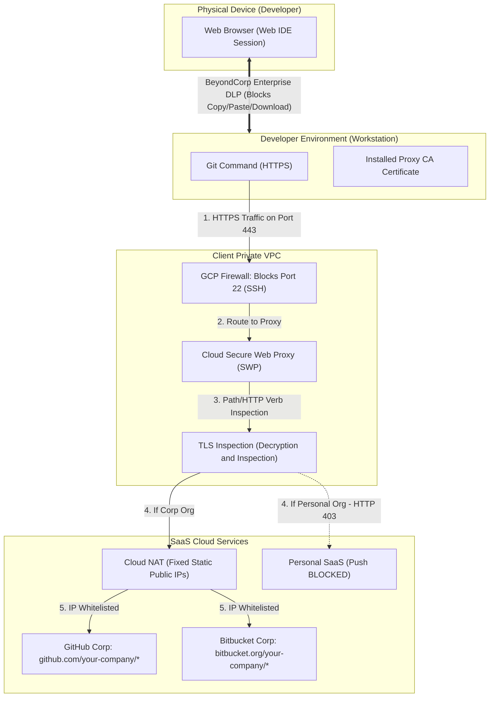

# Asset 1: Best Practices for Network Security and SaaS Traffic Isolation

This technical guide describes how to architect and implement a highly secure **Cloud Workstations** environment on the Google Cloud Platform (GCP). The primary focus of this guide is to **allow access to cloud-hosted SaaS services (GitHub.com and Bitbucket.org) for corporate purposes, while strictly preventing end-users from sharing or leaking intellectual property to personal repositories or accounts.**

---

## 1. Security Architecture Overview

To address the technical challenge where domains like `github.com` and `bitbucket.org` share the same public IP address blocks for both personal and corporate use, we propose an architecture based on **defense in depth**.

---

## 2. Fundamental Network and Isolation Elements

### 2.1 100% Private VPC Network (No Public IPs)
The underlying VMs for Cloud Workstations must be provisioned without external public IP addresses (`--disable-public-ip-addresses` in the workstation configuration). All infrastructure management traffic must flow through private routes managed by Google's network, secured by **Identity-Aware Proxy (IAP)**.

### 2.2 Private Google Access
You must enable **Private Google Access** on the VPC subnet. Without public IPs and direct internet routes, workstations rely on this feature to download base images from the Artifact Registry, send metrics to Cloud Logging, and communicate internally with GCP APIs using high-performance private routes.

---

## 3. SaaS Write Restriction Strategy (GitHub & Bitbucket)

To restrict code pushes to personal namespaces while maintaining corporate access, four combined network and data protection pillars are deployed:

### 3.1 Cloud Secure Web Proxy (SWP) with TLS Inspection
A standard L3/L4 firewall cannot filter HTTPS URL paths. On GCP, the best practice for application layer filtering (L7) is the **Cloud Secure Web Proxy (SWP)** integrated with **TLS Inspection**.

1. **Secure Decryption**: The SWP intercepts outbound HTTPS connections destined for GitHub and Bitbucket, temporarily decrypting them using an enterprise CA key generated and controlled by the client (configured via GCP Certificate Manager / CA Service). The corresponding certificate is installed as trusted in the workstation container.
2. **URL Path Inspection**: Once traffic is decrypted, the proxy analyzes the exact repository URL:
   - **Allowed**: `https://github.com/your-company/*` (GET and POST)
   - **Allowed**: `https://bitbucket.org/your-company/*` (GET and POST)
   - **Blocked**: `https://github.com/personal-profile/*` (Any POST/push)
3. **Selective Filtering by HTTP Verbs**: SWP can be configured to allow read commands (`GET` for `git clone/pull`) to external public repositories (facilitating the download of public packages), while **strictly blocking any write requests** (`POST`, `PUT`, `PATCH`) to destinations outside the approved corporate organization.

### 3.2 Data Loss Prevention with BeyondCorp Enterprise (BCE) DLP
Network isolation alone does not prevent a user from copying source code displayed in the editor and pasting it into a notepad on their physical machine. To seal this physical data exfiltration vector, we implement **BeyondCorp Enterprise** DLP rules:
* **Clipboard Blocking**: Prevents copy/paste actions between the developer's physical computer clipboard and the Cloud Workstations Web IDE editor.
* **Download Blocking**: Restricts the ability to download code files from the workstation to the user's local filesystem.
* **Print Blocking**: Disables the ability to print the screen content or save it to a local PDF without authorization.

### 3.3 Block Outbound SSH (Port 22)
The Git protocol over SSH (`git@github.com:...`) travels through an end-to-end encrypted binary stream over TCP port 22. Because SSH does not have the concept of HTTP headers or URL paths, it bypasses Secure Web Proxy inspection entirely.
* **Best Practice**: Implement a VPC Firewall rule with a `DENY` action and `EGRESS` direction to block any outbound traffic destined for port `22` on the workstation subnet.
* **How it works**: This forces the developer and container Git tools to use HTTPS transport over port `443`, which is filtered by the L7 proxy.

### 3.4 Cloud NAT with Static IPs (IP Whitelisting)
Associate **static** public external IP addresses (previously reserved in GCP Compute Engine) with the VPC's **Cloud NAT** gateway, instead of using automatic dynamic IP allocation.
* **Benefit**: Register these static enterprise IPs in the IP protection settings (IP Allow List) of your corporate GitHub Enterprise Cloud or Bitbucket Cloud organization.
* **Result**: Access to corporate SaaS will only be accepted when originating from secure workstations (which egress through the NAT with the registered IPs). If a developer attempts to access corporate repositories from their personal machine, the SaaS will reject the connection as it lies outside the allowed IP range.

---

## 4. Recommended Implementation Steps

To build your first secure network infrastructure designed to secure access to GitHub/Bitbucket SaaS and prevent data exfiltration, we recommend that your platform team follows these implementation steps:

1. **Provision the Private VPC** and enable Private Google Access on the main subnet.
2. **Configure Cloud Secure Web Proxy (SWP)** with TLS Inspection integrated with Certificate Manager to intercept and audit outbound HTTPS traffic destined for `github.com` and `bitbucket.org`.
3. **Create L7 Security Policies in SWP** that strictly block POST/PUT/PATCH methods for URL paths outside the corporate organization namespace (e.g., allowing only `github.com/your-company/*` and `bitbucket.org/your-company/*`).
4. **Enable BeyondCorp Enterprise DLP Policies** in the workstation settings to block copying, pasting, and downloading data to the physical machine.
5. **Implement the SSH Block Rule (Port 22)** from the very first day of environment validation to force the use of the secure HTTPS protocol, enabling traffic inspection.
6. **Associate Static Public IPs with Cloud NAT** and register them in the IP Allow List of your corporate GitHub/Bitbucket SaaS organizations to restrict access exclusively to connections originating from authorized workstations.
