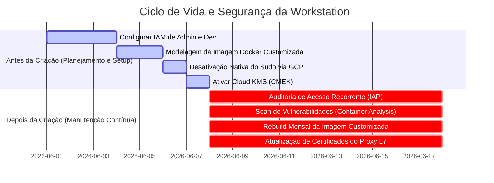

# Asset 2: Melhores Práticas de Controle de Acesso, Manutenção e Imagens Customizadas

Este guia prático descreve as melhores práticas de **Controle de Acesso (IAM/IAP/Context-Aware)**, **Manutenção Preventiva** e, especialmente, os **Requisitos Indispensáveis para Imagens Customizadas** no ecossistema do **Cloud Workstations**.

A segurança e estabilidade das workstations dependem não apenas de uma rede VPC isolada (Asset 1), mas também do controle rígido de identidades, da conformidade operacional contínua, da desativação nativa de privilégios e de um ciclo de vida estruturado para as imagens Docker utilizadas pelos desenvolvedores.

---

## 📋 Resumo Executivo: Pré vs. Pós-Criação

Para garantir o funcionamento regular e seguro das workstations corporativas, o ciclo operacional é estruturado em duas fases críticas:



---

## 1. Requisitos Indispensáveis e Estrutura Base para Imagens Customizadas

Uma imagem customizada no Cloud Workstations é um container Docker herdado de uma imagem base homologada que é empacotado com ferramentas de desenvolvimento, utilitários corporativos e configurações imutáveis de conformidade. 

Recomenda-se seguir estes requisitos indispensáveis e estruturas recomendadas para criar e manter imagens de desenvolvimento seguras:

### 1.1 Requisitos Indispensáveis (Hard Requirements)

1. **Herança de Imagem Base Oficial**:
   - Toda imagem customizada deve herdar obrigatoriamente de uma imagem oficial do Google (disponíveis no Artifact Registry oficial, como `us-central1-docker.pkg.dev/cloud-workstations-images/predefined/code-oss:latest` para desenvolvimento geral ou `.../predefined/base:latest` para outras IDEs).
   - **Por que é obrigatório?** As imagens oficiais vêm pré-configuradas com os proxies gRPC, agentes de comunicação de rede do control plane e dependências de runtime que permitem ao serviço do Cloud Workstations se conectar e gerenciar a sessão da IDE de forma segura.
2. **Contexto de Execução Não-Root (`user:1000`)**:
   - Por segurança, o container deve alternar o contexto de execução de volta para o usuário comum (`USER user` de UID/GID `1000`) ao final do Dockerfile.
   - **Por que é obrigatório?** Impedir que o desenvolvedor final acesse o terminal e as ferramentas da IDE como `root` evita a desativação de controles locais do sistema de dentro do container.
3. **Resolução do Desafio do Ciclo de Vida Efêmero do `/home/user`**:
   - Quando as Cloud Workstations ligam, o Google monta um disco persistente sobreposto no diretório `/home/user`. Isso significa que qualquer arquivo copiado para `/home/user` durante a construção da imagem Docker (`docker build`) é "ocultado" ou perdido no runtime.
   - **Solução Mandatória**: Utilizar scripts em `/etc/workstation-startup.d/` (como o `210_setup_corporate_git.sh`). Esses scripts rodam como `root` a cada boot *após* a montagem bem-sucedida do disco persistente, permitindo injetar de forma dinâmica os links simbólicos de diretrizes (AGENTS.md) e configurações sem o risco de ocultação de arquivos.
4. **Git Hardening com core.hooksPath Global**:
   - Em vez de confiar em ganchos locais nos diretórios `.git/hooks` de cada repositório (os quais o usuário poderia excluir ou alterar), a melhor prática é definir a propriedade global `core.hooksPath` em `/etc/gitconfig` apontando para `/etc/git/hooks/`.
   - Essa pasta pertence ao `root` e é configurada como somente leitura para o usuário de desenvolvimento. Dessa forma, todos os ganchos Git de segurança (como o bloqueio de exfiltração `pre-push`) são aplicados de forma imutável em qualquer repositório (atual ou novo), sem possibilidade de desvio pelo desenvolvedor.

### 1.2 Estrutura Base Recomendada de Pastas

Para manter a conformidade do ambiente, estruture o sistema de arquivos do seu container com os seguintes diretórios corporativos padrões:

* `/etc/security/`: Pasta administrativa para armazenar diretrizes locais e políticas de conformidade (ex: `AGENTS.md`), visíveis no workspace em formato somente-leitura.
* `/etc/workstation-startup.d/`: Pasta padrão de boot do sistema. Qualquer script executável colocado aqui (ex: `210_setup_corporate_git.sh`) é disparado de forma automática como `root` no boot do container, após a montagem do disco persistente `/home/user`.
* `/etc/git/hooks/`: Diretório base para armazenar ganchos globais do Git de forma imutável para o usuário comum.
* `/usr/local/share/ca-certificates/`: Diretório padrão do Debian/Ubuntu para depósito de certificados corporativos privados `.crt`, necessários para validar a confiança nas cadeias de decodificação TLS.

---

## 2. Controle de Acesso, Sudo e IAM (Identity and Access Management)

O princípio do **Menor Privilégio** e do **Zero Trust** devem reger a atribuição de permissões no Google Cloud.

### 🛑 ANTES DA CRIAÇÃO (Configuração de Segurança Inicial)

#### A. Desativação Nativa de Privilégios Sudo (Bloqueio Absoluto)
A melhor prática para impedir que desenvolvedores alterem configurações de rede, instalem ferramentas não autorizadas ou desativem os ganchos de segurança locais é desativar por completo as permissões de `sudo/root`.
* **Como fazer**: Na criação da **Workstation Configuration** no GCP, defina a seguinte variável de ambiente integrada do plano de controle:
  ```text
  CLOUD_WORKSTATIONS_CONFIG_DISABLE_SUDO = true
  ```
* **Vantagem arquitetural**: Essa flag é um controle nativo gerenciado diretamente pelo Google Cloud. Ela retira completamente o usuário `user` do grupo de sudoers e impede a elevação de privilégios de forma nativa e imutável pelo plano de controle, tornando impossível qualquer bypass local mesmo que o container venha com heranças indesejadas de sudo.

#### B. Segregação de Papéis no IAM (Roles)
Nunca conceda privilégios amplos (como `roles/owner` ou `roles/editor`) aos desenvolvedores ou administradores no projeto. Utilize papéis específicos:
* **Equipe de Infraestrutura e Plataforma (Admins)**:
  - `roles/workstations.admin` (Permite criar e gerenciar clusters e configurações, mas não concede acesso de leitura ao terminal interno ou código dos desenvolvedores).
  - `roles/compute.networkAdmin` (Gerencia redes VPC, subredes e firewalls).
  - `roles/artifactregistry.admin` (Gerencia repositórios de imagens Docker).
* **Desenvolvedores (Usuários Finais)**:
  - `roles/workstations.user` (Permite iniciar, parar e usar a workstation associada).
  - > [!IMPORTANT]
    > **Regra de Ouro**: O papel `roles/workstations.user` **NÃO** deve ser concedido em nível de projeto ou cluster. Ele deve ser atribuído **individualmente em cada instância de workstation criada**. Isso impede que o Desenvolvedor A acesse ou modifique o ambiente de trabalho do Desenvolvedor B.

#### C. Integração com Context-Aware Access (ACM)
Além de proteger o acesso com o Identity-Aware Proxy (IAP), integre o **Context-Aware Access** do BeyondCorp Enterprise.
* **Benefício**: Garante que o desenvolvedor só consiga estabelecer uma conexão com a IDE na nuvem se estiver acessando a partir de um dispositivo confiável da organização (por exemplo, exigindo um certificado corporativo instalado na máquina física, origem de IPs de filiais cadastradas ou geolocalizações homologadas).

---

## 3. Manutenção Operacional e Segurança de Credenciais

### 🔄 DEPOIS DA CRIAÇÃO (Rotinas de Sustentação Regular)

#### A. Armazenamento Seguro de Credenciais via Google Secret Manager
Nunca salve chaves SSH privadas, tokens de acesso pessoal (PATs) do GitHub/Bitbucket ou credenciais corporativas de forma estática (`hardcoded`) em imagens Docker ou nos scripts de boot localizados no código-fonte.
* **Melhor Prática**: Aloque as credenciais no **Google Secret Manager** e conceda acesso de leitura apenas à Service Account associada à workstation (`roles/secretmanager.secretAccessor`). No script de boot `/etc/workstation-startup.d/210_setup_corporate_git.sh`, utilize a ferramenta de linha de comando `gcloud` pré-instalada para buscar dinamicamente os segredos em tempo de boot e injetá-los diretamente na memória ou em arquivos locais protegidos do usuário final.

#### B. Reconstrução Periódica de Imagens (Rebuild Mensal)
Os patches de segurança de sistemas operacionais e ferramentas de desenvolvimento (como o Code OSS e o Chrome) são lançados quase diariamente.
* **Prática recomendada**: Configure um gatilho de agendamento (Cloud Scheduler + Cloud Build) para realizar um **rebuild completo** da imagem de desenvolvimento pelo menos **uma vez por mês** ou imediatamente após a divulgação de vulnerabilidades de dia zero (0-day). Isso garante pacotes sempre atualizados no boot da máquina.

#### C. Ciclo de Vida Automatizado (Idle Timeout e Auto-Stop)
Estações de trabalho esquecidas ligadas são focos de risco à segurança e de custos desnecessários.
* **Prática recomendada**: Defina o tempo de desligamento automático por inatividade (**Idle Timeout**) em no máximo **30 minutos** (`1800s`), e um tempo de execução máximo diário de **12 horas** (`43200s`) na Workstation Configuration.
* **Resultado**: Garante que os containers sejam destruídos regularmente, forçando a atualização constante a partir da imagem Docker consolidada mais recente no próximo boot.
