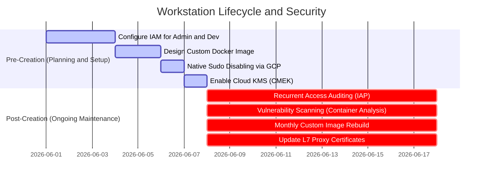

# Asset 2: Best Practices for Access Control, Maintenance, and Custom Images

This practical guide describes the best practices for **Access Control (IAM/IAP/Context-Aware)**, **Preventive Maintenance**, and, especially, the **Indispensable Requirements for Custom Images** within the **Cloud Workstations** ecosystem.

The security and stability of workstations depend not only on an isolated VPC network (Asset 1) but also on the strict control of identities, continuous operational compliance, native privilege disabling, and a structured lifecycle for the Docker images used by developers.

---

## 📋 Executive Summary: Pre vs. Post-Creation

To ensure the secure and regular operation of corporate workstations, the operational lifecycle is structured into two critical phases:



---

## 1. Indispensable Requirements and Base Structure for Custom Images

A custom image in Cloud Workstations is a Docker container inherited from an approved base image packaged with development tools, enterprise utilities, and immutable compliance settings. 

These indispensable requirements and recommended structures must be followed to create and maintain secure development images:

### 1.1 Indispensable Requirements (Hard Requirements)

1. **Inheritance from an Official Base Image**:
   - Every custom image must inherit from an official Google base image (available in the official Artifact Registry, such as `us-central1-docker.pkg.dev/cloud-workstations-images/predefined/code-oss:latest` for general development or `.../predefined/base:latest` for other IDEs).
   - **Why is this mandatory?** Google's official images come pre-configured with internal gRPC proxies, control plane communication agents, and runtime dependencies that allow the Cloud Workstations service to connect and manage the IDE session securely.
2. **Non-Root Execution Context (`user:1000`)**:
   - For security, the container must switch the execution context back to the default non-root user (`USER user` with UID/GID `1000`) at the end of the Dockerfile.
   - **Why is this mandatory?** Preventing the end developer from accessing the terminal and IDE tools as `root` blocks the disabling of local security controls on the operating system from within the container.
3. **Solving the Transient `/home/user` Mount Challenge**:
   - When a Cloud Workstation starts, Google mounts a persistent volume over the `/home/user` directory. This means any file copied to `/home/user` during the container image build (`docker build`) is "hidden" or lost at runtime.
   - **Mandatory Solution**: Use scripts in `/etc/workstation-startup.d/` (such as `210_setup_corporate_git.sh`). These scripts run as `root` on every boot *after* the persistent disk is mounted, allowing you to dynamically inject directory symlinks (like AGENTS.md) and configurations without the risk of hiding files.
4. **Git Hardening with Global core.hooksPath**:
   - Instead of relying on local hooks inside each repository's `.git/hooks` directory (which users could delete or modify), the best practice is to define the global property `core.hooksPath` in `/etc/gitconfig` pointing to `/etc/git/hooks/`.
   - This folder is owned by `root` and configured as read-only for the development user. Thus, all security Git hooks (such as the `pre-push` exfiltration block) are applied immutably across all repositories (current or new), with no possibility of bypass by the developer.

### 1.2 Recommended Folder Structure

To maintain environment compliance, structure your container's filesystem with the following standard corporate directories:

* `/etc/security/`: Administrative folder to store local compliance guidelines and client policies (e.g., `AGENTS.md`), visible in the workspace in a read-only format.
* `/etc/workstation-startup.d/`: Standard system boot folder. Any executable script placed here (e.g., `210_setup_corporate_git.sh`) is automatically triggered as `root` when the container starts, after the persistent disk `/home/user` is mounted.
* `/etc/git/hooks/`: Base directory to store global Git hooks immutably for the default user.
* `/usr/local/share/ca-certificates/`: Default Debian/Ubuntu directory for depositing private corporate `.crt` certificates, necessary to validate trust in TLS decryption chains.

---

## 2. Access Control, Sudo, and IAM (Identity and Access Management)

The principles of **Least Privilege** and **Zero Trust** must govern the assignment of permissions in Google Cloud.

### 🛑 PRE-CREATION (Initial Security Setup)

#### A. Native Disabling of Sudo Privileges (Absolute Block)
The best practice to prevent developers from changing network settings, installing unauthorized tools, or disabling local security hooks is to disable `sudo/root` permissions completely.
* **How to configure**: When creating the **Workstation Configuration** in GCP, set the following integrated environment variable:
  ```text
  CLOUD_WORKSTATIONS_CONFIG_DISABLE_SUDO = true
  ```
* **Architectural Advantage**: This flag is a native control managed directly by Google Cloud. It completely removes the `user` from the sudoers group and prevents privilege elevation natively and immutably from the control plane, making local bypass impossible even if the container inherits sudo capabilities.

#### B. Segregation of IAM Roles
Never grant broad privileges (such as `roles/owner` or `roles/editor`) to developers or workstation administrators in the project. Use specific roles:
* **Infrastructure and Platform Team (Admins)**:
  - `roles/workstations.admin` (Allows creating, deleting, and managing workstation clusters and configurations, but does not grant access to the internal terminal or developers' code).
  - `roles/compute.networkAdmin` (Manages VPC networks, subnets, and firewalls).
  - `roles/artifactregistry.admin` (Manages Docker image repositories).
* **Developers (End-Users)**:
  - `roles/workstations.user` (Allows starting, stopping, and using the associated workstation).
  - > [!IMPORTANT]
    > **Golden Rule**: The role `roles/workstations.user` must **NOT** be granted at the project or cluster level. It must be assigned **individually to each created workstation instance**. This prevents Developer A from accessing or modifying Developer B's workspace.

#### C. Context-Aware Access Integration (ACM)
In addition to securing access via Identity-Aware Proxy (IAP), integrate BeyondCorp Enterprise's **Context-Aware Access**.
* **Benefit**: Ensures that developers can only establish a connection to the IDE in the cloud if they access it from a trusted organization device (e.g., requiring an enterprise certificate installed on the physical machine, coming from registered corporate IP ranges, or approved geolocations).

---

## 3. Operational Maintenance and Credential Security

### 🔄 POST-CREATION (Regular Support Routines)

#### A. Secure Credential Storage via Google Secret Manager
Never save private SSH keys, personal access tokens (PATs) for GitHub/Bitbucket, or corporate credentials as static (`hardcoded`) text in Docker images or boot scripts stored in source control.
* **Best Practice**: Store credentials in **Google Secret Manager** and grant read access only to the Service Account associated with the workstation (`roles/secretmanager.secretAccessor`). In the boot script `/etc/workstation-startup.d/210_setup_corporate_git.sh`, use the pre-installed `gcloud` CLI to fetch secrets dynamically at boot time and inject them directly into memory or protected local files for the end-user.

#### B. Periodic Image Rebuilds (Monthly Rebuild)
Security patches for operating systems and development tools (like Code OSS and Chrome) are released almost daily.
* **Best Practice**: Set up a scheduling trigger (Cloud Scheduler + Cloud Build) to perform a **full rebuild** of the development image at least **once a month** or immediately after zero-day (0-day) vulnerabilities are announced. This ensures updated packages at machine boot.

#### C. Automated Lifecycle (Idle Timeout and Auto-Stop)
Workstations left running present both security risks and unnecessary costs.
* **Best Practice**: Set the automatic shutdown for inactivity (**Idle Timeout**) to a maximum of **30 minutes** (`1800s`), and a maximum daily execution limit of **12 hours** (`43200s`) in the Workstation Configuration.
* **Result**: Ensures that containers are destroyed regularly, forcing constant updates from the latest consolidated Docker image at the next boot.
