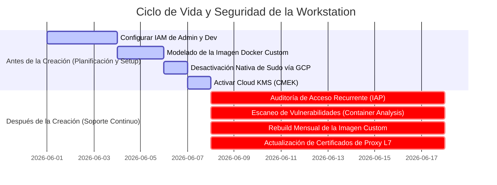

# Asset 2: Mejores Prácticas de Control de Acceso, Mantenimiento e Imágenes Personalizadas

Esta guía práctica describe las mejores prácticas de **Control de Acceso (IAM/IAP/Context-Aware)**, **Mantenimiento Preventivo** y, especialmente, los **Requisitos Indispensables para Imágenes Personalizadas** en el ecosistema de **Cloud Workstations**.

La seguridad y estabilidad de las workstations dependen no solo de una red VPC aislada (Asset 1), sino también del control estricto de identidades, del cumplimiento operativo continuo, de la desactivación nativa de privilegios y de un ciclo de vida estructurado para las imágenes Docker utilizadas por los desarrolladores.

---

## 📋 Resumen Ejecutivo: Pre vs. Post-Creación

Para garantizar el funcionamiento regular y seguro de las workstations corporativas, el ciclo operativo se estructura en dos fases críticas:



---

## 1. Requisitos Indispensables y Estructura Base para Imágenes Personalizadas

Una imagen personalizada en Cloud Workstations es un contenedor Docker heredado de una imagen base homologada que se empaqueta con herramientas de desarrollo, utilidades corporativas y configuraciones inmutables de cumplimiento. 

Se recomienda seguir estos requisitos indispensables y estructuras recomendadas para crear y mantener imágenes de desarrollo seguras:

### 1.1 Requisitos Indispensables (Hard Requirements)

1. **Herencia de Imagen Base Oficial**:
   - Toda imagen personalizada debe heredar obligatoriamente de una imagen oficial de Google (disponibles en el Artifact Registry oficial, como `us-central1-docker.pkg.dev/cloud-workstations-images/predefined/code-oss:latest` para desarrollo general o `.../predefined/base:latest` para otros IDEs).
   - **¿Por qué es obligatorio?** Las imágenes oficiales vienen preconfiguradas con los proxies gRPC, agentes de comunicación de red del plano de control y dependencias de runtime que permiten al servicio de Cloud Workstations conectarse y gestionar la sesión de la IDE de forma segura.
2. **Contexto de Ejecución No-Root (`user:1000`)**:
   - Por seguridad, el contenedor debe alternar el contexto de ejecución de regreso al usuario común (`USER user` con UID/GID `1000`) al final del Dockerfile.
   - **¿Por qué es obligatorio?** Impedir que el desarrollador final acceda a la terminal y a las herramientas de la IDE como `root` evita la desactivación de controles locales de seguridad del sistema desde el contenedor.
3. **Resolución del Desafío del Ciclo de Vida Efímero de `/home/user`**:
   - Cuando las Cloud Workstations se encienden, Google monta un disco persistente sobrepuesto en el directorio `/home/user`. Esto significa que cualquier archivo copiado en `/home/user` durante la construcción de la imagen Docker (`docker build`) se "oculta" o se pierde en el runtime.
   - **Solución Obligatoria**: Utilizar scripts en `/etc/workstation-startup.d/` (como `210_setup_corporate_git.sh`). Estos scripts se ejecutan como `root` en cada arranque *después* del montaje exitoso del disco persistente, permitiendo inyectar dinámicamente los enlaces simbólicos de directrices (AGENTS.md) y configuraciones sin riesgo de ocultamiento de archivos.
4. **Git Hardening con core.hooksPath Global**:
   - En lugar de confiar en ganchos locales en los directorios `.git/hooks` de cada repositorio (los cuales el usuario podría eliminar o alterar), la mejor práctica es definir la propiedad global `core.hooksPath` en `/etc/gitconfig` apuntando a `/etc/git/hooks/`.
   - Esta carpeta pertenece al `root` y está configurada como de solo lectura para el usuario de desarrollo. De esta forma, todos los ganchos Git de seguridad (como el bloqueo de exfiltración `pre-push`) se aplican de forma inmutable en cualquier repositorio (actual o nuevo), sin posibilidad de desvío por parte del desarrollador.

### 1.2 Estructura Base Recomendada de Carpetas

Para mantener el cumplimiento del entorno, estructure el sistema de archivos de su contenedor con los siguientes directorios corporativos estándares:

* `/etc/security/`: Carpeta administrativa para almacenar directrices locales y políticas de cumplimiento (por ejemplo, `AGENTS.md`), visibles en el espacio de trabajo en formato de solo lectura.
* `/etc/workstation-startup.d/`: Carpeta estándar de inicio del sistema. Cualquier script ejecutable colocado aquí (por ejemplo, `210_setup_corporate_git.sh`) se ejecuta automáticamente como `root` al iniciar el contenedor, después de montar el disco persistente `/home/user`.
* `/etc/git/hooks/`: Directorio base para almacenar ganchos globales de Git de forma inmutable para el usuario común.
* `/usr/local/share/ca-certificates/`: Directorio estándar de Debian/Ubuntu para depósito de certificados corporativos privados `.crt`, necesarios para validar la confianza en las cadenas de descifrado TLS.

---

## 2. Control de Acceso, Sudo e IAM (Identity and Access Management)

El principio de **Menor Privilegio** y de **Zero Trust** deben regir la asignación de permisos en Google Cloud.

### 🛑 ANTES DE LA CREACIÓN (Configuración de Seguridad Inicial)

#### A. Desactivación Nativa de Privilegios Sudo (Bloqueo Absoluto)
La mejor práctica para impedir que los desarrolladores alteren configuraciones de red, instalen herramientas no autorizadas o desactiven los ganchos de seguridad locales es desactivar por completo los permisos de `sudo/root`.
* **Cómo configurar**: En la creación de la **Workstation Configuration** en GCP, defina la siguiente variable de entorno integrada del plano de control:
  ```text
  CLOUD_WORKSTATIONS_CONFIG_DISABLE_SUDO = true
  ```
* **Ventaja arquitectónica**: Esta bandera es un control nativo gestionado directamente por Google Cloud. Retira por completo al usuario `user` del grupo de sudoers e impide la elevación de privilegios de forma nativa e inmutable por el plano de control, haciendo imposible cualquier bypass local incluso si el contenedor hereda privilegios.

#### B. Segregación de Roles en el IAM (Roles)
Nunca conceda privilegios amplios (como `roles/owner` o `roles/editor`) a los desarrolladores o administradores en el proyecto. Utilice roles específicos:
* **Equipo de Infraestructura y Plataforma (Admins)**:
  - `roles/workstations.admin` (Permite crear y gestionar clusters y configuraciones, pero no concede acceso de lectura al terminal interno o al código de los desarrolladores).
  - `roles/compute.networkAdmin` (Gestiona redes VPC, subredes y firewalls).
  - `roles/artifactregistry.admin` (Gestiona repositorios de imágenes Docker).
* **Desarrolladores (Usuarios Finales)**:
  - `roles/workstations.user` (Permite iniciar, detener y usar la workstation asociada).
  - > [!IMPORTANT]
    > **Regla de Oro**: El rol `roles/workstations.user` **NO** debe concederse a nivel de proyecto o cluster. Debe asignarse **individualmente en cada instancia de workstation creada**. Esto impide que el Desarrollador A acceda o modifique el espacio de trabajo del Desarrollador B.

#### C. Integración con Context-Aware Access (ACM)
Además de proteger el acceso con Identity-Aware Proxy (IAP), integre el **Context-Aware Access** de BeyondCorp Enterprise.
* **Beneficio**: Garantiza que el desarrollador solo pueda establecer una conexión con la IDE en la nube si accede desde un dispositivo de confianza de la organización (por ejemplo, exigiendo un certificado corporativo instalado en la máquina física, origen de rangos de IP de sucursales registradas o geolocalizaciones homologadas).

---

## 3. Mantenimiento Operativo y Seguridad de Credenciales

### 🔄 DESPUÉS DE LA CREACIÓN (Rutinas de Soporte Regular)

#### A. Almacenamiento Seguro de Credenciales vía Google Secret Manager
Nunca guarde claves SSH privadas, tokens de acceso personal (PATs) de GitHub/Bitbucket o credenciales corporativas de forma estática (`hardcoded`) en imágenes Docker o en scripts de inicio localizados en el código fuente.
* **Mejor Práctica**: Aloje las credenciales en **Google Secret Manager** y conceda acceso de lectura solo a la Service Account asociada a la workstation (`roles/secretmanager.secretAccessor`). En el script de inicio `/etc/workstation-startup.d/210_setup_corporate_git.sh`, utilice la herramienta de línea de comandos `gcloud` preinstalada para buscar dinámicamente los secretos en tiempo de inicio e inyectarlos directamente en la memoria o en archivos locales protegidos para el usuario final.

#### B. Reconstrucción Periódica de Imágenes (Rebuild Mensual)
Los parches de seguridad de sistemas operativos y herramientas de desarrollo (como Code OSS y Chrome) se lanzan casi a diario.
* **Práctica recomendada**: Configure un activador de programación (Cloud Scheduler + Cloud Build) para realizar un **rebuild completo** de la imagen de desarrollo al menos **una vez al mes** o inmediatamente después de la divulgación de vulnerabilidades de día cero (0-day). Esto garantiza paquetes siempre actualizados en el arranque de la máquina.

#### C. Ciclo de Vida Automatizado (Idle Timeout y Auto-Stop)
Las estaciones de trabajo que se dejan encendidas son focos de riesgo de seguridad y costos innecesarios.
* **Práctica recomendada**: Defina el tiempo de apagado automático por inactividad (**Idle Timeout**) en un máximo de **30 minutos** (`1800s`), y un tiempo de ejecución máximo diario de **12 horas** (`43200s`) en la Workstation Configuration.
* **Resultado**: Garantiza que los contenedores se destruyan regularmente, forzando la actualización constante a partir de la imagen Docker consolidada más reciente en el próximo arranque.
