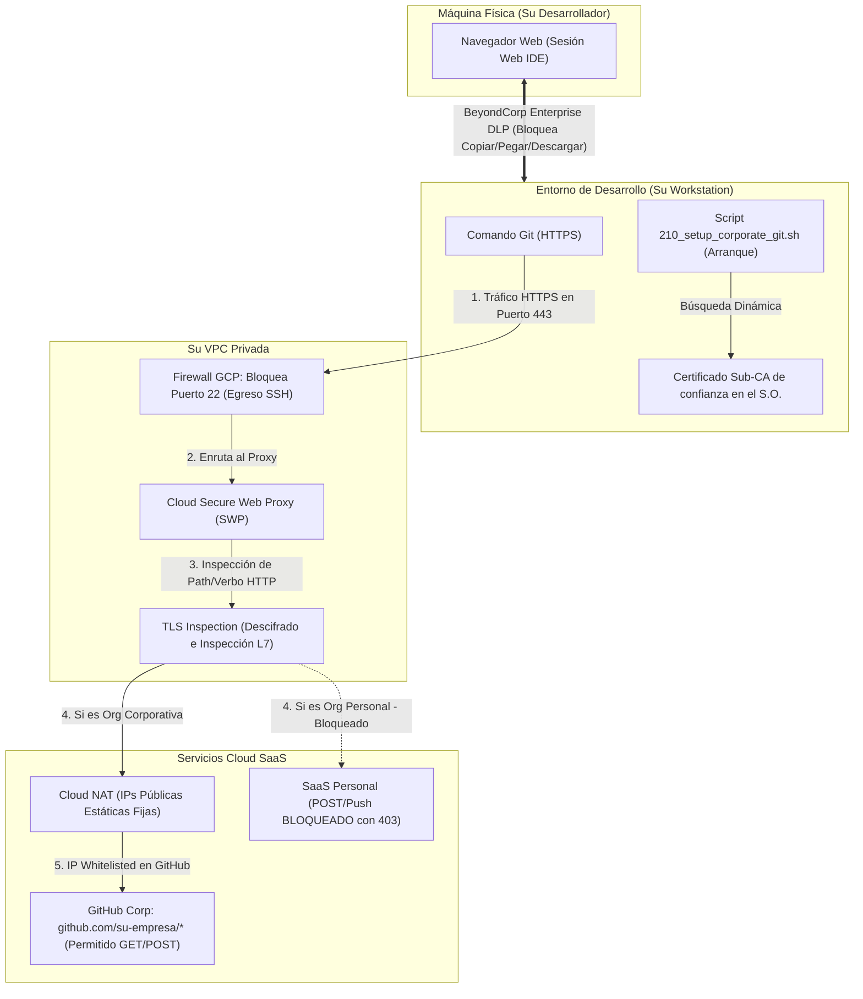

# Manual de Implementación: Su Entorno Seguro de Desarrollo con Cloud Workstations

Este manual ha sido diseñado para guiar a su equipo de ingeniería y plataforma, paso a paso, en el aprovisionamiento de **su entorno de desarrollo seguro basado en Cloud Workstations en Google Cloud Platform (GCP)**.

---

## 🚀 Cómo usar este manual sin edición manual de comandos
Para hacer que la instalación sea rápida y libre de errores de digitación, **su equipo no necesita editar los comandos individualmente**.

Basta con rellenar las variables en el bloque único a continuación, copiarlo y pegarlo en su **Google Cloud Shell** (o terminal con gcloud autenticado). A partir de ese momento, todas las fases del manual utilizarán las variables de entorno activas en la terminal (`$GCP_PROJECT_ID`, `$VPC_NAME`, etc.) de forma automática.

### 📌 Copie y pegue este bloque de variables en su terminal antes de comenzar:

```bash
# ==============================================================================
# BLOQUE DE CONFIGURACIÓN DE VARIABLES (RELLENE CON SUS VALORES)
# ==============================================================================
export GCP_PROJECT_ID="su-empresa-workstations-prod"     # ID de su proyecto de GCP
export GCP_PROJECT_NUMBER="123456789012"                 # Número de su proyecto de GCP
export GCP_REGION="us-central1"                          # Región para los recursos
export GCP_ZONE="us-central1-a"                          # Zona para la workstation
export VPC_NAME="su-empresa-vpc"                        # Nombre de la red VPC principal
export SUBNET_NAME="su-empresa-workstations-subnet"     # Nombre de la subred de workstations
export CORP_ORG_NAME="su-empresa-github"                # Nombre de su Org corporativa de GitHub
export REGISTRY_NAME="su-empresa-repo"                  # Nombre de su Artifact Registry
```

---

## 🗺️ Vista General Visual de Su Infraestructura

El flujo de comunicación y las barreras de seguridad operan según el modelo a continuación:



---

## 🛠️ FASE 1: Infraestructura de Red y Perímetro Seguro

El objetivo de esta fase es crear para su empresa una red privada aislada, sin puntos de salida de internet descontrolados, bloqueando canales de tráfico que evadan el proxy (como conexiones SSH directas).

### Paso 1.1: Crear la VPC Privada y la Subred de las Workstations
> [!NOTE]
> Creamos su red VPC y una subred con la funcionalidad **Private Google Access** activada. Esta característica es indispensable para que sus máquinas sin IPs públicas externas se comuniquen de forma segura con las APIs de Google Cloud.

```bash
# 1. Crear la red VPC en modo personalizado
gcloud compute networks create $VPC_NAME \
    --subnet-mode=custom \
    --project=$GCP_PROJECT_ID

# 2. Crear la subred de las Workstations con Private Google Access activado
gcloud compute networks subnets create $SUBNET_NAME \
    --network=$VPC_NAME \
    --range=10.10.0.0/24 \
    --region=$GCP_REGION \
    --enable-private-ip-google-access \
    --project=$GCP_PROJECT_ID
```

---

### Paso 1.2: Crear la Subred Exclusiva para el Proxy (Proxy-Only Subnet)
> [!IMPORTANT]
> El Secure Web Proxy (SWP) de Google Cloud se basa en instancias Envoy administradas internas. Requiere que cree una subred de tipo `PROXY_ONLY` en la misma región para asignar sus IPs internas de proxy.

```bash
gcloud compute networks subnets create secure-proxy-subnet \
    --network=$VPC_NAME \
    --range=10.129.0.0/23 \
    --region=$GCP_REGION \
    --purpose=REGIONAL_MANAGED_PROXY \
    --role=ACTIVE \
    --project=$GCP_PROJECT_ID
```

---

### Paso 1.3: Bloquear Conexiones de Salida vía SSH (Puerto 22)
> [!CAUTION]
> El protocolo Git por SSH (`git@github.com:...`) está cifrado de extremo a extremo e impide la inspección L7 de su proxy. El bloqueo del puerto 22 de salida obliga a todo el tráfico Git a usar obligatoriamente HTTPS (puerto 443), permitiendo la auditoría profunda de URLs.

```bash
gcloud compute firewall-rules create deny-ssh-egress \
    --network=$VPC_NAME \
    --direction=EGRESS \
    --priority=1000 \
    --action=DENY \
    --rules=tcp:22 \
    --destination-ranges=0.0.0.0/0 \
    --description="Bloquear cualquier conexion SSH de salida a internet para forzar uso de HTTPS" \
    --project=$GCP_PROJECT_ID
```

---

### Paso 1.4: Configurar Cloud NAT con IPs Estáticas
> [!TIP]
> En lugar de exponer las conexiones a IPs dinámicas y rotativas, creamos IPs públicas fijas. Deben registrar estas IPs fijas en la política de seguridad de acceso (Lista de Permitidos de IP) de sus cuentas corporativas de GitHub/Bitbucket Enterprise.

```bash
# 1. Reservar la IP publica estática para su organizacion
gcloud compute addresses create workstations-nat-ip \
    --region=$GCP_REGION \
    --project=$GCP_PROJECT_ID

# 2. Crear el Cloud Router
gcloud compute routers create workstations-router \
    --network=$VPC_NAME \
    --region=$GCP_REGION \
    --project=$GCP_PROJECT_ID

# 3. Crear el Cloud NAT asociado a la IP estática reservada
gcloud compute routers nats create workstations-nat \
    --router=workstations-router \
    --region=$GCP_REGION \
    --nat-custom-ips=workstations-nat-ip \
    --nat-gateway-cos-all-subnet-ip-ranges \
    --project=$GCP_PROJECT_ID
```

---

## 🔑 FASE 2: Autoridad Certificadora y TLS Inspection

Para que el Secure Web Proxy pueda inspeccionar el contenido de las URLs HTTPS cifradas, necesita decodificar el tráfico de salida. Para hacer esto de forma segura, creamos una Autoridad Certificadora regional en su **Private CA Service**.

### Paso 2.1: Crear el CA Pool Regional
```bash
gcloud privateca pools create secure-workstations-ca-pool \
    --location=$GCP_REGION \
    --tier=dev \
    --project=$GCP_PROJECT_ID
```

---

### Paso 2.2: Crear la Subordinate CA en su Pool
```bash
gcloud privateca subordinates create secure-workstations-sub-ca \
    --pool=secure-workstations-ca-pool \
    --location=$GCP_REGION \
    --create-ca \
    --common-name="Secure Workstations Subordinate CA" \
    --organization="$CORP_ORG_NAME" \
    --project=$GCP_PROJECT_ID
```

---

### Paso 2.3: Configurar el Certificado del Proxy en Certificate Manager
> [!NOTE]
> Creamos una referencia en su GCP Certificate Manager que apunta a su CA subordinada regional. El proxy utilizará esta estructura para firmar de forma dinámica los certificados de interceptación de tráfico.

```bash
gcloud certificate-manager certificates create secure-workstations-proxy-cert \
    --location=$GCP_REGION \
    --ca-pool=projects/$GCP_PROJECT_ID/locations/$GCP_REGION/caPools/secure-workstations-ca-pool \
    --project=$GCP_PROJECT_ID
```

---

### Paso 2.4: Conceder Permisos para la Service Account del Proxy (SWP)
> [!IMPORTANT]
> La Service Account interna de su proxy necesita autorización explícita en el IAM de GCP para firmar los certificados dinámicos en el CA Pool. Sin esto, el proxy fallará en las conexiones con el error `552 (handshake_failure)`.

```bash
gcloud privateca pools add-iam-policy-binding secure-workstations-ca-pool \
    --location=$GCP_REGION \
    --role=roles/privateca.certificateManager \
    --member="serviceAccount:service-$GCP_PROJECT_NUMBER@gcp-sa-networksecurity.iam.gserviceaccount.com" \
    --project=$GCP_PROJECT_ID
```

---

## 🛡️ FASE 3: Aprovisionamiento del Secure Web Proxy (SWP)

Esta fase configura las reglas inteligentes de su proxy para validar URLs y prevenir pérdidas de datos de forma automática en la capa de red.

### Paso 3.1: Crear la Gateway Security Policy
```bash
gcloud network-security gateway-security-policies create secure-workstations-policy \
    --location=$GCP_REGION \
    --tls-inspection-policy=projects/$GCP_PROJECT_ID/locations/$GCP_REGION/caPools/secure-workstations-ca-pool \
    --project=$GCP_PROJECT_ID
```

---

### Paso 3.2: Crear las Reglas de L7 en su Secure Web Proxy
> [!NOTE]
> Creamos reglas que separan el acceso corporativo completo de la lectura de librerías públicas externas. Note el uso de los matchers y las prioridades.

#### Regla A: Permitir Lectura y Escritura solo en su Org Corporativa (Prioridad 100)
Garantiza que comandos completos de Git (incluyendo `git push`) se liberen exclusivamente si la ruta de la URL de destino pertenece a su organización:

```bash
gcloud network-security gateway-security-policies rules create allow-corp-github \
    --gateway-security-policy=secure-workstations-policy \
    --location=$GCP_REGION \
    --priority=100 \
    --session-matcher="host() == 'github.com' || host() == 'api.github.com'" \
    --application-matcher="request.path.startsWith('/${CORP_ORG_NAME}/')" \
    --basic-profile=ALLOW \
    --tls-inspection-enabled \
    --project=$GCP_PROJECT_ID
```

#### Regla B: Permitir Solo Clone/Lectura (GET) de Repositorios Públicos (Prioridade 200)
Garantiza la productividad de su equipo permitiendo la descarga (GET/HEAD) y peticiones POST de negociación de clonación de repositorios externos, pero bloquea cualquier escritura:

```bash
gcloud network-security gateway-security-policies rules create allow-github-read \
    --gateway-security-policy=secure-workstations-policy \
    --location=$GCP_REGION \
    --priority=200 \
    --session-matcher="host() == 'github.com' || host() == 'api.github.com'" \
    --application-matcher="request.method == 'GET' || request.method == 'HEAD' || (request.method == 'POST' && request.path.endsWith('/git-upload-pack'))" \
    --basic-profile=ALLOW \
    --tls-inspection-enabled \
    --project=$GCP_PROJECT_ID
```

---

### Paso 3.3: Crear y Lanzar su Gateway del SWP
El Gateway del proxy será aprovisionado y asociado a su subred regional activa:

```bash
gcloud network-security gateways create secure-workstations-proxy \
    --location=$GCP_REGION \
    --addresses=10.10.0.100 \
    --ports=443 \
    --type=SECURE_WEB_PROXY \
    --gateway-security-policy=secure-workstations-policy \
    --network=$VPC_NAME \
    --subnetwork=$SUBNET_NAME \
    --project=$GCP_PROJECT_ID
```

---

## 🐳 FASE 4: Construcción de la Imagen Docker Personalizada Hardened

Creamos una imagen de contenedor Docker personalizada para su equipo de desarrollo. Aplica controles locales inmutables y garantiza que los contenedores confíen automáticamente en el certificado CA de su Proxy en el arranque.

### Paso 4.1: Crear la Estructura de Archivos en el Repositorio

Organice su carpeta de desarrollo local con la siguiente estructura de directorios:

```text
cloud-workstations-custom/
├── Dockerfile
├── config/
│   └── AGENTS.md (Directrices internas mostradas al desarrollador en el arranque)
├── scripts/
│   └── 210_setup_corporate_git.sh (Script de inicializacion ejecutado en el arranque)
└── docs/
    ├── networking/                  # Guía de Redes y SWP
    ├── access_control/              # Guía de Acceso y Mantenimiento
    └── installation_guide/          # El Paso a Paso Práctico
```

#### 📄 Dockerfile de Hardening y Configuración de Proxy
Cree el archivo `Dockerfile` con las siguientes instrucciones de seguridad enxutas:

```dockerfile
FROM us-central1-docker.pkg.dev/cloud-workstations-images/predefined/code-oss:latest
USER root

RUN apt-get update && apt-get install -y --no-install-recommends \
    wget gnupg ca-certificates \
    && wget -q -O - https://dl.google.com/linux/linux_signing_key.pub | gpg --dearmor -o /usr/share/keyrings/google-chrome-keyring.gpg \
    && echo "deb [arch=amd64 signed-by=/usr/share/keyrings/google-chrome-keyring.gpg] http://dl.google.com/linux/chrome/deb/ stable main" | tee /etc/apt/sources.list.d/google-chrome.list > /dev/null \
    && apt-get update && apt-get install -y --no-install-recommends google-chrome-stable \
    && apt-get clean && rm -rf /var/lib/apt/lists/*

RUN mkdir -p /etc/security
COPY config/AGENTS.md /etc/security/AGENTS.md
RUN chmod 644 /etc/security/AGENTS.md

RUN printf '[url "https://github.com/"]\n\tinsteadOf = git@github.com:\n[url "https://bitbucket.org/"]\n\tinsteadOf = git@bitbucket.org:\n[core]\n\thooksPath = /etc/git/hooks\n' > /etc/gitconfig \
    && chmod 644 /etc/gitconfig

RUN mkdir -p /etc/git/hooks
RUN printf '#!/bin/bash\n# Hook global de pre-push contra exfiltracion de datos\nORG_PERMITIDA="${ALLOWED_ORG:-su-empresa}"\nwhile read local_ref local_sha remote_ref remote_sha; do\n\tREMOTE_URL=$(git remote get-url origin 2>/dev/null)\n\tif [[ ! "$REMOTE_URL" =~ (github\\.com|bitbucket\\.org)/$ORG_PERMITIDA/ ]]; then\n\t\techo "=========================================================="\n\t\techo "🚨 ERROR: TENTATIVA DE EXFILTRACIÓN DETECTADA 🚨"\n\t\techo "Pushes permitidos únicamente para la organizacion: $ORG_PERMITIDA"\n\t\techo "=========================================================="\n\t\texit 1\n\tfi\ndone\nexit 0\n' > /etc/git/hooks/pre-push \
    && chmod 755 /etc/git/hooks/pre-push

RUN mkdir -p /usr/local/share/ca-certificates/corp-proxy

COPY scripts/210_setup_corporate_git.sh /etc/workstation-startup.d/210_setup_corporate_git.sh
RUN chmod +x /etc/workstation-startup.d/210_setup_corporate_git.sh
```

#### 📄 Script de Inicialización (`scripts/210_setup_corporate_git.sh`)
Cree el archivo del script que instala de forma dinámica el certificado de red de salida en el arranque de la máquina:

```bash
#!/bin/bash
echo "=== [START] Inicializando Configuraciones Corporativas de Seguridad ==="

TARGET_LINK="/home/user/AGENTS.md"
SOURCE_FILE="/etc/security/AGENTS.md"

if [ -f "$SOURCE_FILE" ]; then
    rm -f "$TARGET_LINK"
    ln -sf "$SOURCE_FILE" "$TARGET_LINK"
    chown -h user:user "$TARGET_LINK"
fi

CA_CERT_PATH="/usr/local/share/ca-certificates/corp-proxy/secure-workstations-sub-ca.crt"
if [ -d "/usr/local/share/ca-certificates/corp-proxy" ] && [ ! -f "$CA_CERT_PATH" ]; then
    GCP_PROJECT=$(curl -s -H "Metadata-Flavor: Google" http://metadata.google.com/computeMetadata/v1/project/project-id 2>/dev/null)
    if [ -n "$GCP_PROJECT" ]; then
        if gcloud privateca subordinates describe secure-workstations-sub-ca \
            --pool=secure-workstations-ca-pool \
            --location=us-central1 \
            --project="$GCP_PROJECT" \
            --format="value(pemCaCertificates)" > "$CA_CERT_PATH" 2>/dev/null; then
            echo "Certificado de la CA privada obtenido con éxito en $CA_CERT_PATH!"
        fi
    fi
fi

if [ -d "/usr/local/share/ca-certificates/corp-proxy" ]; then
    if ls /usr/local/share/ca-certificates/corp-proxy/*.crt >/dev/null 2>&1; then
        echo "Actualizando el trust store de certificados CA del sistema..."
        update-ca-certificates --fresh
    fi
fi

echo "=== [END] Configuraciones Corporativas Concluidas ==="
```

---

### Paso 4.2: Compilar y Enviar la Imagen a su Artifact Registry
Ejecute la compilación segura en la infraestructura de nube utilizando **Google Cloud Build**:

```bash
# 1. Crear el repositorio en Artifact Registry (si no existe)
gcloud artifacts repositories create $REGISTRY_NAME \
    --repository-format=docker \
    --location=$GCP_REGION \
    --description="Repositorio de Imagenes de Workstations Seguras" \
    --project=$GCP_PROJECT_ID

# 2. Someter la compilacion del Dockerfile al Cloud Build
gcloud builds submit --tag ${GCP_REGION}-docker.pkg.dev/${GCP_PROJECT_ID}/${REGISTRY_NAME}/secure-code-oss:latest . \
    --project=$GCP_PROJECT_ID
```

---

### Paso 4.3: Liberar Permiso de Lectura de la CA para su Workstation
> [!IMPORTANT]
> Para que el script de arranque (`210_setup_corporate_git.sh`) pueda leer el certificado público de la Subordinate CA en el arranque, la Service Account asociada a la workstation (por defecto, la Compute Engine Default Service Account) debe recibir el rol de **Auditor de la CA** en el proyecto.

```bash
gcloud privateca pools add-iam-policy-binding secure-workstations-ca-pool \
    --location=$GCP_REGION \
    --role=roles/privateca.auditor \
    --member="serviceAccount:${GCP_PROJECT_NUMBER}-compute@developer.gserviceaccount.com" \
    --project=$GCP_PROJECT_ID
```

---

## 🚀 FASE 5: Aprovisionamiento de las Cloud Workstations en GCP

En esta fase, creamos las especificaciones de las estaciones de trabajo de su equipo, blindando privilegios locales y aplicando los bloqueos de prevención de pérdida de datos (DLP) de BeyondCorp Enterprise.

### Paso 5.1: Crear su Workstation Configuration
> [!NOTE]
> Note los parámetros esenciales de seguridad:
> * Desactivación nativa absoluta de privilegios sudo.
> * Enrutamiento forzado de tráfico HTTP y HTTPS a la IP de su proxy regional.
> * Bloqueo de portapapeles (clipboard), descarga de archivos e impresión.

```bash
# Crear la configuracion inicial de las Workstations
gcloud workstations configs create secure-workstations-config \
    --cluster=secure-workstations-cluster \
    --location=$GCP_REGION \
    --container-custom-image=${GCP_REGION}-docker.pkg.dev/${GCP_PROJECT_ID}/${REGISTRY_NAME}/secure-code-oss:latest \
    --container-predefined-use-shared-home \
    --disable-public-ip-addresses \
    --subnet=projects/${GCP_PROJECT_ID}/regions/${GCP_REGION}/subnetworks/${SUBNET_NAME} \
    --shielded-secure-boot \
    --shielded-vtpm \
    --shielded-integrity-monitoring \
    --max-idle-duration=1800s \
    --project=$GCP_PROJECT_ID
```

#### 🔒 Configuraciones Adicionales Recomendadas vía Consola de GCP
Para aplicar los controles de seguridad granulares, acceda a la configuración creada en la Consola de GCP y realice los siguientes ajustes:

1. **Variables de Entorno del Contenedor (Container Options)**:
   * `CLOUD_WORKSTATIONS_CONFIG_DISABLE_SUDO`: `true` *(Desactiva las capacidades de root en su máquina)*
   * `ALLOWED_ORG`: `[CORP_ORG_NAME]` *(Reemplace por el valor de $CORP_ORG_NAME para definir su org corporativa permitida para push)*
   * `http_proxy`: `http://10.10.0.100:443` *(Direcciona todo el tráfico de red al SWP)*
   * `https_proxy`: `http://10.10.0.100:443` *(Direcciona todo el tráfico cifrado al SWP)*
   * `no_proxy`: `metadata.google.internal,169.254.169.254,10.0.0.0/8` *(Bypass interno)*

2. **Políticas de Prevención de Pérdida de Datos (BeyondCorp Enterprise DLP)**:
   En la pestaña **Security Settings** de su configuración de workstation, cambie los selectores a `DISABLED` para bloquear los siguientes vectores:
   * **Enable clipboard** ➡️ `DISABLED` (Impide copiar/pegar datos con su computadora física)
   * **Enable file download** ➡️ `DISABLED` (Impide descargar archivos de código a su máquina física)
   * **Enable printing** ➡️ `DISABLED` (Impide la impresión física o guardar PDFs locales de la pantalla)

---

### Paso 5.2: Crear e Iniciar la Instancia de Workstation de su Desarrollador
```bash
# 1. Crear la workstation dedicada para su desarrollador
gcloud workstations create secure-dev-station \
    --cluster=secure-workstations-cluster \
    --config=secure-workstations-config \
    --location=$GCP_REGION \
    --project=$GCP_PROJECT_ID

# 2. Iniciar la workstation para comenzar el desarrollo
gcloud workstations start secure-dev-station \
    --cluster=secure-workstations-cluster \
    --config=secure-workstations-config \
    --location=$GCP_REGION \
    --project=$GCP_PROJECT_ID
```

---

## 🧪 FASE 6: Plan de Homologación (Pruebas de Validación Práctica)

Para que su equipo compruebe el funcionamiento regular y la eficacia de todos los bloqueos implementados en este manual, realice las siguientes 5 pruebas prácticas abriendo la terminal integrada de Code OSS:

### 🚫 Prueba 1: Intento de Elevación de Privilegios (Sudo)
* **Acción en la terminal**:
  ```bash
  sudo -i
  ```
* **Comportamiento Esperado**: El sistema operativo rechazará el comando de inmediato, alertando que el usuario `user` no pertenece al archivo sudoers.
* **¿Qué demuestra esto?** Ningún desarrollador tendrá permisos administrativos para evadir o alterar los controles locales, desinstalar los ganchos globales de Git o desactivar los certificados de confianza de la red.

---

### 🚫 Prueba 2: Bloqueo del Protocolo SSH (Puerto 22)
* **Acción en la terminal**:
  ```bash
  ssh -T git@github.com
  ```
* **Comportamiento Esperado**: La conexión se mantendrá suspendida por unos segundos y sufrirá un timeout sin establecer contacto.
* **¿Qué demuestra esto?** El tráfico directo de red fuera de HTTPS está debidamente bloqueado por el firewall VPC, impidiendo desvíos cifrados que evadan la auditoría de L7.

---

### 🟢 Prueba 3: Descarga y Clonación de Dependencias Públicas (Lectura)
* **Acción en la terminal**:
  ```bash
  git clone https://github.com/twbs/bootstrap.git
  ```
* **Comportamiento Esperado**: La clonación se realiza con éxito y rapidez, descargando los archivos normalmente.
* **¿Qué demuestra esto?** El desarrollador mantiene el acceso de lectura para descargar dependencias open-source públicas que le ayuden en su desarrollo, preservando la productividad de su equipo.

---

### 🟢 Prueba 4: Trabajo Regular y Pushes a su Organización Corporativa
* **Acción en la terminal**:
  ```bash
  # 1. Clonar el repositorio corporativo aprobado (utiliza la variable de su Org)
  git clone https://github.com/${CORP_ORG_NAME}/proyecto-modelo.git
  cd proyecto-modelo

  # 2. Realizar cambios de prueba y confirmar localmente
  echo "/* Cambio de seguridad corporativa */" >> README.md
  git commit -am "Commit corporativo autorizado"

  # 3. Enviar los cambios
  git push origin main
  ```
* **Comportamiento Esperado**: Todas las interacciones (lectura y escritura) ocurren con éxito y rapidez. El tráfico de salida de Git se decodifica, analiza por el Secure Web Proxy y autoriza de forma transparente.
* **¿Qué demuestra esto?** La regla de seguridad de red `allow-corp-github` (prioridad 100) está liberando perfectamente el acceso completo al dominio corporativo de su empresa.

---

### 🚫 Prueba 5: Intento de Push a Repositorios Personales (Fuga de Código)
* **Acción en la terminal**:
  ```bash
  # 1. Añadir un remote personal externo del desarrollador
  git remote add leak https://github.com/perfil-personal/repositorio-filtrado.git

  # 2. Intentar enviar el código corporativo al destino no corporativo
  git push leak main
  ```
* **Comportamiento Esperado**: La operación es abortada localmente y muestra la siguiente advertencia destacada en la terminal del desarrollador:
  ```text
  ==========================================================
  🚨 ERROR: TENTATIVA DE EXFILTRAÇÃO DETECTADA 🚨
  Pushes permitidos únicamente para la organizacion: $CORP_ORG_NAME
  ==========================================================
  ```
* **¿Qué demuestra esto?** Tienen ahora dos barreras inviolables contra la fuga de código:
  1. **La barrera local**: El gancho inmutable `pre-push` de Git, administrado por el `root` del contenedor, aborta el comando antes de colocar cualquier paquete en la red.
  2. **La barrera de red**: Si el desarrollador intenta evadir el gancho local de Git de alguna manera, el Secure Web Proxy (SWP) detectará la llamada HTTPS `POST` a una ruta externa y bloqueará el tráfico de red devolviendo el estado de error `HTTP 403 Forbidden`.
