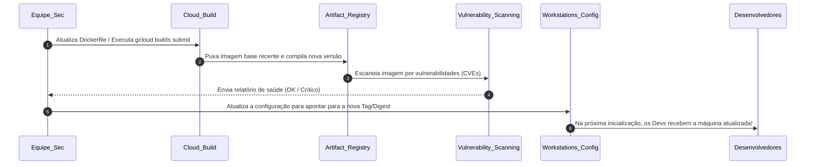

# Asset 2: Melhores Práticas de Controle de Acesso e Manutenção Preventiva

Este guia prático foi criado sob medida para ajudar você (Sabrina) e o seu cliente a estabelecerem controles rigorosos de **IAM (Identity and Access Management)**, **segurança operacional** e **manutenção recorrente** para o ambiente de **Cloud Workstations**.

A segurança de uma Workstation não depende apenas da rede VPC fechada (Asset 1); ela exige que o acesso seja estritamente controlado e que o ciclo de vida das imagens de desenvolvimento seja mantido atualizado contra vulnerabilidades de forma contínua.

---

## 📋 Resumo Executivo: Pré vs. Pós-Criação

Para garantir o funcionamento regular e seguro do ambiente, dividimos as ações em duas fases críticas:


---

## 1. Controle de Acesso (IAM e IAP)

O princípio do **Menor Privilégio** é o coração dessa estratégia. Devemos separar rigidamente quem administra a infraestrutura de quem consome as workstations.

### 🛑 ANTES DA CRIAÇÃO (Configuração de Segurança Inicial)

#### A. Segregação de Papéis no IAM (Roles)
Nunca conceda privilégios amplos (como `roles/owner` ou `roles/editor`) aos desenvolvedores ou administradores de workstations no projeto. Utilize papéis específicos:

* **Para Administradores da Infraestrutura (Ex: Equipe de Platform/Cloud Security)**:
  - `roles/workstations.admin` (Gerencia clusters, configurações e as instâncias, mas não permite acessar o código do desenvolvedor).
  - `roles/compute.networkAdmin` (Gerencia redes VPC, subredes e firewalls).
  - `roles/artifactregistry.admin` (Gerencia repositórios de imagens).
* **Para os Desenvolvedores (Os usuários finais da Workstation)**:
  - `roles/workstations.user` (Permite iniciar, parar e usar a workstation).
  - > [!IMPORTANT]
    > **Regra de Ouro**: Esse papel **NÃO** deve ser atribuído em nível de projeto. Ele deve ser vinculado **individualmente a cada máquina de workstation criada**. Assim, o Desenvolvedor A não consegue iniciar ou bisbilhotar a workstation do Desenvolvedor B.

#### B. Service Accounts de Serviço de Menor Privilégio
Durante a criação de uma Workstation Configuration, você define uma Service Account que a VM usará para interagir com os serviços do Google Cloud:
* **Prática recomendada**: Crie uma Service Account customizada (ex: `sa-workstation-runner@...`) em vez de usar a padrão do Compute Engine.
* Conceda a ela apenas as permissões estritamente necessárias (como permissões para ler e gravar logs no Cloud Logging, escrever métricas de monitoramento e puxar imagens do Artifact Registry via papel `roles/artifactregistry.reader`).
* Garanta que a conta usada pelo Cloud Build (`...-compute@developer.gserviceaccount.com` ou a Service Account padrão do Cloud Build) tenha permissões de escrita apenas para o Artifact Registry (`roles/artifactregistry.writer`).

#### C. Proteção Adicional com Context-Aware Access (IAP)
O tráfego de acesso à workstation passa obrigatoriamente pelo **Identity-Aware Proxy (IAP)** do Google.
* **Prática recomendada**: Configure níveis de acesso no **Access Context Manager** da organização.
* **Benefício**: Você pode ditar que o desenvolvedor só conseguirá acessar a workstation se ele:
  1. Estiver autenticado com a conta corporativa (Google Workspace/Identity).
  2. Estiver conectando de um IP de origem homologado (Ex: IP de saída do escritório ou da VPN corporativa).
  3. Estiver utilizando um dispositivo corporativo gerenciado que cumpra regras de segurança (como disco criptografado e sistema operacional atualizado).

---

### 🔄 DEPOIS DA CRIAÇÃO (Manutenção Recorrente e Monitoramento)

#### A. Auditoria Periódica de Acessos
* **Ação trimestral**: Utilize o **IAM Policy Troubleshooter** e ferramentas de IAM Recommender para detectar permissões excessivas atribuídas a desenvolvedores.
* **Revogação Automatizada**: Integre ao processo de offboarding da empresa um script ou automação (usando Terraform ou chamadas de API gcloud) para excluir a workstation individual e revogar todas as vinculações de IAM do usuário desligado imediatamente.

#### B. Auditoria Ativa de Logs de Acesso
Ative os **Data Access Audit Logs** (logs de acesso a dados) para a API do Cloud Workstations no console IAM.
* **Por que fazer?** Isso gera registros de auditoria detalhados no **Cloud Logging** sempre que alguém inicia (`Start`), para (`Stop`), edita uma configuração ou estabelece uma conexão via navegador/SSH na máquina.
* Crie alertas automáticos no Cloud Logging para conexões suspeitas fora do horário de trabalho padrão do desenvolvedor.

---

## 2. Ciclo de Vida e Otimização de Custos (VM Lifecycle)

Manter máquinas de desenvolvimento ativas 24 horas por dia, 7 dias por semana, gera desperdício de custo e amplia a janela de ataque caso uma máquina seja comprometida.

### 🛑 ANTES DA CRIAÇÃO (Configuração de Segurança Inicial)

#### A. Timeout de Inatividade (Auto-Stop / Idle Timeout)
As workstations rodam em containers mantidos por VMs por trás dos panos.
* **Prática recomendada**: Configure a sua Workstation Configuration para encerrar automaticamente as instâncias após um período de inatividade.
  ```bash
  --idle-timeout="1800s" # 30 minutos de inatividade desliga a workstation automaticamente
  ```
* **Como funciona?** Se o desenvolvedor fechar o navegador e parar de interagir com o Code OSS por 30 minutos, o container e a VM subjacente são desligados. Os dados dele não são perdidos (estão no disco persistente `/home/user`), mas o custo de processamento cai para zero e o vetor de ataque é removido.

#### B. Limite de Execução Diário (Running Timeout)
Mesmo se o desenvolvedor esquecer algum script rodando que impeça a máquina de entrar em estado ocioso ("idle"), você deve forçar um encerramento diário.
* **Prática recomendada**: Defina um timeout de execução máxima.
  ```bash
  --running-timeout="43200s" # Força o desligamento automático após 12 horas consecutivas rodando
  ```
* **Por que fazer?** Além de economizar, isso força o container a ser destruído e recriado a partir da imagem Docker limpa na manhã seguinte. Qualquer malware, script temporário perigoso ou modificação indesejada feita no sistema de arquivos raiz do container (fora da home persistente) é 100% eliminado, garantindo um ambiente limpo ("clean-state") todos os dias.

#### C. Criptografia Avançada com CMEK (Customer-Managed Encryption Keys)
Por padrão, os discos das workstations são criptografados com chaves gerenciadas pelo Google.
* **Prática recomendada**: Se o cliente exige conformidade máxima (PII, PCI-DSS ou segredo industrial), crie uma chave criptográfica simétrica no **Cloud KMS** (Key Management Service) no mesmo projeto.
* Atribua a chave à configuração usando o parâmetro `--encryption-key`. Os dados dos desenvolvedores em `/home/user` estarão trancados sob chaves de criptografia controladas diretamente pela equipe de segurança do cliente, com a capacidade de revogar a chave em caso de incidente cibernético extremo.

---

### 🔄 DEPOIS DA CRIAÇÃO (Manutenção Recorrente e Monitoramento)

#### A. Ciclo Mensal de Patching e Atualização de Imagem
Sua imagem customizada possui o Google Chrome e o Code OSS. Essas ferramentas sofrem dezenas de atualizações de segurança por mês. Mantê-las intocadas criará vulnerabilidades graves.

**O Processo de Atualização Mensal Segura**:



1. **Rebuild Automatizado**: Configure um gatilho mensal (via **Cloud Build Triggers** agendado por Cloud Scheduler) para recompilar a imagem. A compilação forçará o `apt-get update && apt-get install google-chrome-stable` a buscar o navegador mais recente disponível e atualizar as extensões de segurança do VS Code.
2. **Atualização Invisível**: Quando a nova imagem for publicada no Artifact Registry com a tag `:latest` (ou usando tags de versão específicas), o Cloud Workstations **não desliga as máquinas dos usuários ativos imediatamente**. Ele espera que as máquinas sejam desligadas (manualmente ou via idle-timeout).
3. **Carregamento Automático**: Quando o desenvolvedor iniciar a workstation no dia seguinte, o Cloud Workstations detectará que a configuração aponta para uma imagem mais recente no Artifact Registry e criará o container do usuário já utilizando a versão segura remendada, sem que ele perca nenhum arquivo do seu diretório `/home/user`.

#### B. Varredura Contínua de Vulnerabilidades (Vulnerability Scanning)
Ative o **Artifact Registry Vulnerability Scanning** (parte do serviço Container Analysis do Google Cloud).
* **Como funciona**: Toda vez que o Cloud Build envia uma imagem customizada para o Artifact Registry, o Google Cloud faz uma varredura estática de segurança do sistema operacional (Ubuntu/Debian) e dos pacotes instalados.
* Ele exibe uma lista de CVEs conhecidas e sua gravidade (Baixa, Média, Alta, Crítica).
* **Ação de Manutenção**: Bloqueie a promoção de configurações para produção se a imagem correspondente contiver vulnerabilidades com status "Critical" ou "High" que possuam correção disponível ("fix available").

---

## 3. Gestão e Backup de Dados Persistentes do Usuário

O diretório `/home/user` do desenvolvedor fica montado em um disco rígido persistente SSD do GCP (Compute Engine Persistent Disk). O sistema operacional e as ferramentas ficam no container, mas todo o código, configurações e histórico de comandos ficam salvos no disco persistente.

### ANTES DA CRIAÇÃO (Configuração de Segurança Inicial)

#### A. Definir Política de Recuperação de Disco (Reclaim Policy)
* Ao configurar as workstations, decida o que acontece com o disco do desenvolvedor caso sua conta de workstation seja excluída.
* No nosso script `gcloud_setup.sh`, usamos:
  ```bash
  --disk-reclaim-policy="delete"
  ```
  Isso significa que, se excluirmos a workstation de um desenvolvedor por offboarding, o disco contendo seu código é excluído permanentemente, impedindo vazamento de dados.
* Se a política do cliente for reter o código para auditoria antes de apagar, altere para `--disk-reclaim-policy="retain"`. O disco continuará existindo como um recurso órfão no Compute Engine para análise e backup, devendo ser destruído manualmente após a auditoria.

### DEPOIS DA CRIAÇÃO (Manutenção Recorrente e Monitoramento)

#### A. Backup Automatizado de Discos (Snapshots)
O Cloud Workstations não faz backup automático nativo do conteúdo do disco persistente `/home/user`.
* **Prática recomendada**: Crie uma política de snapshots programados (**Snapshot Schedules**) no console do Compute Engine.
* Associe essa política para tirar snapshots diários ou semanais dos discos das workstations (que começam com o prefixo `workstation-`).
* **Por que fazer?** Caso o desenvolvedor delete um código crítico sem commitar no GitHub por engano, ou sua área de trabalho sofra alguma corrupção de arquivos, você poderá restaurar o disco persistente do usuário para o estado do dia anterior em minutos.
