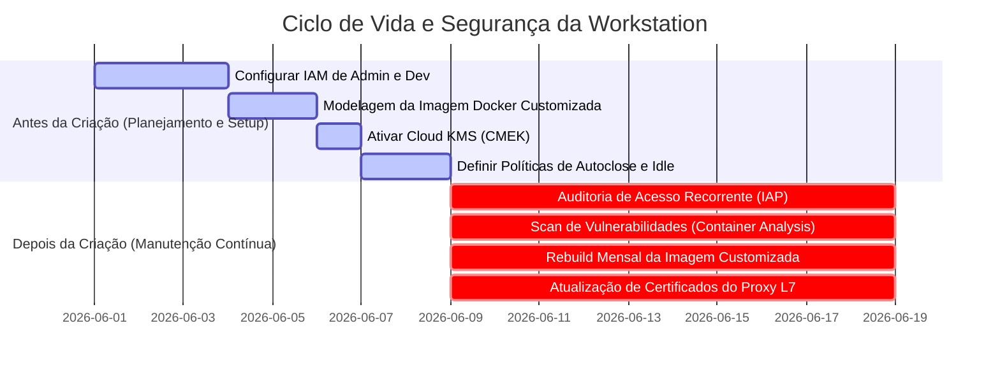
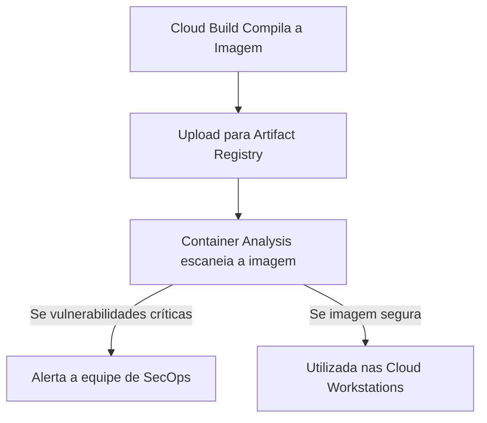

# Asset 2: Melhores Práticas de Controle de Acesso, Manutenção e Imagens Customizadas

Este guia prático descreve as melhores práticas de **Controle de Acesso (IAM/IAP)**, **Manutenção Preventiva** e, especialmente, os **Requisitos Indispensáveis para Imagens Customizadas** no ecossistema do **Cloud Workstations**.

A segurança e estabilidade das workstations dependem não apenas de uma rede VPC isolada (Asset 1), mas também do controle rígido de identidades, da conformidade operacional contínua e de um ciclo de vida estruturado para as imagens Docker utilizadas pelos desenvolvedores.

---

## 📋 Resumo Executivo: Pré vs. Pós-Criação

Para garantir o funcionamento regular e seguro das workstations corporativas, o ciclo operacional é estruturado em duas fases críticas:

---

## 1. Requisitos Indispensáveis e Estrutura Base para Imagens Customizadas

Uma imagem customizada no Cloud Workstations é um container Docker herdado de uma imagem base homologada que é empacotado com ferramentas de desenvolvimento, utilitários corporativos e configurações imutáveis de conformidade. 

Recomenda-se seguir estes requisitos indispensáveis e estruturas recomendadas para criar e manter imagens de desenvolvimento seguras:

### 1.1 Requisitos Indispensáveis (Hard Requirements)

1. **Herança de Imagem Base Oficial**:
   - Toda imagem customizada deve herdar obrigatoriamente de uma imagem oficial do Google (disponíveis no Artifact Registry oficial, como `us-central1-docker.pkg.dev/cloud-workstations-images/predefined/code-oss:latest` para desenvolvimento geral ou `.../predefined/base:latest` para outras IDEs).
   - **Por que é obrigatório?** As imagens oficiais do Google vêm pré-configuradas com os proxies gRPC, agentes de comunicação de rede do control plane e dependências de runtime que permitem ao serviço do Cloud Workstations se conectar e gerenciar a sessão da IDE de forma segura.
2. **Contexto de Execução Não-Root (`user:1000`)**:
   - Por segurança, o container deve alternar o contexto de execução de volta para o usuário comum (`USER user` de UID/GID `1000`) ao final do Dockerfile.
   - **Por que é obrigatório?** Impedir que o desenvolvedor final acesse o terminal e as ferramentas da IDE como `root` evita a desativação acidental ou intencional de controles de segurança locais do sistema operacional (como a manipulação de regras globais do Git e regras de proxy).
3. **Gerenciamento de Certificados CA Corporativos**:
   - A imagem deve conter o pacote `ca-certificates` instalado. Para permitir inspeção profunda TLS em proxies corporativos, deve existir uma pasta estruturada para acomodar certificados adicionais.
   - Os certificados devem ser copiados e ativados via `update-ca-certificates` durante a compilação da imagem.
4. **Endurecimento do Git e Bloqueio de SSH**:
   - A imagem deve conter um arquivo `/etc/gitconfig` gravado pelo usuário `root` (com permissões somente-leitura `644`), contendo regras obrigatórias de redirecionamento de requisições de SSH para HTTPS.
   - Isso garante que o desenvolvedor use o protocolo HTTPS, permitindo a inspeção de caminhos pelo Secure Web Proxy (SWP).

### 1.2 Estrutura Base Recomendada de Pastas

Para manter a conformidade do ambiente, estruture o sistema de arquivos do seu container com os seguintes diretórios corporativos padrões:

* `/etc/security/`: Pasta administrativa para armazenar diretrizes locais e políticas de conformidade do cliente (ex: `AGENTS.md`), visíveis no workspace do usuário em formato somente-leitura.
* `/etc/workstation-startup.d/`: Pasta padrão de boot do sistema. Qualquer script executável colocado aqui (ex: `210_link_agents.sh`) é disparado de forma automática como `root` assim que o container é ligado, após a montagem do disco `/home`. Ideal para autodiagnóstico e redefinição de links de segurança.
* `/etc/git/templates/hooks/`: Diretório base para armazenar templates imutáveis de hooks do Git (ex: `pre-push`). No boot ou ao criar novos repositórios locais, esses ganchos interceptam comandos para validar a conformidade das URLs remotas.
* `/usr/local/share/ca-certificates/`: Diretório padrão do Debian/Ubuntu para depósito de certificados corporativos privados `.crt`, necessários para validar a confiança nas cadeias de decodificação TLS.

---

## 2. Controle de Acesso e IAM (Identity and Access Management)

O princípio do **Menor Privilégio** e do **Zero Trust** devem reger a atribuição de permissões no Google Cloud.

### 🛑 ANTES DA CRIAÇÃO (Configuração de Segurança Inicial)

#### A. Segregação de Papéis no IAM (Roles)
Nunca conceda privilégios amplos (como `roles/owner` ou `roles/editor`) aos desenvolvedores ou administradores de workstations no projeto. Utilize papéis específicos:
* **Equipe de Infraestrutura e Plataforma (Admins)**:
  - `roles/workstations.admin` (Permite criar, deletar e gerenciar clusters e configurações de workstations, mas não concede acesso de leitura ao terminal interno ou código dos desenvolvedores).
  - `roles/compute.networkAdmin` (Gerencia redes VPC, subredes e firewalls).
  - `roles/artifactregistry.admin` (Gerencia repositórios de imagens Docker).
* **Desenvolvedores (Usuários Finais)**:
  - `roles/workstations.user` (Permite iniciar, parar e usar a workstation associada).
  - > [!IMPORTANT]
    > **Regra de Ouro**: O papel `roles/workstations.user` **NÃO** deve ser concedido em nível de projeto ou cluster. Ele deve ser atribuído **individualmente em cada instância de workstation criada**. Isso impede que o Desenvolvedor A acesse ou modifique o ambiente de trabalho do Desenvolvedor B.

#### B. Service Accounts de Serviço de Menor Privilégio
Sempre associe uma **Service Account customizada** às configurações das Cloud Workstations (Workstation Configuration), em vez de herdar a Service Account padrão do Compute Engine.
* Crie uma conta específica (ex: `sa-workstation-runner@...`) concedendo apenas as permissões de gravação de logs no Cloud Logging, métricas no Cloud Monitoring e leitura de imagens no Artifact Registry (`roles/artifactregistry.reader`).

---

## 3. Manutenção Operacional e Controle de Vulnerabilidades

### 🔄 DEPOIS DA CRIAÇÃO (Rotinas de Sustentação Regular)

#### A. Reconstrução Periódica de Imagens (Rebuild Mensal)
Os patches de segurança de sistemas operacionais e ferramentas de desenvolvimento (como o Code OSS e o Chrome) são lançados quase diariamente.
* **Prática recomendada**: Configure um gatilho de agendamento (Cloud Scheduler + Cloud Build) para realizar um **rebuild completo** da imagem de desenvolvimento pelo menos **uma vez por mês** ou imediatamente após a divulgação de vulnerabilidades de dia zero (0-day). Isso garante pacotes sempre atualizados no boot da máquina.

#### B. Escaneamento Automático de Vulnerabilidades (Container Analysis)
Ative a API **Container Analysis** no projeto GCP para monitorar as imagens armazenadas no Artifact Registry.
* **Funcionamento**: A ferramenta realiza análises automáticas nas imagens e emite alertas caso vulnerabilidades conhecidas (CVEs) sejam descobertas em pacotes instalados.

#### C. Ciclo de Vida Automatizado (Idle Timeout e Auto-Stop)
Estações de trabalho esquecidas ligadas são focos de risco à segurança e de custos desnecessários.
* **Prática recomendada**: Defina o tempo de desligamento automático por inatividade (**Idle Timeout**) em no máximo **30 minutos** (`1800s`), e um tempo de execução máximo diário de **12 horas** (`43200s`) na Workstation Configuration.
* **Resultado**: Garante que os containers sejam destruídos regularmente, forçando a atualização constante a partir da imagem Docker consolidada mais recente no próximo boot.

---

## 4. Práticas de Isolamento de Identidade em SaaS Cloud

Além dos controles internos do GCP, para consolidar a barreira de exfiltração de dados para contas pessoais de GitHub/Bitbucket do usuário corporativo, é altamente recomendada a adoção das seguintes soluções de identidade corporativa:

1. **GitHub Enterprise Managed Users (EMU)**:
   - Configura identidades de usuários pertencentes inteiramente à corporação, impedindo a criação de perfis pessoais ou forking para fora do controle da empresa.
2. **Atlassian Guard**:
   - Gerencia e restringe o acesso ao Bitbucket Cloud baseado nas contas corporativas sincronizadas diretamente com o provedor de identidade (IdP) da organização.
