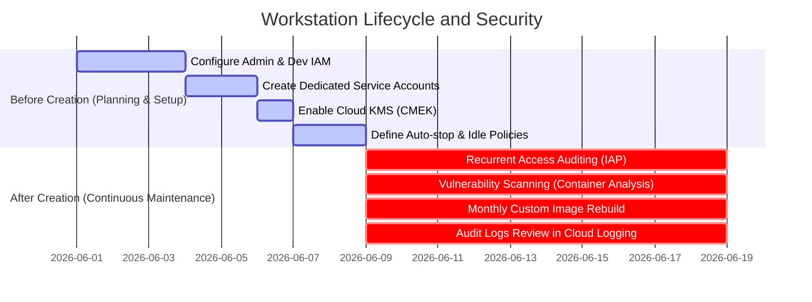
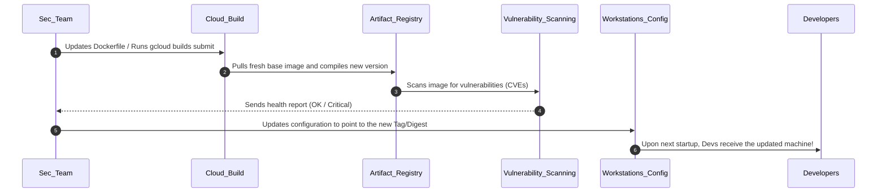

# Asset 2: Access Control and Preventive Maintenance (English Version)

This practical guide is tailored to help you (Sabrina) and your client establish strict **IAM (Identity and Access Management)**, **operational security**, and **recurrent maintenance** controls for the **Cloud Workstations** environment.

A workstation's security does not rely solely on a locked-down VPC network (Asset 1); it requires strictly controlled access and continuous updates to the development image lifecycle to patch vulnerabilities.

---

## 📋 Executive Summary: Pre-creation vs. Post-creation

To ensure the regular and secure operation of the environment, we divide the actions into two critical phases:



---

## 1. Access Control (IAM and IAP)

The principle of **Least Privilege** is at the heart of this strategy. We must strictly separate those who manage the infrastructure from those who consume the workstations.

### 🛑 BEFORE CREATION (Initial Security Configuration)

#### A. Segregation of Roles in IAM
Never grant broad privileges (such as `roles/owner` or `roles/editor`) to developers or workstation administrators in the project. Use specific roles:

* **For Infrastructure Administrators (e.g., Platform/Cloud Security team)**:
  - `roles/workstations.admin` (Allows managing clusters, configurations, and instances, but does not allow accessing the developer's code).
  - `roles/compute.networkAdmin` (Allows managing VPC networks, subnets, and firewalls).
  - `roles/artifactregistry.admin` (Allows managing image repositories).
* **For Developers (The Workstations' End Users)**:
  - `roles/workstations.user` (Allows starting, stopping, and using the workstation).
  - > [!IMPORTANT]
    > **Golden Rule**: This role **SHOULD NOT** be assigned at the project level. It must be bound **individually to each created workstation instance**. This ensures Developer A cannot start or inspect Developer B's workstation.

#### B. Least-Privilege Custom Service Accounts
During the creation of a Workstation Configuration, you define a Service Account that the workstation VM will use to interact with Google Cloud services:
* **Recommended Practice**: Create a custom Service Account (e.g., `sa-workstation-runner@...`) instead of using the default Compute Engine service account.
* Grant it only the strictly necessary permissions (such as permissions to read and write logs to Cloud Logging, write monitoring metrics, and pull images from the Artifact Registry via the `roles/artifactregistry.reader` role).
* Ensure that the account used by Cloud Build (`...-compute@developer.gserviceaccount.com`) has write access only to the Artifact Registry (`roles/artifactregistry.writer`).

#### C. Additional Protection with Context-Aware Access (IAP)
All connection traffic to the workstation must pass through Google's **Identity-Aware Proxy (IAP)**.
* **Recommended Practice**: Configure access levels in the organization's **Access Context Manager**.
* **Benefit**: You can dictate that the developer can only access the workstation if they:
  1. Are authenticated with their corporate account (Google Workspace/Identity).
  2. Are connecting from an authorized origin IP address (e.g., the office or corporate VPN egress IP).
  3. Are using a managed corporate device that complies with security rules (such as disk encryption and an updated operating system).

---

### 🔄 AFTER CREATION (Recurrent Maintenance and Monitoring)

#### A. Periodic Access Audits
* **Quarterly Action**: Use the **IAM Policy Troubleshooter** and IAM Recommender tools to detect excessive permissions assigned to developers.
* **Automated Revocation**: Integrate into the company's offboarding process a script or automation (using Terraform or gcloud API calls) to delete the individual workstation and revoke all IAM bindings of the terminated user immediately.

#### B. Active Audit Logging
Enable **Data Access Audit Logs** for the Cloud Workstations API in the IAM console.
* **Why do this?** This generates detailed audit logs in **Cloud Logging** whenever someone starts (`Start`), stops (`Stop`), edits a configuration, or establishes a browser/SSH connection to the machine.
* Create automated alerts in Cloud Logging for suspicious connection attempts outside the developer's standard working hours.

---

## 2. Lifecycle and Cost Optimization (VM Lifecycle)

Keeping development machines active 24/7 generates cost waste and widens the attack surface if a machine is compromised.

### 🛑 BEFORE CREATION (Initial Security Configuration)

#### A. Idle Timeout (Auto-Stop)
Workstations run in containers supported by VMs behind the scenes.
* **Recommended Practice**: Configure your Workstation Configuration to automatically shut down instances after a period of inactivity.
  ```bash
  --idle-timeout="1800s" # 30 minutes of inactivity shuts down the workstation automatically
  ```
* **How does it work?** If the developer closes the browser and stops interacting with Code OSS for 30 minutes, the container and underlying VM are stopped. Their data is not lost (it is safe on the persistent `/home/user` disk), but processing costs drop to zero and the attack vector is removed.

#### B. Maximum Execution Limit (Running Timeout)
Even if a developer leaves a running script that prevents the machine from going idle, you should force a daily shutdown.
* **Recommended Practice**: Define a maximum running timeout limit.
  ```bash
  --running-timeout="43200s" # Forces automatic shutdown after 12 consecutive hours of running
  ```
* **Why do this?** In addition to saving money, this forces the container to be destroyed and recreated from a clean Docker image the next morning. Any malware, dangerous temporary scripts, or unwanted modifications made to the container's root filesystem (outside the persistent home) are 100% eliminated, ensuring a clean-state environment every single day.

#### C. Advanced Encryption with CMEK (Customer-Managed Encryption Keys)
By default, workstation disks are encrypted with Google-managed keys.
* **Recommended Practice**: If the client requires maximum compliance (PII, PCI-DSS, or trade secrets), create a symmetric cryptographic key in **Cloud KMS** (Key Management Service) within the same project.
* Assign this key to the configuration using the `--encryption-key` parameter. The developers' data in `/home/user` will be locked under cryptographic keys controlled directly by the client's security team, with the ability to revoke the key in case of an extreme cyber security incident.

---

### 🔄 AFTER CREATION (Recurrent Maintenance and Monitoring)

#### A. Monthly Image Patching and Rebuilding Cycle
Your custom image contains Google Chrome and Code OSS. These tools receive dozens of security updates every month. Leaving them unpatched will create serious vulnerabilities.

**The Secure Monthly Update Process**:



1. **Automated Rebuilds**: Configure a monthly trigger (via **Cloud Build Triggers** scheduled by Cloud Scheduler) to recompile the image. The compilation will force `apt-get update && apt-get install google-chrome-stable` to fetch the latest available stable browser and update VS Code security extensions.
2. **Seamless Updates**: When the new image is published to the Artifact Registry with the `:latest` tag (or using specific version tags), Cloud Workstations **does not shut down active users' machines immediately**. It waits until the machines are shut down (either manually or via idle timeout).
3. **Automatic Loading**: When the developer starts the workstation the next day, Cloud Workstations will detect that the configuration points to a newer image in the Artifact Registry and will spin up the user's container using the patched secure version, without losing any files in their `/home/user` directory.

#### B. Continuous Vulnerability Scanning
Enable **Artifact Registry Vulnerability Scanning** (part of Google Cloud's Container Analysis service).
* **How it works**: Every time Cloud Build pushes a custom image to the Artifact Registry, Google Cloud runs a static security scan of the operating system (Ubuntu/Debian) and installed packages.
* It displays a list of known CVEs and their severity (Low, Medium, High, Critical).
* **Maintenance Action**: Block configuration promotions to production if the corresponding image contains vulnerabilities with a "Critical" or "High" status that have a fix available.

---

## 3. Persistent User Data Management and Backup

The developer's `/home/user` directory remains mounted on a GCP SSD Persistent Disk (Compute Engine Persistent Disk). While the operating system and tools are in the container, all code, settings, and command history are saved on the persistent disk.

### BEFORE CREATION (Initial Security Configuration)

#### A. Define Disk Reclaim Policy
* When configuring workstations, decide what happens to the developer's disk if their workstation account is deleted.
* In our `gcloud_setup.sh` script, we use:
  ```bash
  --disk-reclaim-policy="delete"
  ```
  This means that if we delete a developer's workstation due to offboarding, the disk containing their code is permanently deleted, preventing data leakage.
* If the client's policy is to retain the code for auditing before deleting, change this to `--disk-reclaim-policy="retain"`. The disk will continue to exist as an orphaned resource in Compute Engine for analysis and backup, and must be destroyed manually after auditing.

### AFTER CREATION (Recurrent Maintenance and Monitoring)

#### A. Automated Disk Backups (Snapshots)
Cloud Workstations does not offer native automatic backups for the `/home/user` persistent disk.
* **Recommended Practice**: Create scheduled snapshot policies (**Snapshot Schedules**) in the Compute Engine console.
* Associate this policy to take daily or weekly snapshots of workstation disks (which start with the `workstation-` prefix).
* **Why do this?** In case a developer accidentally deletes critical code before committing it to GitHub, or their workspace suffers file corruption, you can restore the user's persistent disk to the previous day's state in minutes.
