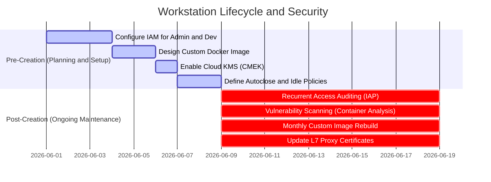
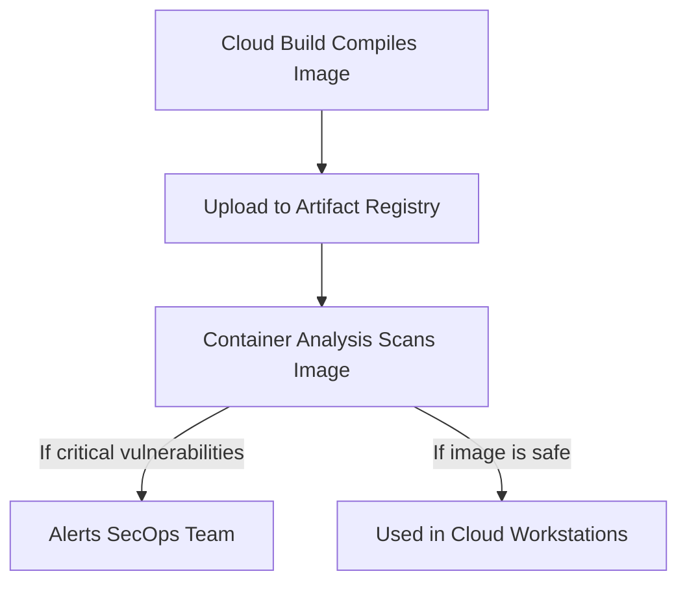

# Asset 2: Best Practices for Access Control, Maintenance, and Custom Images

This practical guide describes the best practices for **Access Control (IAM/IAP)**, **Preventive Maintenance**, and, especially, the **Indispensable Requirements for Custom Images** within the **Cloud Workstations** ecosystem.

The security and stability of workstations depend not only on an isolated VPC network (Asset 1) but also on the strict control of identities, continuous operational compliance, and a structured lifecycle for the Docker images used by developers.

---

## 📋 Executive Summary: Pre vs. Post-Creation

To ensure the secure and regular operation of corporate workstations, the operational lifecycle is structured into two critical phases:

---

## 1. Indispensable Requirements and Base Structure for Custom Images

A custom image in Cloud Workstations is a Docker container inherited from an approved base image packaged with development tools, enterprise utilities, and immutable compliance settings. 

These indispensable requirements and recommended structures must be followed to create and maintain secure development images:

### 1.1 Indispensable Requirements (Hard Requirements)

1. **Inheritance from an Official Base Image**:
   - Every custom image must inherit from an official Google base image (available in the official Artifact Registry, such as `us-central1-docker.pkg.dev/cloud-workstations-images/predefined/code-oss:latest` for general development or `.../predefined/base:latest` for other IDEs).
   - **Why is this mandatory?** Google's official images come pre-configured with internal gRPC proxies, control plane communication agents, and runtime dependencies that allow the Cloud Workstations service to connect and manage the IDE session securely.
2. **Non-Root Execution Context (`user:1000`)**:
   - For security, the container must switch the execution context back to the default non-root user (`USER user` with UID/GID `1000`) at the end of the Dockerfile.
   - **Why is this mandatory?** Preventing the end developer from accessing the terminal and IDE tools as `root` blocks the accidental or intentional disabling of local security controls on the operating system (such as manipulating global Git configurations and proxy settings).
3. **Enterprise CA Certificate Management**:
   - The image must have the `ca-certificates` package installed. To support deep TLS inspection on corporate proxies, a structured folder must exist to accommodate additional certificates.
   - Certificates must be copied and activated via `update-ca-certificates` during image compilation.
4. **Git Hardening and SSH Blocking**:
   - The image must contain a `/etc/gitconfig` file written by the `root` user (with read-only permissions of `644`), containing mandatory rules for redirecting SSH requests to HTTPS.
   - This ensures that developers use the HTTPS protocol, permitting URL path inspection by the Secure Web Proxy (SWP).

### 1.2 Recommended Folder Structure

To maintain environment compliance, structure your container's filesystem with the following standard corporate directories:

* `/etc/security/`: Administrative folder to store local compliance guidelines and client policies (e.g., `AGENTS.md`), visible in the user's workspace in a read-only format.
* `/etc/workstation-startup.d/`: Standard system boot folder. Any executable script placed here (e.g., `210_link_agents.sh`) is automatically triggered as `root` when the container starts, after the `/home` disk is mounted. This is ideal for self-diagnostics and resetting security links.
* `/etc/git/templates/hooks/`: Base directory to store immutable Git hook templates (e.g., `pre-push`). At boot or when creating new local repositories, these hooks intercept commands to validate the compliance of remote URLs.
* `/usr/local/share/ca-certificates/`: Default Debian/Ubuntu directory for depositing private corporate `.crt` certificates, necessary to validate trust in TLS decryption chains.

---

## 2. Access Control and IAM (Identity and Access Management)

The principles of **Least Privilege** and **Zero Trust** must govern the assignment of permissions in Google Cloud.

### 🛑 PRE-CREATION (Initial Security Setup)

#### A. Segregation of IAM Roles
Never grant broad privileges (such as `roles/owner` or `roles/editor`) to developers or workstation administrators in the project. Use specific roles:
* **Infrastructure and Platform Team (Admins)**:
  - `roles/workstations.admin` (Allows creating, deleting, and managing workstation clusters and configurations, but does not grant access to the internal terminal or developers' code).
  - `roles/compute.networkAdmin` (Manages VPC networks, subnets, and firewalls).
  - `roles/artifactregistry.admin` (Manages Docker image repositories).
* **Developers (End-Users)**:
  - `roles/workstations.user` (Allows starting, stopping, and using the associated workstation).
  - > [!IMPORTANT]
    > **Golden Rule**: The role `roles/workstations.user` must **NOT** be granted at the project or cluster level. It must be assigned **individually to each created workstation instance**. This prevents Developer A from accessing or modifying Developer B's workspace.

#### B. Least Privilege Service Accounts
Always associate a **custom Service Account** with the Cloud Workstations configurations (Workstation Configuration), instead of inheriting the default Compute Engine Service Account.
* Create a specific account (e.g., `sa-workstation-runner@...`) granting only logging permissions in Cloud Logging, metrics in Cloud Monitoring, and image reading permissions in Artifact Registry (`roles/artifactregistry.reader`).

---

## 3. Operational Maintenance and Vulnerability Control

### 🔄 POST-CREATION (Regular Support Routines)

#### A. Periodic Image Rebuilds (Monthly Rebuild)
Security patches for operating systems and development tools (like Code OSS and Chrome) are released almost daily.
* **Best Practice**: Set up a scheduling trigger (Cloud Scheduler + Cloud Build) to perform a **full rebuild** of the development image at least **once a month** or immediately after zero-day (0-day) vulnerabilities are announced. This ensures updated packages at machine boot.

#### B. Automatic Vulnerability Scanning (Container Analysis)
Enable the **Container Analysis** API in the GCP project to monitor images stored in the Artifact Registry.
* **How it works**: The tool automatically scans images and triggers alerts if known vulnerabilities (CVEs) are discovered in installed packages.

#### C. Automated Lifecycle (Idle Timeout and Auto-Stop)
Workstations left running present both security risks and unnecessary costs.
* **Best Practice**: Set the automatic shutdown for inactivity (**Idle Timeout**) to a maximum of **30 minutes** (`1800s`), and a maximum daily execution limit of **12 hours** (`43200s`) in the Workstation Configuration.
* **Result**: Ensures that containers are destroyed regularly, forcing constant updates from the latest consolidated Docker image at the next boot.

---

## 4. Identity Isolation Practices in Cloud SaaS

In addition to internal GCP controls, to establish a hard barrier against exfiltration to personal GitHub/Bitbucket accounts, it is highly recommended to configure:

1. **GitHub Enterprise Managed Users (EMU)**:
   - Configures user identities fully owned by the corporation, preventing the creation of personal profiles or forking outside company control.
2. **Atlassian Guard**:
   - Manages and restricts access to Bitbucket Cloud based on corporate accounts synced directly with the organization's identity provider (IdP).
