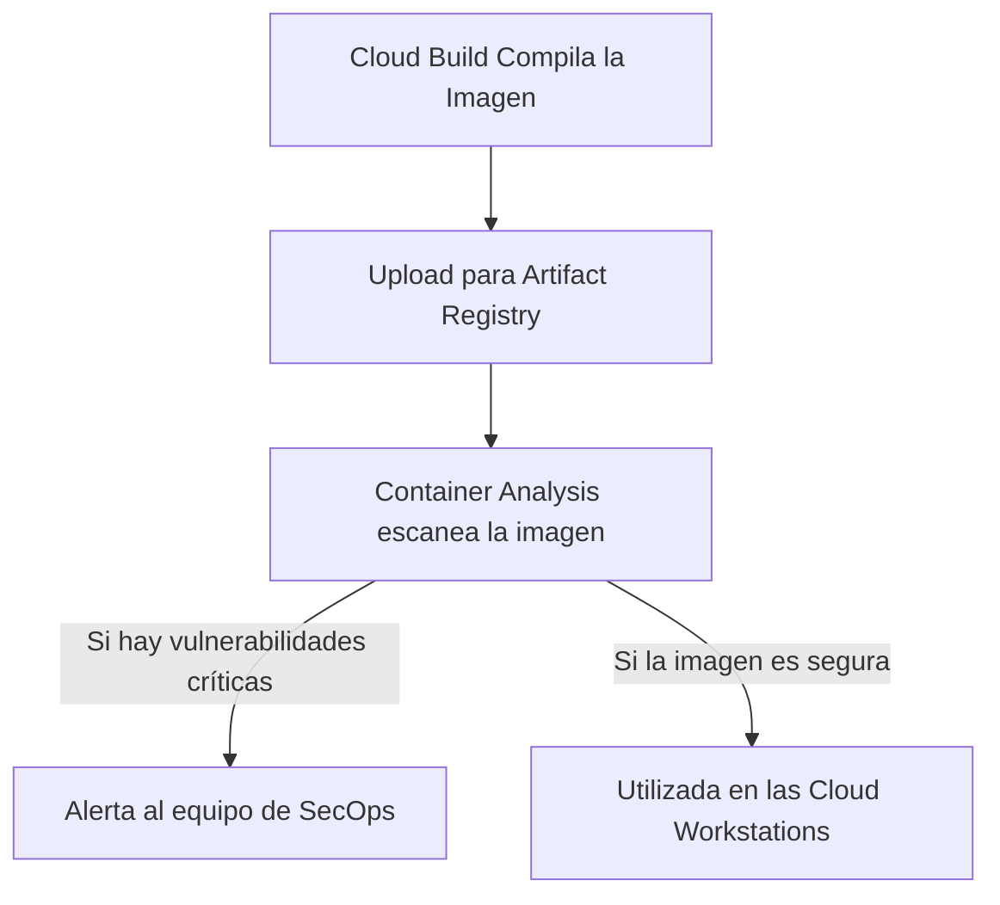

# Asset 2: Mejores Prácticas de Control de Acceso, Mantenimiento e Imágenes Personalizadas

Esta guía práctica describe las mejores prácticas de **Control de Acceso (IAM/IAP)**, **Mantenimiento Preventivo** y, especialmente, los **Requisitos Indispensables para Imágenes Personalizadas** en el ecosistema de **Cloud Workstations**.

La seguridad y estabilidad de las estaciones de trabajo dependen no solo de una red VPC aislada (Asset 1), sino también del control estricto de identidades, la conformidad operativa continua y un ciclo de vida estructurado para las imágenes Docker utilizadas por los desarrolladores.

---

## 📋 Resumen Ejecutivo: Antes vs. Después de la Creación

Para garantizar el funcionamiento seguro y regular de las estaciones de trabajo corporativas, el ciclo operativo se estructura en dos fases críticas:

---

## 1. Requisitos Indispensables y Estructura Base para Imágenes Personalizadas

Una imagen personalizada en Cloud Workstations es un contenedor Docker heredado de una imagen base aprobada que se empaqueta con herramientas de desarrollo, utilidades corporativas y configuraciones inmutables de conformidad. 

Se deben seguir estos requisitos indispensables y estructuras recomendadas para crear y mantener imágenes de desarrollo seguras:

### 1.1 Requisitos Indispensables (Hard Requirements)

1. **Herencia de una Imagen Base Oficial**:
   - Toda imagen personalizada debe heredar obligatoriamente de una imagen oficial de Google (disponibles en el Artifact Registry oficial, como `us-central1-docker.pkg.dev/cloud-workstations-images/predefined/code-oss:latest` para desarrollo general o `.../predefined/base:latest` para otros IDEs).
   - **¿Por qué es obligatorio?** Las imágenes oficiales de Google vienen preconfiguradas con los proxies gRPC, agentes de comunicación de red del plano de control y dependencias de runtime que permiten al servicio de Cloud Workstations conectarse y gestionar la sesión del IDE de forma segura.
2. **Contexto de Ejecución No-Root (`user:1000`)**:
   - Por seguridad, el contenedor debe alternar el contexto de ejecución de vuelta al usuario común (`USER user` con UID/GID `1000`) al final del Dockerfile.
   - **¿Por qué es obligatorio?** Impedir que el desarrollador final acceda a la terminal y a las herramientas del IDE como `root` evita la desactivación accidental o intencional de controles de seguridad locales del sistema operativo (como la manipulación de reglas globales de Git y reglas de proxy).
3. **Gestión de Certificados CA Corporativos**:
   - El contenedor debe tener el paquete `ca-certificates` instalado. Para permitir una inspección profunda TLS en proxies corporativos, debe existir una carpeta estructurada para alojar certificados adicionales.
   - Los certificados deben copiarse y activarse mediante `update-ca-certificates` durante la compilación de la imagen.
4. **Endurecimiento de Git y Bloqueo de SSH**:
   - La imagen debe contener un archivo `/etc/gitconfig` escrito por el usuario `root` (con permisos de solo lectura `644`), que contenga reglas obligatorias para redirigir las solicitudes de SSH a HTTPS.
   - Esto asegura que los desarrolladores utilicen el protocolo HTTPS, lo que permite la inspección de la ruta de la URL por parte de Secure Web Proxy (SWP).

### 1.2 Estructura Base Recomendada de Carpetas

Para mantener la conformidad del entorno, estructure el sistema de archivos de su contenedor con los siguientes directorios corporativos estándar:

* `/etc/security/`: Carpeta administrativa para almacenar directrices locales y políticas de conformidad del cliente (ej: `AGENTS.md`), visibles en el espacio de trabajo del usuario en formato de solo lectura.
* `/etc/workstation-startup.d/`: Carpeta estándar de inicio del sistema. Cualquier script ejecutable colocado aquí (ej: `210_link_agents.sh`) se ejecuta automáticamente como `root` en cuanto se enciende el contenedor, después de montar el disco `/home`. Es ideal para autodiagnósticos y restablecer enlaces de seguridad.
* `/etc/git/templates/hooks/`: Directorio base para almacenar plantillas inmutables de ganchos de Git (ej: `pre-push`). En el inicio o al crear nuevos repositorios locales, estos ganchos interceptan comandos para validar la conformidad de las URLs remotas.
* `/usr/local/share/ca-certificates/`: Directorio predeterminado de Debian/Ubuntu para depositar certificados corporativos privados `.crt`, necesarios para validar la confianza en las cadenas de descifrado TLS.

---

## 2. Control de Acceso y IAM (Identity and Access Management)

El principio de **Menor Privilegio** y de **Zero Trust** deben regir la asignación de permisos en Google Cloud.

### 🛑 ANTES DE LA CREACIÓN (Configuración de Seguridad Inicial)

#### A. Segregación de Roles en IAM
Nunca conceda privilegios amplios (como `roles/owner` o `roles/editor`) a los desarrolladores o administradores de workstations en el proyecto. Utilice roles específicos:
* **Equipo de Infraestructura y Plataforma (Admins)**:
  - `roles/workstations.admin` (Permite crear, eliminar y gestionar clústeres y configuraciones de estaciones de trabajo, pero no concede acceso de lectura a la terminal interna ni al código de los desarrolladores).
  - `roles/compute.networkAdmin` (Gestiona redes VPC, subredes y firewalls).
  - `roles/artifactregistry.admin` (Gestiona repositorios de imágenes Docker).
* **Desarrolladores (Usuarios Finales)**:
  - `roles/workstations.user` (Permite iniciar, detener y usar la workstation asociada).
  - > [!IMPORTANT]
    > **Regla de Oro**: El rol `roles/workstations.user` **NO** debe otorgarse a nivel de proyecto o clúster. Debe asignarse **individualmente en cada instancia de workstation creada**. Esto impide que el Desarrollador A acceda o modifique el entorno de trabajo del Desarrollador B.

#### B. Service Accounts de Menor Privilégio
Siempre asocie una **Service Account personalizada** a las configuraciones de Cloud Workstations (Workstation Configuration), en lugar de heredar la Service Account predeterminada de Compute Engine.
* Cree una cuenta específica (ej: `sa-workstation-runner@...`) otorgando solo permisos para escribir registros en Cloud Logging, métricas en Cloud Monitoring y lectura de imágenes en Artifact Registry (`roles/artifactregistry.reader`).

---

## 3. Mantenimiento Operacional y Control de Vulnerabilidades

### 🔄 DESPUÉS DE LA CREACIÓN (Rutinas de Sustentación Regular)

#### A. Reconstrucción Periódica de Imágenes (Rebuild Mensual)
Los parches de seguridad para sistemas operativos y herramientas de desarrollo (como Code OSS y Chrome) se lanzan casi a diario.
* **Práctica recomendada**: Configure un disparador de programación (Cloud Scheduler + Cloud Build) para realizar un **rebuild completo** de la imagen de desarrollo al menos **una vez al mes** o inmediatamente después de que se anuncien vulnerabilidades de día cero (0-day). Esto garantiza paquetes actualizados al iniciar la máquina.

#### B. Escaneo Automático de Vulnerabilidades (Container Analysis)
Active la API **Container Analysis** en el proyecto de GCP para monitorear las imágenes almacenadas en el Artifact Registry.
* **Funcionamiento**: La herramienta realiza análisis automáticos en las imágenes y emite alertas en caso de descubrir vulnerabilidades conocidas (CVE) en los paquetes instalados.

#### C. Ciclo de Vida Automatizado (Idle Timeout y Auto-Stop)
Las estaciones de trabajo que se quedan encendidas representan riesgos de seguridad y costos innecesarios.
* **Práctica recomendada**: Defina el tiempo de apagado automático por inactividad (**Idle Timeout**) en un máximo de **30 minutos** (`1800s`), y un tiempo de ejecución máximo diario de **12 horas** (`43200s`) en la Workstation Configuration.
* **Resultado**: Asegura que los contenedores se destruyan de forma regular, obligando a actualizaciones constantes a partir de la última imagen Docker consolidada en el siguiente inicio.

---

## 4. Prácticas de Aislamiento de Identidad en SaaS Cloud

Además de los controles internos de GCP, para consolidar la barrera de fuga de datos hacia cuentas personales de GitHub/Bitbucket del usuario corporativo, se recomienda encarecidamente configurar:

1. **GitHub Enterprise Managed Users (EMU)**:
   - Configura identidades de usuarios pertenecientes por completo a la corporación, impidiendo la creación de perfiles personales o bifurcaciones (forking) fuera del control de la empresa.
2. **Atlassian Guard**:
   - Gestiona y restringe el acceso a Bitbucket Cloud basado en las cuentas corporativas sincronizadas directamente con el proveedor de identidad (IdP) de la organización.
