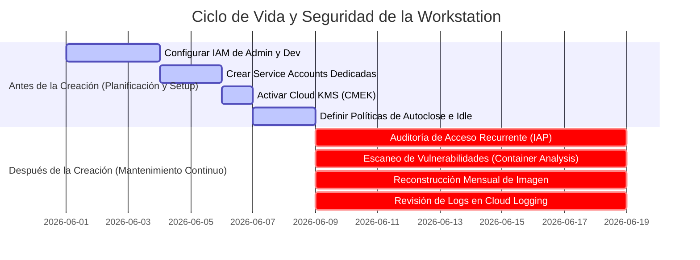
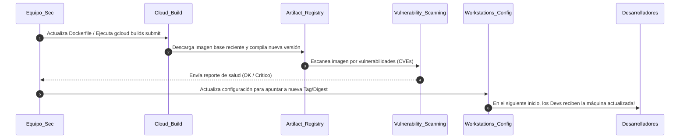

# Asset 2: Mejores Prácticas de Control de Acceso y Mantenimiento Preventivo

Este guía práctico fue diseñado a medida para ayudarte a ti (Sabrina) y a tu cliente a establecer controles rigurosos de **IAM (Identity and Access Management)**, **seguridad operativa** y **mantenimiento recurrente** para el entorno de **Cloud Workstations**.

La seguridad de una Workstation no depende únicamente de la red VPC cerrada (Asset 1); exige que el acceso esté estrictamente controlado y que el ciclo de vida de las imágenes de desarrollo se mantenga actualizado contra vulnerabilidades de manera continua.

---

## 📋 Resumen Ejecutivo: Antes vs. Después de la Creación

Para garantizar el funcionamiento regular y seguro del entorno, dividimos las acciones en dos fases críticas:



---

## 1. Control de Acceso (IAM e IAP)

El principio de **Menor Privilegio** es el corazón de esta estrategia. Debemos separar estrictamente a quienes administran la infraestructura de quienes consumen las workstations.

### 🛑 ANTES DE LA CREACIÓN (Configuración de Seguridad Inicial)

#### A. Segregación de Roles en IAM (Roles)
Nunca otorgue privilegios amplios (como `roles/owner` o `roles/editor`) a los desarrolladores o administradores de workstations en el proyecto. Utilice roles específicos:

* **Para Administradores de Infraestructura (Ej: Equipo de Platform/Cloud Security)**:
  - `roles/workstations.admin` (Administra clústeres, configuraciones e instancias, pero no permite acceder al código del desarrollador).
  - `roles/compute.networkAdmin` (Administra redes VPC, subredes y firewalls).
  - `roles/artifactregistry.admin` (Administra repositorios de imágenes).
* **Para los Desarrolladores (Los usuarios finales de la Workstation)**:
  - `roles/workstations.user` (Permite iniciar, detener y utilizar la workstation).
  - > [!IMPORTANT]
    > **Regra de Oro**: Este rol **NO** debe asignarse a nivel de proyecto. Debe vincularse **individualmente a cada máquina de workstation creada**. De este modo, el Desarrollador A no puede iniciar ni curiosear en la workstation del Desarrollador B.

#### B. Service Accounts con el Menor Privilegio
Durante la creación de una Workstation Configuration, usted define una Service Account que la VM utilizará para interactuar con los servicios de Google Cloud:
* **Prática recomendada**: Cree una Service Account personalizada (ej: `sa-workstation-runner@...`) en lugar de usar la predeterminada de Compute Engine.
* Otórguele únicamente los permisos estrictamente necesarios (como permisos para leer y escribir registros en Cloud Logging, escribir métricas de monitoreo y descargar imágenes de Artifact Registry a través del rol `roles/artifactregistry.reader`).
* Asegúrese de que la cuenta utilizada por Cloud Build (`...-compute@developer.gserviceaccount.com` o la Service Account predeterminada de Cloud Build) tenga permisos de escritura únicamente para el Artifact Registry (`roles/artifactregistry.writer`).

#### C. Protección Adicional con Context-Aware Access (IAP)
El tráfico de acceso a la workstation pasa obligatoriamente por el **Identity-Aware Proxy (IAP)** de Google.
* **Prática recomendada**: Configure niveles de acceso en el **Access Context Manager** de la organización.
* **Beneficio**: Puede definir que el desarrollador solo pueda acceder a la workstation si:
  1. Está autenticado con su cuenta corporativa (Google Workspace/Identity).
  2. Se conecta desde una IP de origen autorizada (Ej: IP de salida de la oficina o de la VPN corporativa).
  3. Utiliza un dispositivo corporativo administrado que cumpla con las reglas de seguridad (como disco cifrado y sistema operativo actualizado).

---

### 🔄 DESPUÉS DE LA CREACIÓN (Mantenimiento Recurrente y Monitoreo)

#### A. Auditoría Periódica de Accesos
* **Acción trimestral**: Utilice **IAM Policy Troubleshooter** y las herramientas de IAM Recommender para detectar permisos excesivos asignados a los desarrolladores.
* **Revocación Automatizada**: Integre al proceso de desvinculación (offboarding) de la empresa un script o automatización (usando Terraform o comandos de gcloud) para eliminar la workstation individual y revocar todas las vinculaciones de IAM del usuario desvinculado de inmediato.

#### B. Auditoría Activa de Logs de Acceso
Active los **Data Access Audit Logs** (registros de auditoría de acceso a datos) para la API de Cloud Workstations en la consola de IAM.
* **¿Por qué hacerlo?** Esto genera registros de auditoría detallados en **Cloud Logging** cada vez que alguien inicia (`Start`), detiene (`Stop`), edita una configuración o establece una conexión mediante el navegador o SSH en la máquina.
* Cree alertas automáticas en Cloud Logging ante conexiones sospechosas fuera del horario laboral estándar del desarrollador.

---

## 2. Ciclo de Vida y Optimización de Costos (VM Lifecycle)

Mantener máquinas de desarrollo activas las 24 horas del día, los 7 días de la semana, genera costos innecesarios y amplía la ventana de ataque en caso de que una máquina se vea comprometida.

### 🛑 ANTES DE LA CREACIÓN (Configuración de Seguridad Inicial)

#### A. Tiempo de Espera por Inactividad (Auto-Stop / Idle Timeout)
Las workstations se ejecutan en contenedores alojados en VMs en segundo plano.
* **Prática recomendada**: Configure su Workstation Configuration para apagar automáticamente las instancias después de un período de inactividad.
  ```bash
  --idle-timeout="1800s" # 30 minutos de inactividad apagan la workstation automáticamente
  ```
* **¿Cómo funciona?** Si el desarrollador cierra el navegador y deja de interactuar con Code OSS durante 30 minutos, el contenedor y la VM subyacente se apagan. Sus datos no se pierden (están en el disco persistente `/home/user`), pero el costo de procesamiento se reduce a cero y se elimina el vector de ataque.

#### B. Límite de Ejecución Diario (Running Timeout)
Incluso si al desarrollador se le olvida algún script en ejecución que impida que la máquina entre en estado inactivo ("idle"), usted debe forzar un apagado diario.
* **Prática recomendada**: Defina un tiempo de espera de ejecución máximo.
  ```bash
  --running-timeout="43200s" # Fuerza el apagado automático tras 12 horas consecutivas de ejecución
  ```
* **¿Por qué hacerlo?** Además de ahorrar costos, esto obliga a que el contenedor se destruya y se vuelva a crear a partir de la imagen limpia de Docker a la mañana siguiente. Cualquier malware, script temporal peligroso o modificación no deseada realizada en el sistema de archivos raíz del contenedor (fuera del directorio persistente home) se elimina al 100%, garantizando un entorno limpio ("clean-state") todos los días.

#### C. Cifrado Avanzado con CMEK (Customer-Managed Encryption Keys)
Por defecto, los discos de las workstations se cifran con claves administradas por Google.
* **Prática recomendada**: Si el cliente exige el máximo nivel de cumplimiento (PII, PCI-DSS o secreto industrial), cree una clave de cifrado simétrica en **Cloud KMS** (Key Management Service) en el mismo proyecto.
* Asigne la clave a la configuración utilizando el parámetro `--encryption-key`. Los datos de los desarrolladores en `/home/user` estarán protegidos bajo claves de cifrado controladas directamente por el equipo de seguridad del cliente, con la capacidad de revocar la clave en caso de un incidente cibernético extremo.

---

### 🔄 DESPUÉS DE LA CREACIÓN (Mantenimiento Recurrente y Monitoreo)

#### A. Ciclo Mensual de Parches y Actualización de Imagen
Su imagen personalizada incluye Google Chrome y Code OSS. Estas herramientas reciben decenas de actualizaciones de seguridad al mes. Dejarlas sin actualizar creará vulnerabilidades graves.

**El Proceso de Actualización Mensual Segura**:



1. **Reconstrucción Automatizada (Rebuild)**: Configure un activador mensual (a través de **Cloud Build Triggers** programado por Cloud Scheduler) para volver a compilar la imagen. La compilación obligará a que `apt-get update && apt-get install google-chrome-stable` busque el navegador más reciente disponible y actualice las extensiones de seguridad de VS Code.
2. **Actualización Invisible**: Cuando se publique la nueva imagen en el Artifact Registry con la etiqueta `:latest` (o utilizando etiquetas de versión específicas), Cloud Workstations **no apaga las máquinas de los usuarios activos de inmediato**. Espera a que las máquinas se apaguen (manualmente o mediante el idle-timeout).
3. **Carga Automática**: Cuando el desarrollador inicie la workstation al día siguiente, Cloud Workstations detectará que la configuración apunta a una imagen más reciente en Artifact Registry y creará el contenedor del usuario utilizando la versión parcheada y segura, sin perder ningún archivo de su directorio `/home/user`.

#### B. Escaneo Continuo de Vulnerabilidades (Vulnerability Scanning)
Active el **Artifact Registry Vulnerability Scanning** (parte del servicio Container Analysis de Google Cloud).
* **Cómo funciona**: Cada vez que Cloud Build envía una imagen personalizada al Artifact Registry, Google Cloud realiza un escaneo estático de seguridad del sistema operativo (Ubuntu/Debian) y de los paquetes instalados.
* Muestra una lista de CVEs conocidas y su gravedad (Baja, Media, Alta, Crítica).
* **Acción de Mantenimiento**: Bloquee la promoción de configuraciones a producción si la imagen correspondiente contiene vulnerabilidades con estado "Critical" o "High" para las que haya un parche disponible ("fix available").

---

## 3. Gestión y Respaldo (Backup) de Datos Persistentes del Usuario

El directorio `/home/user` del desarrollador se monta en un disco duro persistente SSD de GCP (Compute Engine Persistent Disk). El sistema operativo y las herramientas residen en el contenedor, pero todo el código, las configuraciones y el historial de comandos se guardan en el disco persistente.

### ANTES DE LA CREACIÓN (Configuración de Seguridad Inicial)

#### A. Definir la Política de Recuperación de Disco (Reclaim Policy)
* Al configurar las workstations, decida qué sucede con el disco del desarrollador en caso de que se elimine su cuenta de workstation.
* En nuestro script `gcloud_setup.sh`, utilizamos:
  ```bash
  --disk-reclaim-policy="delete"
  ```
  Esto significa que, si eliminamos la workstation de un desarrollador debido a su desvinculación (offboarding), el disco que contiene su código se elimina de forma permanente, evitando fugas de datos.
* Si la política del cliente es retener el código para auditorías antes de eliminarlo, cámbielo a `--disk-reclaim-policy="retain"`. El disco seguirá existiendo como un recurso huérfano en Compute Engine para su análisis y respaldo, y deberá destruirse manualmente tras la auditoría.

### DESPUÉS DE LA CREACIÓN (Mantenimiento Recurrente y Monitoreo)

#### A. Respaldo Automatizado de Discos (Snapshots)
Cloud Workstations no realiza copias de seguridad automáticas nativas del contenido del disco persistente `/home/user`.
* **Prática recomendada**: Cree una política de instantáneas programadas (**Snapshot Schedules**) en la consola de Compute Engine.
* Vincule esta política para tomar instantáneas diarias o semanales de los discos de las workstations (que comienzan con el prefijo `workstation-`).
* **¿Por qué hacerlo?** Si el desarrollador elimina accidentalmente un código crítico sin haber hecho commit en GitHub, o si su área de trabajo sufre alguna corrupción de archivos, podrá restaurar el disco persistente del usuario al estado del día anterior en cuestión de minutos.
