# Roteiro de Reunião: Setup Seguro de Cloud Workstations (1 Hora)

Este guia prático serve como roteiro para você (Sabrina) conduzir uma reunião de 1 hora com as equipes técnica, de segurança e de desenvolvimento do seu cliente. O objetivo é apresentar a infraestrutura segura de **Cloud Workstations** e realizar o provisionamento prático da primeira instância em conjunto.

---

## 📋 Checklist Pré-Reunião (O que deixar aberto na sua tela)

Antes de iniciar a chamada de vídeo com o cliente, abra e organize as seguintes abas no seu navegador:

1. **Console do Google Cloud** conectado no projeto do cliente (`workstations-demo-491214`).
2. **Terminal local** aberto na pasta do repositório (`eager-shannon/`).
3. Os guias de melhores práticas (Assets 1 e 2) abertos em abas secundárias.
4. O arquivo `gcloud_setup.sh` aberto no VS Code ou editor de texto de sua preferência para exibir o código.

---

## ⏱️ Divisão de Tempo da Reunião (60 Minutos)

```mermaid
gantt
    title Cronograma de 60 Minutos da Reunião
    dateFormat  X
    axisFormat %M
    section Alinhamento e Arquitetura
    Apresentação e Redes (Asset 1)      :0, 10
    section Implantação Prática (IaC)
    Execução do Script (gcloud_setup.sh)  :10, 25
    section Demonstração ao Vivo
    Acesso à IDE e Testes de Segurança   :25, 45
    section Recomendações e Custos
    Manutenção, Custos e IAM (Asset 2)  :45, 55
    Perguntas e Respostas (Q&A)          :55, 60
```



---

## 📑 Passo a Passo do Roteiro

### 1. Alinhamento de Arquitetura e Segurança de Rede (10 min)

*   **Objetivo**: Explicar a segurança por trás da rede privada onde as workstations viverão.
*   **O que falar**:
    *   "Nossa meta é construir um ambiente onde o desenvolvedor trabalhe com o mesmo conforto de uma máquina local, mas sem que um único bit de código ou dado corporativo possa vazar."
*   **O que mostrar**: Abra o **Asset 1 (Redes)** e apresente o diagrama de arquitetura de rede.
*   **Pontos-chave a destacar**:
    *   **Isolamento Absoluto**: As VMs não têm IPs públicos. Elas estão protegidas dentro da subrede interna da VPC do cliente (`10.10.0.0/24`).
    *   **Private Google Access**: As VMs conversam com as APIs do Google (incluindo o Artifact Registry para puxar a imagem Docker) por rotas internas seguras, sem precisar tocar na internet pública.
    *   **Flexibilidade de Saída**: Explique que para o protótipo estamos usando o **Cloud NAT** (seguro, unidirecional e muito barato: ~$1.00/mês). No futuro, para produção estrita, o cliente pode facilmente migrar para o **Secure Web Proxy (SWP)** se precisar de filtragem detalhada por URL, ou fechar 100% o acesso caso utilizem GitHub Self-Hosted na rede privada corporativa.

---

### 2. Executando a Infraestrutura como Código (IaC) (15 min)

*   **Objetivo**: Mostrar a facilidade de provisionamento repetível e auditável via script.
*   **O que mostrar**: Abra o arquivo `gcloud_setup.sh` rapidamente no editor para mostrar que o ambiente está totalmente documentado em comandos `gcloud` limpos e organizados.
*   **O que fazer**: Execute o script no terminal:
    ```bash
    ./gcloud_setup.sh
    ```
*   **O que falar enquanto o script roda** *(leva de 5 a 10 minutos para concluir o build serverless do Cloud Build)*:
    *   "Estamos usando uma abordagem de **Infraestrutura como Código (IaC)**. Este script cria a VPC, as subredes, os firewalls, o cluster de workstations e as configurações automatizadas."
    *   "O **Cloud Build** está compilando nossa imagem customizada agora mesmo na nuvem do Google de forma rápida e isolada. Ele pega a imagem base oficial do Code OSS (que é a base de código aberto do VS Code), adiciona o navegador Google Chrome estável, e injeta nossa cartilha de segurança corporativa em um diretório protegido do sistema operacional."

---

### 3. Demonstração Prática e Testes com o Cliente (20 min)

*   **Objetivo**: Entregar a chave da primeira máquina e demonstrar as ferramentas e os mecanismos de segurança aplicados.
*   **O que fazer**:
    1.  Acesse o console de **Cloud Workstations** e mostre a workstation criada.
    2.  Clique no link para iniciar a workstation e abra o **Code OSS** no navegador.
    3.  Abra um terminal integrado no Code OSS.
*   **O que testar e mostrar ao vivo**:
    *   **Teste de Ferramentas (Chrome)**: Execute `google-chrome --version` ou abra o Chrome de dentro da workstation para validar seu pleno funcionamento.
    *   **Teste de Autocura de Segurança (Mecanismo Antigravity)**: Mostre o arquivo de cartilha de segurança em `/etc/security/AGENTS.md`. No terminal da workstation, simule um desenvolvedor travesso tentando apagar o arquivo do seu diretório home:
        ```bash
        rm -f ~/AGENTS.md
        ```
        Em seguida, explique ao cliente que esse mecanismo é autocurável. Desligue e inicie a máquina novamente para mostrar que o script `/etc/workstation-startup.d/210_link_agents.sh` recria o link simbólico imutável automaticamente, blindando as regras de auditoria do time de segurança corporativa.
    *   **Teste de Comunicação**: Rode um `curl -I https://github.com` para mostrar que o Cloud NAT está funcionando com sucesso para baixar dependências e interagir com o GitHub.

---

### 4. Manutenção Preventiva, Gestão de Custos e IAM (15 min)

*   **Objetivo**: Trazer as recomendações de administração para que o ambiente funcione de forma barata, organizada e segura em produção.
*   **O que falar**:
    *   "A segurança do ambiente não termina na criação da máquina. Precisamos garantir controle rígido de quem acessa e custos otimizados de operação."
*   **O que mostrar**: Abra o **Asset 2 (Manutenção e IAM)** e mostre o diagrama do ciclo de vida das imagens de segurança.
*   **Pontos-chave a destacar**:
    *   **Otimização de Custos Inteligente**: Explique que configuramos duas políticas agressivas de economia no script:
        *   `--idle-timeout="1800s"`: Se o desenvolvedor sair da frente do computador por 30 minutos, a workstation desliga sozinha. Eles pagam zero de processamento quando não estão codando.
        *   `--running-timeout="43200s"`: Força a workstation a reiniciar após 12 horas seguidas rodando. Isso limpa arquivos temporários desnecessários e força o container a rodar de uma base fresca e imutável todos os dias, eliminando potenciais malwares.
    *   **O Princípio do Menor Privilégio no IAM**: Destaque a importância de não dar o papel de `workstations.user` no nível do projeto, mas sim de forma **individual**, garantindo que nenhum desenvolvedor consiga abrir ou acessar o ambiente de outro colega de equipe.
    *   **Atualização de Vulnerabilidades de Imagem**: Explique o ciclo de build mensal do Dockerfile usando **Vulnerability Scanning** no Artifact Registry. Isso garante que o Chrome e o Code OSS estejam sempre atualizados com os últimos patches de segurança sem que o desenvolvedor precise se preocupar com isso.
    *   **Políticas de Backup**: Explique que como o diretório `/home/user` reside em um disco persistente SSD do Compute Engine, criamos uma política de snapshots programados na console para manter cópias de segurança diárias dos códigos em andamento.

---

### 5. Dúvidas, Próximos Passos e Q&A (5 min)

*   **Objetivo**: Abrir espaço para os técnicos de segurança ou gerentes de plataforma do cliente fazerem suas perguntas e agendar os próximos passos da homologação em produção.
