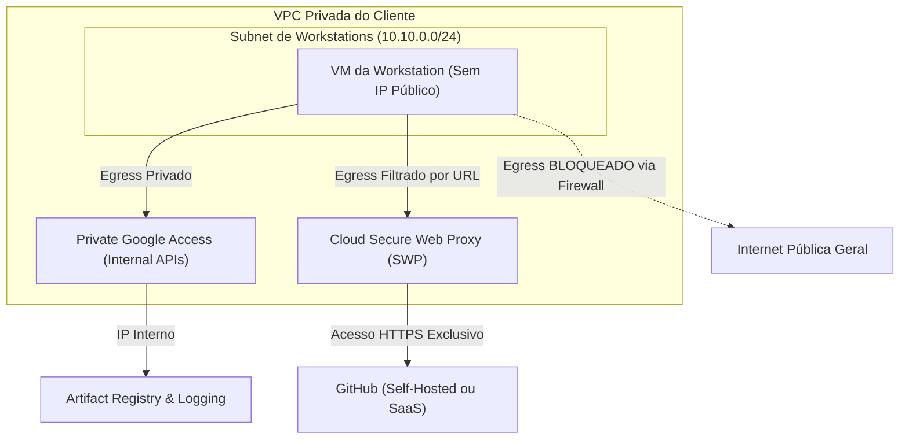

# Asset 1: Melhores Práticas de Redes e Isolamento de Tráfego

Este guia técnico descreve como arquitetar e implementar um ambiente de **Cloud Workstations** altamente isolado no Google Cloud Platform (GCP). O objetivo é garantir que as máquinas virtuais de desenvolvimento se comuniquem de forma estritamente privada, impedindo o vazamento de dados corporativos e permitindo saída apenas para o GitHub e destinos homologados.

---

## 1. Arquitetura de Rede Privada (VPC)

Para eliminar qualquer exposição à internet pública, a base da infraestrutura deve ser construída sobre uma VPC privada configurada para o isolamento completo de egress e ingress.



### 1.1 Cluster de Workstations Privado (Private Gateway)
Por padrão, um cluster de workstations expõe seu gateway de conexão (Control Plane) por meio de um IP público protegido pelo Cloud Identity-Aware Proxy (IAP). 
* **Melhor Prática**: Se o cliente possuir conexões híbridas (como VPN Site-to-Step ou Cloud Interconnect), você deve criar o cluster com a flag `--enable-private-endpoint`. Isso atribui um endereço IP interno ao gateway de controle, garantindo que o cluster e as IDEs fiquem completamente invisíveis para a internet pública. O acesso só será possível para quem estiver conectado fisicamente à rede corporativa do cliente.

### 1.2 Desativação de IPs Públicos nas VMs
* **Melhor Prática**: Configurar a Workstation Configuration com a flag `--disable-public-ip-addresses`. Isso garante que as instâncias (VMs) criadas para cada desenvolvedor tenham apenas IPs privados internos dentro da subrede selecionada. Elas nunca receberão um IP externo.

### 1.3 Private Google Access (Acesso Privado do Google)
* **Melhor Prática**: Habilitar obrigatoriamente a opção `Private Google Access` na subrede da VPC. 
* **Por que fazer?** Sem IPs públicos e sem rota de internet padrão, as VMs não conseguiriam falar com o Artifact Registry para baixar a imagem Docker, nem enviar logs para o Cloud Logging. O Private Google Access faz com que as VMs falem com todas as APIs do Google utilizando rotas internas privadas de alta velocidade.

---

## 2. Controle de Saída Restrito (Egress Isolation)

O maior risco em ambientes de desenvolvimento é o tráfego de saída (exfiltração de código ou downloads de dependências maliciosas). Existem duas abordagens principais para restringir a saída mantendo o acesso ao GitHub:

### Abordagem A: GitHub Totalmente Interno (Self-Hosted na Rede Privada)
Se o GitHub auto-hospedado do cliente reside na rede privada do próprio cliente (acessível via VPN/Interconnect ou VPC Peering):
1. **Remover o Cloud NAT**: Não associe nenhum gateway Cloud NAT à VPC das workstations. Sem o NAT, as workstations não possuem capacidade física de falar com o protocolo IPv4 público da internet.
2. **Firewall de Egress Restrito**:
   - Crie uma regra com prioridade baixa (ex: `65000`) para bloquear todo o tráfego de saída (`0.0.0.0/0`).
   - Crie uma regra com prioridade alta (ex: `1000`) para permitir tráfego TCP (portas `22` e `443`) apontando exclusivamente para o bloco de IPs privados (`CIDR`) onde reside o servidor GitHub interno do cliente.

---

### Abordagem B: GitHub Externo (SaaS / github.com) com Controle de URL
Se os desenvolvedores precisam acessar o GitHub SaaS (`github.com`) ou sites homologados na nuvem pública, mas você deseja bloquear todo o resto da internet, um firewall tradicional por IP é ineficiente porque os IPs de grandes SaaS mudam constantemente.
* **Melhor Prática**: Utilizar o **Cloud Secure Web Proxy (SWP)** do GCP.

#### Como configurar o Cloud Secure Web Proxy (SWP):
O SWP é um serviço de proxy web gerenciado que faz a filtragem de tráfego de saída na camada de aplicação (HTTP/HTTPS) usando nomes de domínio (FQDNs) e caminhos de URL, em vez de endereços IP.

1. **Criar a Subrede de Proxy**: O SWP requer uma subrede dedicada do tipo `REGIONAL_MANAGED_PROXY` na VPC.
2. **Definir a URL List (Lista de Permissões)**:
   Crie um recurso de regras contendo os domínios oficiais que o desenvolvedor pode acessar. Para o GitHub, inclua:
   - `*.github.com`
   - `github.com`
   - `*.githubusercontent.com` (necessário para baixar arquivos crus e extensões do Code OSS)
3. **Criar o Secure Web Proxy**: Implante a instância do proxy apontando para a VPC e para a lista de permissões criada.
4. **Forçar o Tráfego pelo Proxy**:
   Na imagem Docker das workstations (ou via script de inicialização), configure as variáveis de ambiente globais do sistema operacional para apontar para o IP interno do Secure Web Proxy:
   ```bash
   export http_proxy="http://[IP_INTERNO_DO_PROXY]:443"
   export https_proxy="http://[IP_INTERNO_DO_PROXY]:443"
   export no_proxy="metadata.google.internal,169.254.169.254"
   ```
5. **Bloquear Saídas Diretas**: Configure o firewall do GCP para bloquear qualquer tráfego TCP de saída direto nas portas `80` e `443` das workstations que não seja direcionado ao IP do proxy web.

---

### Abordagem C: Acesso Geral Seguro e Econômico (Cloud NAT - Ideal para Protótipos)
Se o cliente está na fase de testes (prototipação), ainda não possui um GitHub self-hosted, e quer **evitar o custo elevado do Secure Web Proxy (SWP)**, a melhor solução técnica é usar o **Cloud NAT**.

1. **Como funciona**: O Cloud NAT permite que as VMs das workstations (que não possuem IPs públicos) iniciem conexões de saída (Egress) seguras com a internet para acessar o `github.com` público, buscar dependências ou baixar extensões do Code OSS.
2. **Por que é seguro?** Como o Cloud NAT é um proxy de saída unidirecional de alta capacidade, nenhum atacante ou bot na internet consegue rastrear, ler portas ou iniciar uma conexão direta de entrada (Ingress) com as VMs das workstations.
3. **Custo-Benefício imbatível**: Custa aproximadamente **1,00 USD por mês** como taxa fixa da porta NAT na região (us-central1), mais taxas mínimas por gigabyte processado, comparado com os mais de 55,00 USD fixos mensais do Secure Web Proxy.
4. **Modo de Implantação**: Deixe as regras estritas de bloqueio total de saída comentadas (em standby) e configure o Cloud NAT na VPC. Quando o cliente amadurecer a infraestrutura de produção, as regras de firewall de egress podem ser ativadas para restringir o tráfego a destinos específicos.

---


## 3. Prevenção Avançada contra Exfiltração: VPC Service Controls (VPC-SC)

Para cenários onde a segurança de dados é crítica, o cliente deve configurar o **VPC Service Controls**.
* **Como funciona**: O VPC-SC cria um perímetro de segurança em nível de organização que isola recursos de serviços do Google (como Artifact Registry, Cloud Storage e Cloud Workstations).
* **Benefício**: Mesmo se um desenvolvedor tentar usar suas chaves pessoais para copiar dados da workstation para um bucket público de outra conta do Google Cloud, o VPC-SC bloqueará a transação, pois o tráfego de saída de dados só é permitido dentro do perímetro de segurança homologado da organização do cliente.
* **O que colocar no perímetro**:
  - O projeto de Cloud Workstations.
  - O projeto do Artifact Registry (armazenamento de imagens).
  - Os buckets do Cloud Storage utilizados no Cloud Build.
