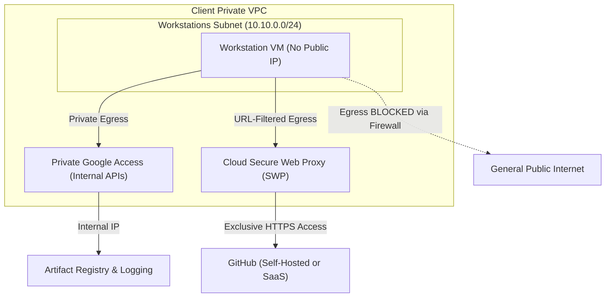

# Asset 1: Security and Networking Best Practices (English Version)

This technical guide describes how to architect and implement a highly isolated **Cloud Workstations** environment on Google Cloud Platform (GCP). The goal is to ensure that development virtual machines communicate strictly in a private manner, preventing corporate data leakage while allowing egress only to GitHub and authorized endpoints.

---

## 1. Private Network Architecture (VPC)

To eliminate any exposure to the public internet, the foundation of the infrastructure must be built on a private VPC configured for complete egress and ingress isolation.



### 1.1 Private Workstations Cluster (Private Gateway)
By default, a workstations cluster exposes its connection gateway (Control Plane) through a public IP protected by Cloud Identity-Aware Proxy (IAP).
* **Best Practice**: If the client has hybrid connectivity (such as Site-to-Site VPN or Cloud Interconnect), you should create the cluster with the `--enable-private-endpoint` flag. This assigns an internal IP address to the control gateway, ensuring that the cluster and IDEs remain completely invisible to the public internet. Access will only be possible for users physically connected to the client's corporate network.

### 1.2 Disabling Public IPs on VMs
* **Best Practice**: Configure the Workstation Configuration with the `--disable-public-ip-addresses` flag. This ensures that the virtual machines (VMs) created for each developer only have internal private IPs within the selected subnet. They will never receive an external IP.

### 1.3 Private Google Access
* **Best Practice**: Enable **Private Google Access** on the VPC subnet.
* **Why do this?** Without public IPs and without a default internet route, the VMs would not be able to communicate with the Artifact Registry to download the Docker image, nor send logs to Cloud Logging. Private Google Access allows the VMs to talk to all Google APIs using high-speed, secure internal private routes.

---

## 2. Restricted Egress Isolation

The greatest risk in development environments is outbound traffic (code exfiltration or downloading malicious dependencies). There are three main approaches to restricting egress while maintaining access to GitHub:

### Approach A: Fully Internal GitHub (Self-Hosted on the Private Network)
If the client's self-hosted GitHub resides within the client's own private network (accessible via VPN/Interconnect or VPC Peering):
1. **Remove Cloud NAT**: Do not associate any Cloud NAT gateway with the workstations' VPC. Without a NAT or public IPs, the workstations have no physical way of communicating with the public internet.
2. **Restricted Egress Firewall**:
   - Create a low-priority rule (e.g., `65000`) to block all outbound traffic (`0.0.0.0/0`).
   - Create a high-priority rule (e.g., `1000`) to allow TCP traffic (ports `22` and `443`) pointing exclusively to the private IP range (`CIDR`) where the internal GitHub server resides.

---

### Approach B: External GitHub (SaaS / github.com) with URL Filtering
If developers need to access public GitHub SaaS (`github.com`) or authorized sites in the public cloud, but you want to block everything else, a traditional firewall by IP is inefficient because SaaS IPs change constantly.
* **Best Practice**: Use **Cloud Secure Web Proxy (SWP)**.

#### How to configure Cloud Secure Web Proxy (SWP):
SWP is a managed web proxy service that performs application-layer (HTTP/HTTPS) egress filtering using domain names (FQDNs) and URL paths instead of IP addresses.

1. **Create the Proxy Subnet**: SWP requires a dedicated regional subnet of type `REGIONAL_MANAGED_PROXY` in the VPC.
2. **Define the URL List (Allowlist)**:
   Create a ruleset resource containing the official domains developers are allowed to access. For GitHub, include:
   - `*.github.com`
   - `github.com`
   - `*.githubusercontent.com` (required for downloading raw files and Code OSS extensions)
3. **Create the Secure Web Proxy**: Deploy the proxy instance pointing to the VPC and the created allowlist.
4. **Enforce Proxy Traffic**:
   In the workstations' Docker image (or via a startup script), configure the system-wide environment variables to point to the proxy's internal IP:
   ```bash
   export http_proxy="http://[PROXY_INTERNAL_IP]:443"
   export https_proxy="http://[PROXY_INTERNAL_IP]:443"
   export no_proxy="metadata.google.internal,169.254.169.254"
   ```
5. **Block Direct Outbound Traffic**: Configure the GCP firewall to block any direct outbound TCP traffic on ports `80` and `443` from the workstations that is not directed to the SWP internal IP.

---

### Approach C: Secure and Cost-Effective General Access (Cloud NAT - Ideal for Prototypes)
If the client is in the testing phase (prototyping), does not yet have a self-hosted GitHub, and wants to **avoid the high cost of Secure Web Proxy (SWP)**, the best technical solution is to use **Cloud NAT**.

1. **How it works**: Cloud NAT allows workstation VMs (which have no public IPs) to securely initiate outbound connections (Egress) to the internet to access public `github.com`, fetch dependencies, or download Code OSS extensions.
2. **Why is it secure?** Because Cloud NAT is a one-way outbound proxy, no external attacker or internet bot can scan ports or initiate any inbound connection (Ingress) to the workstation VMs.
3. **Unbeatable Cost-Benefit**: It costs approximately **$1.00 USD per month** as a flat rate for the NAT port in the region (us-central1), plus minimal data processing fees, compared to over $55.00 USD flat monthly fee for Secure Web Proxy.
4. **Deployment Mode**: Leave strict outbound block rules commented out (on standby) and configure Cloud NAT on the VPC. As the client's production infrastructure matures, egress firewall rules can be enabled to restrict traffic to specific destinations.

---

## 3. Advanced Exfiltration Prevention: VPC Service Controls (VPC-SC)

For scenarios where data security is critical, the client must configure **VPC Service Controls**.
* **How it works**: VPC-SC creates an organization-level security perimeter that isolates Google service resources (such as Artifact Registry, Cloud Storage, and Cloud Workstations).
* **Benefit**: Even if a developer attempts to use their personal API keys to copy data from the workstation to a public bucket in another Google Cloud account, VPC-SC will block the transaction, as data egress is only permitted within the authorized security perimeter of the client's organization.
* **What to include in the perimeter**:
  - The Cloud Workstations project.
  - The Artifact Registry project (image storage).
  - The Cloud Storage buckets used by Cloud Build.
