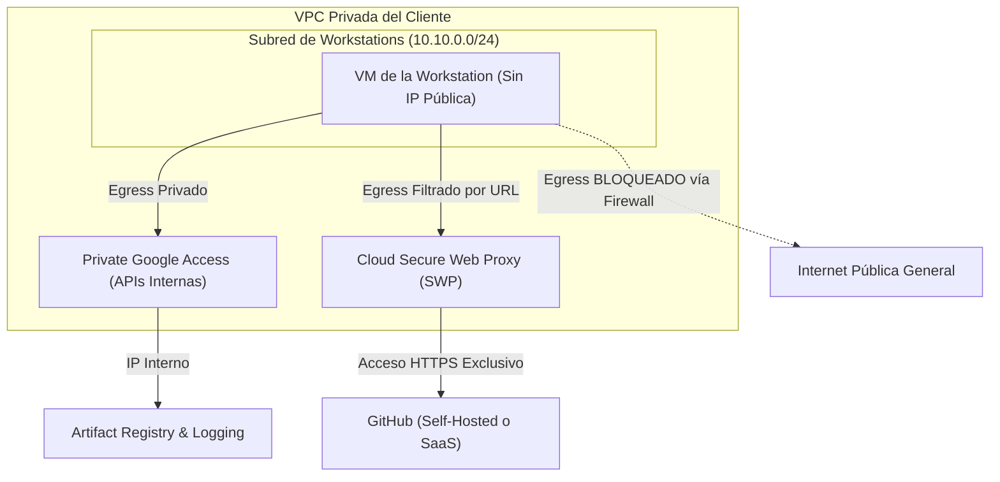

# Asset 1: Mejores Prácticas de Red y Aislamiento de Tráfico

Este guía técnico describe cómo diseñar e implementar un entorno de **Cloud Workstations** altamente aislado en Google Cloud Platform (GCP). El objetivo es garantizar que las máquinas virtuales de desarrollo se comuniquen de forma estrictamente privada, evitando la fuga de datos corporativos y permitiendo la salida de tráfico únicamente hacia GitHub y destinos autorizados.

---

## 1. Arquitectura de Red Privada (VPC)

Para eliminar cualquier exposición a la internet pública, la base de la infraestructura debe construirse sobre una VPC privada configurada para el aislamiento completo de entrada (ingress) y salida (egress).



### 1.1 Clúster de Workstations Privado (Private Gateway)
Por defecto, un clúster de workstations expone su puerta de enlace de conexión (Control Plane) a través de una IP pública protegida por Cloud Identity-Aware Proxy (IAP). 
* **Mejor Práctica**: Si el cliente cuenta con conectividad híbrida (como VPN Site-to-Site o Cloud Interconnect), se debe crear el clúster con la bandera `--enable-private-endpoint`. Esto asigna una dirección IP interna a la puerta de enlace de control, garantizando que el clúster y los IDEs permanezcan completamente invisibles para la internet pública. El acceso solo será posible para los usuarios que estén físicamente conectados a la red corporativa del cliente.

### 1.2 Desactivación de IPs Públicas en las VMs
* **Mejor Práctica**: Configurar la Workstation Configuration con la bandera `--disable-public-ip-addresses`. Esto garantiza que las máquinas virtuales (VMs) creadas para cada desarrollador solo tengan IPs privadas internas dentro de la subred seleccionada. Nunca recibirán una IP externa.

### 1.3 Private Google Access (Acceso Privado a Google)
* **Mejor Práctica**: Habilitar obligatoriamente la opción `Private Google Access` en la subred de la VPC.
* **¿Por qué hacerlo?** Sin IPs públicas y sin una ruta de internet por defecto, las VMs no podrían comunicarse con el Artifact Registry para descargar la imagen de Docker, ni enviar registros a Cloud Logging. Private Google Access permite que las VMs se comuniquen con todas las APIs de Google utilizando rutas privadas internas de alta velocidad.

---

## 2. Control de Salida Restringido (Egress Isolation)

El mayor riesgo en entornos de desarrollo es el tráfico de salida (filtración de código o descarga de dependencias maliciosas). Existen tres enfoques principales para restringir la salida manteniendo el acceso a GitHub:

### Enfoque A: GitHub Completamente Interno (Self-Hosted en la Red Privada)
Si el GitHub auto-hospedado del cliente reside dentro de su propia red privada (accesible a través de VPN/Interconnect o VPC Peering):
1. **Eliminar Cloud NAT**: No asocie ninguna puerta de enlace Cloud NAT con la VPC de las workstations. Sin un NAT ni IPs públicas, las workstations no tienen forma física de comunicarse con la internet pública.
2. **Firewall de Salida (Egress) Restringido**:
   - Cree una regla de baja prioridad (ej. `65000`) para bloquear todo el tráfico de salida (`0.0.0.0/0`).
   - Cree una regla de alta prioridad (ej. `1000`) para permitir el tráfico TCP (puertos `22` y `443`) que apunte exclusivamente al rango de IPs privadas (`CIDR`) donde reside el servidor interno de GitHub.

---

### Enfoque B: GitHub Externo (SaaS / github.com) con Filtrado de URL
Si los desarrolladores necesitan acceder al GitHub SaaS público (`github.com`) o a sitios autorizados en la nube pública, pero desea bloquear todo lo demás, un firewall tradicional por IP es ineficiente porque las IPs de los grandes SaaS cambian constantemente.
* **Mejor Práctica**: Utilizar **Cloud Secure Web Proxy (SWP)** de GCP.

#### Cómo configurar Cloud Secure Web Proxy (SWP):
SWP es un servicio de proxy web administrado que realiza el filtrado de salida en la capa de aplicación (HTTP/HTTPS) utilizando nombres de dominio (FQDNs) y rutas de URL en lugar de direcciones IP.

1. **Crear la Subred de Proxy**: SWP requiere una subred regional dedicada de tipo `REGIONAL_MANAGED_PROXY` en la VPC.
2. **Definir la URL List (Lista de Permitidos)**:
   Cree un recurso de reglas que contenga los dominios oficiales a los que los desarrolladores pueden acceder. Para GitHub, incluya:
   - `*.github.com`
   - `github.com`
   - `*.githubusercontent.com` (necesario para descargar archivos en crudo y extensiones de Code OSS)
3. **Crear el Secure Web Proxy**: Implemente la instancia de proxy apuntando a la VPC y a la lista de permitidos creada.
4. **Forzar el Tráfico por el Proxy**:
   En la imagen de Docker de las workstations (o mediante un script de inicio), configure las variables de entorno globales del sistema operativo para apuntar a la IP interna del proxy:
   ```bash
   export http_proxy="http://[IP_INTERNA_DEL_PROXY]:443"
   export https_proxy="http://[IP_INTERNA_DEL_PROXY]:443"
   export no_proxy="metadata.google.internal,169.254.169.254"
   ```
5. **Bloquear Salidas Directas**: Configure el firewall de GCP para bloquear cualquier tráfico TCP de salida directo en los puertos `80` y `443` desde las workstations que no esté dirigido a la IP interna del SWP.

---

### Enfoque C: Acceso General Seguro y Económico (Cloud NAT - Ideal para Prototipos)
Si el cliente se encuentra en la fase de pruebas (prototipado), aún no cuenta con un GitHub auto-hospedado y desea **evitar el alto costo de Secure Web Proxy (SWP)**, la mejor solución técnica es utilizar **Cloud NAT**.

1. **Cómo funciona**: Cloud NAT permite que las VMs de las workstations (que no tienen IPs públicas) inicien conexiones de salida (Egress) seguras a internet para acceder al `github.com` público, buscar dependencias o descargar extensiones de Code OSS.
2. **¿Por qué es seguro?** Dado que Cloud NAT es un proxy de salida unidireccional, ningún atacante externo o bot en internet puede escanear puertos o iniciar una conexión de entrada (Ingress) directa con las VMs de las workstations.
3. **Relación Costo-Beneficio imbatible**: Cuesta aproximadamente **1.00 USD al mes** como tarifa fija por el puerto NAT en la región (us-central1), más tarifas mínimas por gigabyte procesado, en comparación con los más de 55.00 USD mensuales fijos de Secure Web Proxy.
4. **Modo de Implementación**: Deje comentadas (en standby) las reglas estrictas de bloqueo de salida y configure Cloud NAT en la VPC. A medida que madure la infraestructura de producción del cliente, se pueden activar las reglas de firewall de salida para restringir el tráfico a destinos específicos.

---

## 3. Prevención Avanzada contra Filtración: VPC Service Controls (VPC-SC)

Para escenarios donde la seguridad de los datos es crítica, el cliente debe configurar **VPC Service Controls**.
* **Cómo funciona**: VPC-SC crea un perímetro de seguridad a nivel de organización que aísla los recursos de los servicios de Google (como Artifact Registry, Cloud Storage y Cloud Workstations).
* **Beneficio**: Incluso si un desarrollador intenta usar sus claves de API personales para copiar datos de la workstation a un bucket público en otra cuenta de Google Cloud, VPC-SC bloqueará la transacción, ya que la salida de datos solo está permitida dentro del perímetro de seguridad autorizado de la organización del cliente.
* **Qué incluir en el perímetro**:
  - El proyecto de Cloud Workstations.
  - El proyecto de Artifact Registry (almacenamiento de imágenes).
  - Los buckets de Cloud Storage utilizados por Cloud Build.
